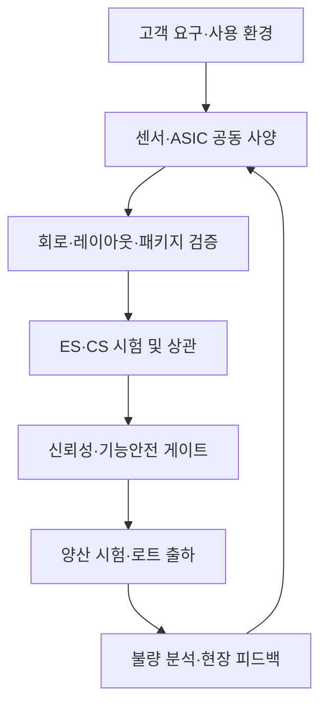

# ALPS ALPINE Engineering Twin Workbench
## ASIC 기술 차별화 기반 추가 개발 및 고도화 지시서

**문서 버전:** v1.1  
**기준일:** 2026-09-15  
**대상 시스템:** ALPS ALPINE Engineering Twin Workbench v1.0  
**대상 독자:** 제품책임자, ASIC 설계·검증·평가·품질·생산기술 담당자, 프런트엔드·백엔드·데이터·AI 개발자  
**참조:** [Alps Alpine 공식 ASIC Design Technology](https://tech.alpsalpine.com/e/technology-info/asic/)  

> **문서의 위치** — 본 문서는 Alps Alpine 공식 공개 기술을 기준으로 현재 워크벤치의 기능 공백을 분석하고, 추가 개발 범위·우선순위·데이터 계약·수용 기준을 정의한 실행 지시서다. 공개 페이지에 없는 내부 공정 조건, 수율, 결함 기준, 장비 인터페이스는 사실로 가정하지 않는다. 해당 값은 현업 확인 전까지 `TBD` 또는 `교육용 추정치`로 표시한다.

---

## 0. 경영진 요약

현재 시스템은 요구사항, 3D, 시뮬레이션, 상관, 게이트, 양산 품질을 한 화면에 묶고 ASIC 개발 9단계를 구현했다. 그러나 공식 ASIC 기술이 강조하는 **풀 턴키 서비스**, **20년 이상 센서 ASIC 경험**, **센서와 ASIC의 단일 패키지 통합**, **FAB·패키지·원가·납기 검토**, **최신 EDA 활용**, **AEC-Q100·ISO 26262 대응**, **사내 시험·불량 분석**, **외부 파운드리·OSAT 관리**를 실무 수준의 데이터와 워크플로로 연결하려면 다음 고도화가 필요하다.

### 최우선 개발 과제

| 순위 | 고도화 과제 | Alps Alpine에 제공하는 실질 가치 | 릴리즈 목표 |
|---:|---|---|---|
| P0 | 센서-ASIC 공동설계 트윈 | 센서 소자·AFE·ADC·보정·인터페이스를 하나의 오류 예산으로 검증 | R1 |
| P0 | 시험 장비·실측 데이터 증적 파이프라인 | T2000/V93000/프로버/핸들러 결과를 게이트에 직접 연결 | R1 |
| P0 | 불량 분석 폐루프(FA→RCA→ECO→재검증) | 불량 위치·원인·대책·재발 방지 효과를 설계 리비전에 추적 | R1 |
| P0 | 기능안전·AEC-Q100 증적 매트릭스 | 자동차용 전류·캡터치·모터 리플 ASIC의 준수 주장과 증거를 분리 | R1 |
| P1 | FAB·패키지·원가·납기 시나리오 | 2단계 ASIC 사양 개발의 사업성·리스크 판단을 정량화 | R2 |
| P1 | DFT·양산 테스트 프로그램 디지털 트윈 | 결함 커버리지, 테스트 시간, 비용, 오버킬/언더킬을 동시 최적화 | R2 |
| P1 | 파운드리·OSAT 협업 및 공급망 게이트 | Fabless 운영에서 외주 증적·변경·로트 상태를 통제 | R2 |
| P1 | 제품군별 검증 팩 4종 | 각 ASIC의 실제 신호 체인과 자동차 등급 조건을 템플릿화 | R2 |
| P2 | AI 설계·시험·FA 보조 Copilot | 반복 분석을 단축하되 모든 결과에 근거·불확실성·승인 절차 유지 | R3 |

### 제안 포지셔닝

이 시스템을 범용 EDA 대체품으로 포지셔닝하지 않는다. 차별화 문장은 다음으로 통일한다.

> **“Alps Alpine의 센서·혼합신호 ASIC·시험·불량 분석 경험을 요구사항부터 양산까지 연결하고, 실제 증적 없이는 출시 승인을 허용하지 않는 웹 기반 엔지니어링 의사결정 워크벤치.”**

---

## 1. 공식 ASIC 기술에서 확인되는 회사 강점

아래 항목은 Alps Alpine 공식 페이지에서 직접 확인되는 내용이다.

| 공식 기술·운영 특성 | 공식 페이지의 근거 요약 | 시스템에 반영할 핵심 객체 |
|---|---|---|
| 약 20년 ASIC 설계 경험 | 자체 모듈용 ASIC을 장기간 설계 | 재사용 IP, 설계 근거, 과거 프로젝트 지식 |
| 센서와 ASIC 단일 패키지 | 센서 디바이스와 ASIC 통합 패키지 전문성 | Sensor Die–ASIC Die–Package 공동 모델 |
| 20종 이상 센서 개발 | 지자기·정전식 등 다양한 센서 공급 | 제품군별 템플릿과 검증 프로파일 |
| Fabless + 풀 턴키 | 시스템 설계부터 품질·시험·양산 후 FA까지 제공 | 외주 파트너, 단계 게이트, 증적 체인 |
| 세계적 파운드리·OSAT 협력 | 제조·패키징 전문사와 전략적 협력 | 파트너 승인, 공정/패키지 옵션, 변경 통지 |
| 누적 양산 실적 | 2023년까지 20만 웨이퍼, 30억 칩 출하 | 대량 양산 이력 기반 품질 지식화 |
| 자동차 신뢰성·기능안전 | AEC-Q100 Grade 0 및 ISO 26262 대응 제품 경험 | 시험 조건, 안전 요구, 진단·고장 주입 증적 |
| 사내 시험 환경 | T7722/T2000/V93000, 200/300mm 프로버, M4171 핸들러 | 장비 자산, 시험 프로그램, 원시 결과, 교정 상태 |
| 사내 불량 분석 | 외관·전기·비파괴·개봉·단면 분석과 설계자 참여 | FA 케이스, 물리 위치, RCA, ECO, 재발 방지 |
| Concurrent Engineering | 사양 확정 전 일부 설계 병행, CS 일정 유연화 | 가정 기반 분기, 위험 수용, 동시 작업 의존성 |

**출처:** [Alps Alpine — ASIC Design Technology](https://tech.alpsalpine.com/e/technology-info/asic/) (접속·검토: 2026-09-15)

---

## 2. 현재 시스템 대비 갭 분석

### 2.1 이미 구현되어 유지할 기반

- ASIC 9단계 작업 센터와 단계별 게이트
- 요구사항·검증·3D·시뮬레이션·상관·양산 품질의 통합 내비게이션
- 캡터치 AFE, 전류 센서, 모터 리플, 환경 센서 템플릿
- ES 상관 지표(R², bias, MAE, RMSE)
- ECO 종료 시 마스크·시험 프로그램 리비전 증가 및 재승인 강제
- AEC-Q100 온도 조건 정책과 증적/CAPA/웨이버 구조
- 패키지 3D 트윈, 로트 SPC·파레토·MRB
- 교육·합성·목 결과를 실무 사인오프에서 차단하는 정직성 원칙

### 2.2 추가 고도화가 필요한 공백

| 영역 | 현재 수준 | 필요한 수준 | 위험 |
|---|---|---|---|
| 센서-ASIC 공동설계 | 패키지 3D와 제품 템플릿 중심 | 소자 물리량→AFE→ADC→보정→출력의 실행 가능한 혼합신호 체인 | 블록 간 오류 예산과 보정 효과를 판단하기 어려움 |
| 사양·사업성 | 옵션 승인과 리드타임 표시 | FAB/공정/패키지/수량별 NRE·단가·일정·리스크 시나리오 | 2단계 의사결정이 정성적 상태표시에 머묾 |
| 실 EDA | 목 교육 러너 | 상용·오픈소스 EDA 결과 메타데이터와 로그·리포트 수집 | 설계 완료 게이트의 기술 근거 부족 |
| DFT/ATE | 테스트 프로그램 리비전만 관리 | 패턴·테스트 항목·한계값·커버리지·시간·원가·상관 관리 | 양산 시험성과 설계 검증이 분리됨 |
| 장비 연계 | 합성 실측 중심 | 장비·프로버·핸들러 원시 결과의 서명·해시·교정 이력 | 실측 신뢰성과 재현성 입증 불가 |
| 기능안전 | 정책·블로커 중심 | Safety Goal→FSR/TSR→메커니즘→고장 주입→FMEDA 연결 | ISO 26262 준수 주장의 증적 구조 부족 |
| 신뢰성 | Grade 조건 테이블 | 시험 계획, 샘플·로트, 스트레스 전후 측정, 실패·웨이버 폐루프 | QUAL_PASS의 깊이가 제품별로 불균일 |
| 불량 분석 | CAPA/MRB 중심 | FA 위치·이미지·분석법·RCA·설계 리비전·재시험 연결 | 학습이 다음 설계에 재사용되지 않음 |
| 외주 파트너 | 생산 상태 관리 | Foundry/OSAT 변경·수율·CoA/CoC·PCN·NCR 증적 | Fabless 핵심 운영 리스크가 워크벤치 밖에 남음 |
| AI | 화면 안내 중심 | 근거가 있는 제안, 이상탐지, 시험 최적화, FA 유사사례 검색 | 경쟁력 있는 의사결정 자동화가 제한됨 |

---

## 3. 목표 운영 모델



모든 화살표에는 다음 정보가 함께 전달되어야 한다.

- 입력·출력 아티팩트의 리비전과 해시
- 데이터 출처(`REAL_MEASURED`, `SIMULATION`, `SURROGATE`, `SYNTHETIC`, `MANUAL`)
- 사용 장비·툴·모델 버전과 교정/검증 상태
- 요구사항·위험·검증 항목 링크
- 실행자·검토자·승인자와 시간
- 예외·웨이버·잔여 위험과 유효 기간

---

## 4. 상세 추가 개발 지시

## EPIC A. 센서-ASIC 공동설계 트윈

### 목적

센서 소자의 물리 현상과 ASIC의 신호 처리 회로를 분리해서 보는 한계를 해소한다. 공식 포트폴리오의 핵심인 지자기·환경·전류·정전식 센서 ASIC을 **입력 물리량부터 디지털/아날로그 출력까지** 연속 검증한다.

### 구현 범위

1. 공통 신호 체인 편집기를 추가한다.
   - Sensor element activation
   - 센서 전달함수 및 온도·오프셋·노이즈 모델
   - AFE 증폭·필터·클램프
   - ADC/DAC 및 양자화
   - 디지털 보정·선형화
   - I2C/SPI/UART/Single-wire 출력
2. 블록별 오류 예산을 입력·계산·시각화한다.
   - offset, gain error, INL/DNL, noise, drift, latency, saturation
3. Corner·Monte Carlo·온도 Sweep을 동일 실행 계약으로 지원한다.
4. 실측 데이터로 모델 파라미터를 보정하되, 보정 전/후 모델과 적용 범위를 별도 리비전으로 저장한다.
5. 센서 다이·ASIC 다이·본딩와이어·패키지 열경로를 3D 패키지 트윈과 연결한다.

### 제품별 필수 시나리오

| 템플릿 | 필수 입력·모델 | 필수 출력·판정 |
|---|---|---|
| 환경·지자기 혼합신호 IC | 센서 활성화, 증폭, ADC, 온도·오프셋 보정 | 디지털 코드, 보정 잔차, I2C/SPI 프레임 |
| 전류 센서 IC | 비례형/평형형 선택, GMR 전달함수, 온도 특성 | 아날로그 출력, 클램프, 진단 상태, Grade 0 조건 |
| 모터 리플 검출 IC | −10~+60V 입력, 모터 전압·전류 파형 | 리플 펄스, UART/Single-wire 프레임, Grade 1 조건 |
| 정전식 AFE/SoC | 전극 ΔC, 다채널 스캔, 장갑·근접 조건 | ADC 코드, 채널 지연, 판정 상태, Grade 2 조건 |

### 수용 기준

- [ ] 사용자가 템플릿 4종 중 하나를 선택하고 신호 체인을 그래프로 편집할 수 있다.
- [ ] 각 결과가 요구사항 ID와 모델·파라미터 리비전을 포함한다.
- [ ] Corner/Monte Carlo 결과에서 P50/P95/P99와 규격 이탈률을 확인할 수 있다.
- [ ] 보정 모델이 학습 데이터 범위를 벗어나면 `MODEL_OOD`를 표시한다.
- [ ] 합성·서로게이트 결과만 존재하면 `DESIGN_SIGNOFF`가 차단된다.

---

## EPIC B. FAB·패키지·원가·납기 의사결정 트윈

### 목적

공식 2단계에서 수행하는 FAB 공정·패키지 조사와 개발 기간·개발비·양산 단가 추정을 재현 가능한 시나리오로 관리한다.

### 구현 범위

- `ManufacturingOption` 객체: foundry, node, wafer_size, voltage_option, device_option, temperature_grade, package, OSAT, MOQ
- NRE 구성: 설계, IP, 마스크, MPW/셔틀, 패키지 툴링, 시험 개발, 신뢰성 평가
- 단가 구성: wafer, die yield, assembly, final test, logistics, scrap
- 일정 구성: PDK/IP 준비, 설계, tape-out, wafer, assembly, ES/CS, qualification
- 리스크: 공급 단일화, 장기 리드타임, 수율 불확실성, 패키지 열/응력, 장비 가용성
- 2~5개 옵션의 비용·일정·기술·공급 위험을 가중치로 비교하는 Trade Study
- 모든 숫자에 통화, 기준일, 수량 구간, 신뢰구간, 근거 문서를 연결

### 수용 기준

- [ ] 단일 숫자가 아니라 Base/Best/Worst 시나리오를 제공한다.
- [ ] 수량 변화에 따른 NRE 상각 단가와 손익분기점을 표시한다.
- [ ] 미확정 값은 `TBD`이며 0으로 계산되지 않는다.
- [ ] 옵션 선택 시 승인자·판단 근거·잔여 위험을 기록한다.
- [ ] 내부 단가 데이터는 역할·프로젝트·협력사별로 열람 범위를 제한한다.

---

## EPIC C. EDA 실행·검증 오케스트레이션

### 목적

교육용 목 러너를 유지하면서 실제 EDA 산출물을 별도 신뢰 계층으로 수집한다. 특정 EDA 공급사를 대체하지 않고 설계 결과를 요구사항·게이트에 연결한다.

### 구현 범위

- 공통 `ToolRun` 계약: tool, version, container/image digest 또는 실행 환경, command profile, input hash, output hash, exit code, log URI
- 설계 플로우 어댑터:
  - schematic/netlist 검사
  - SPICE·AMS 시뮬레이션
  - RTL lint·CDC/RDC(SoC 해당 시)
  - synthesis·STA·P&R
  - DRC/LVS/ERC 및 sign-off report 수집
- 라이선스가 필요한 상용 툴은 온프레미스 실행 에이전트에서 구동하고, 워크벤치에는 승인된 메타데이터와 결과만 전송
- 실패 재시도는 입력 해시가 동일한 경우에만 동일 런 계보로 연결
- 목 러너와 실 러너의 아이콘·색·문구를 명확히 분리

### 수용 기준

- [ ] 모든 실 EDA 결과는 툴 버전·입력 해시·로그·리포트 원본 링크를 가진다.
- [ ] 하나의 게이트에 필요한 결과가 서로 다른 설계 리비전이면 `MIXED_REVISION_EVIDENCE`로 차단한다.
- [ ] 재실행 결과는 기존 결과를 덮어쓰지 않는다.
- [ ] 라이선스 파일·PDK·원본 넷리스트가 브라우저 또는 일반 로그에 노출되지 않는다.

---

## EPIC D. DFT·양산 테스트 프로그램 트윈

### 목적

ASIC 설계 개선 단계에서 만드는 양산 테스트 프로그램을 하나의 관리 파일이 아니라 **측정 항목·결함 커버리지·테스트 시간·원가·리비전**의 실행 가능한 모델로 만든다.

### 구현 범위

- Test Flow 편집기: contact/pre-check → DC → analog/mixed-signal → digital → trim/calibration → interface → final bin
- 각 항목에 limits, units, temperature, site count, pattern/vector, instrument, expected duration 연결
- Wafer sort와 final test의 항목 계보 및 중복/누락 분석
- Golden unit·correlation lot·guardband 관리
- Test Program 리비전과 mask/design/package 리비전 호환성 매트릭스
- 테스트 시간과 결함 검출 효과를 기반으로 한 비용 최적화 제안
- Bin map, wafer map, site별 편향, 재시험률, 오버킬/언더킬 추정

### 수용 기준

- [ ] 시험 항목별 요구사항·고장 모드·장비 채널 링크가 존재한다.
- [ ] 한계값 변경 시 영향을 받는 로트·제품·인증 증적이 자동 표시된다.
- [ ] 시험 프로그램과 실리콘 리비전이 불일치하면 실행·승인을 차단한다.
- [ ] 비용 최적화 AI는 시험 삭제를 자동 적용하지 않고 검토안만 생성한다.

---

## EPIC E. 시험 장비·실측 데이터 증적 파이프라인

### 목적

공식 페이지에 공개된 시험 환경을 기준으로 실측 데이터의 출처와 재현성을 확보한다.

### 우선 연계 대상

| 장비 유형 | 공개된 예 | 수집할 데이터 |
|---|---|---|
| Semiconductor Test System | T7722, T2000, V93000 | test item, limit, value, bin, site, cycle time, program revision |
| Wafer Prober | UF2000 계열, AP3000e | wafer/XY 좌표, contact 상태, chuck 온도, probe card, map |
| Test Handler | M4171 | device ID, socket/site, 설정·실측 온도, dwell, thermal alarm |

### 구현 범위

- 파일 수집부터 시작: CSV/STDF/장비 리포트 원본을 변경 불가 객체로 보관
- 장비별 파서를 플러그인 구조로 구현
- `MeasurementRun`에 장비 ID, 펌웨어, 교정 유효기간, 프로그램 리비전, operator, 시간, 원본 해시 기록
- 단위 변환은 원본 값과 변환 값을 모두 유지
- 비정상 종료·부분 파일·중복 파일·시간 역전 검출
- 데이터 수신 후 스키마·범위·완전성 검증을 통과해야 `VERIFIED_INGEST` 부여

### 수용 기준

- [ ] 동일 원본 파일을 재수집해도 중복 런을 생성하지 않는다.
- [ ] 교정 만료 장비의 결과는 `CALIBRATION_EXPIRED`로 게이트에서 차단된다.
- [ ] 파서 오류 시 원본은 유지되고 오류 위치와 원인이 표시된다.
- [ ] 원시 파일·정규화 데이터·집계 지표를 상호 추적할 수 있다.

---

## EPIC F. AEC-Q100·ISO 26262 증적 워크벤치

### 목적

자동차 제품의 등급·기능안전 주장을 “체크됨” 상태가 아니라 검증 가능한 증적 구조로 바꾼다.

### 구현 범위

1. AEC-Q100 Qualification Matrix
   - 제품·패키지·공정·Grade별 적용 시험
   - 시험 조건, 샘플 수, 로트, 장비, 전/후 전기 측정
   - 실패, 재시험, root cause, corrective action, waiver
2. Functional Safety Trace
   - Safety Goal → FSR → TSR → HW requirement
   - safety mechanism, diagnostic coverage, safe state, fault response time
   - FMEDA 행과 고장 주입 시험의 양방향 링크
3. 제품별 조건
   - 전류 센서: 출력 clamping·fail-safe·온도 보상 검증
   - 모터 리플: 입력 범위·진단 통신·자동차 온도 조건
   - 정전식 SoC: AEC-Q100 Grade 2 대상 조건과 인터페이스 오류 처리

### 수용 기준

- [ ] 표준 “준수” 문구는 승인된 증적이 모두 있을 때만 표시된다.
- [ ] 표준 버전·사내 정책 버전·적용/비적용 근거가 기록된다.
- [ ] 요구사항 또는 설계 리비전 변경 시 영향받는 시험을 자동 재오픈한다.
- [ ] FMEDA 수치는 출처 파일·검토자·산식 버전을 가진다.
- [ ] 시스템은 인증기관을 대체한다고 표현하지 않는다.

---

## EPIC G. 불량 분석(FA) 디지털 폐루프

### 목적

공식 강점인 사내 FA와 설계자 직접 참여를 시스템 차별화의 핵심으로 전환한다.

### 구현 범위

- FA 케이스 접수: lot/wafer/die/package/field return, 증상, 재현 조건
- 분석 단계 템플릿: 외관 → 전기 → 비파괴 → 개봉 → 국부 분석 → 단면
- 3D 패키지/다이 뷰에 불량 위치와 분석 이미지를 좌표 기반으로 오버레이
- RCA 트리: 관찰 사실, 가설, 확인 시험, 배제 근거, 최종 원인 분리
- 원인 분류: design/process/package/test/handling/application/unknown
- 대책을 ECO·공정변경·시험 항목·협력사 8D/CAPA에 연결
- 재발 방지 효과를 후속 로트와 신뢰성 시험에서 확인
- 유사 FA 검색: 증상·파형·위치·결함 이미지·공정 조건 기반

### 수용 기준

- [ ] `최종 원인`은 관찰 사실과 확인 증적 없이는 승인할 수 없다.
- [ ] 설계자·품질·분석 담당자의 역할별 검토 기록이 남는다.
- [ ] ECO 완료만으로 FA를 닫을 수 없으며 재현 실패/후속 검증 결과가 필요하다.
- [ ] 이미지 AI 결과는 확률·유사 사례·모델 버전을 표시하고 자동 판정하지 않는다.
- [ ] 후속 로트에서 동일 불량률이 목표 이하인지 효과 검증 지표를 제공한다.

---

## EPIC H. 파운드리·OSAT 협업 및 공급망 품질 게이트

### 목적

Fabless 운영의 핵심인 외주 제조·패키징·시험 파트너를 프로젝트 증적 체인에 포함한다.

### 구현 범위

- 파트너·사이트·공정·패키지·승인 상태 마스터
- Lot Traveler와 wafer → assembly → test 계보
- CoA/CoC, wafer map, assembly lot, final test summary 수집
- PCN, 공정 편차, 자재·장비·사이트 변경의 영향 분석
- NCR/SCAR/8D와 MRB 결정 추적
- 협력사별 제한 포털: 필요한 아티팩트만 업로드·검토 가능
- 납기·수율·품질 지표는 계약상 정의와 데이터 가용성을 표시

### 수용 기준

- [ ] 파트너 변경 또는 PCN 미승인 시 관련 양산 게이트가 차단된다.
- [ ] 서로 다른 협력사는 상대방의 단가·도면·불량 데이터를 열람할 수 없다.
- [ ] 로트 계보가 끊기거나 중복되면 출하 승인을 차단한다.
- [ ] 협력사 업로드 파일도 해시·서명·리비전·검토 상태를 가진다.

---

## EPIC I. Concurrent Engineering 제어판

### 목적

사양 확정 전 설계를 병행하는 공식 개발 방식의 속도 장점은 유지하면서, 가정 변경으로 인한 재작업을 통제한다.

### 구현 범위

- 확정 요구사항과 `ASSUMPTION_BASED` 요구사항을 구분
- 가정마다 owner, due date, confidence, downstream dependency 등록
- 가정 변경 시 영향받는 회로, 레이아웃, 패키지, 시험, 견적을 자동 탐색
- 병렬 작업 스트림과 동기화 지점을 타임라인으로 표시
- CS 공정 단축/변형 시 생략·병행 단계와 잔여 위험을 승인 문서로 생성

### 수용 기준

- [ ] 미해결 고위험 가정이 있으면 mask release가 차단된다.
- [ ] 가정 변경 영향 목록이 재실행·재검토 상태로 자동 전환된다.
- [ ] 일정 단축으로 생략된 활동은 숨기지 않고 승인된 편차로 남는다.

---

## EPIC J. 근거 중심 AI Engineering Copilot

### 목적

AI를 설계 승인자가 아니라 증거를 찾고 비교하며 다음 실험을 제안하는 보조자로 제한한다.

### 우선 유스케이스

1. 고객 요구 문장에서 측정 가능한 ASIC 요구·검증 초안 생성
2. 과거 제품·FA·시험에서 유사 사례 검색
3. Corner/Monte Carlo 결과의 규격 민감도와 주요 파라미터 설명
4. Wafer map·site·온도·시간 기반 이상 패턴 탐지
5. FA 가설과 확인 시험 후보 제안
6. 테스트 시간 대비 결함 검출 효율이 낮은 항목의 검토 후보 제안
7. 게이트 누락 증적과 서로 충돌하는 리비전 요약

### AI 안전·정직성 요구

- AI 출력에는 사용 데이터, 검색 근거 링크, 모델 버전, 생성 시각, 신뢰도 표시
- 내부 IP·PDK·고객 데이터는 승인된 테넌트 경계를 벗어나지 않음
- AI가 요구사항, 한계값, 웨이버, MRB, 릴리즈를 자동 승인하지 않음
- 추천 적용 전 인간 승인과 변경 diff를 강제
- 합성 데이터로 학습·평가한 모델은 실데이터 모델과 분리
- OOD·데이터 부족·근거 충돌 시 답변 대신 명시적 보류

### 수용 기준

- [ ] 근거 링크가 없는 AI 제안은 게이트 증적으로 첨부할 수 없다.
- [ ] 사용자가 AI 제안 수락 전 원문 대비 diff를 확인한다.
- [ ] 동일 입력·모델·검색 스냅샷에 대한 감사 재현 메타데이터가 남는다.
- [ ] AI 성능은 정확도뿐 아니라 false negative, calibration, abstention으로 평가한다.

---

## 5. 화면 추가·개편 지시

| 화면 ID | 화면명 | 핵심 구성 | 연결 대상 |
|---|---|---|---|
| A02 | Architecture & Trade Study | 신호 체인, FAB/패키지 옵션, 원가·일정·위험 비교 | ASIC ②·③ |
| D04 | Mixed-Signal Verification | Corner/Monte Carlo, 오류 예산, 규격 커버리지 | ASIC ④ |
| T05 | Test Program Twin | test flow, limits, coverage, time/cost, revision matrix | ASIC ⑤·⑥·⑨ |
| Q07 | Qualification Matrix | AEC-Q100 시험·로트·조건·증적·웨이버 | ASIC ⑦·⑧ |
| S07 | Functional Safety | safety trace, FMEDA, fault injection, residual risk | ASIC ④·⑦·⑧ |
| L09 | Lot & Partner Control | foundry/OSAT lot genealogy, PCN/NCR, release | ASIC ⑨ |
| F09 | Failure Analysis Studio | 분석 단계, 3D 위치, RCA, ECO/CAPA, 효과검증 | ASIC ⑤·⑦·⑨ |
| C00 | Engineering Copilot | 화면 문맥 기반 근거 검색·비교·제안 | 전 화면 |

### 공통 UX 원칙

- 상태는 색만으로 표현하지 않고 아이콘·문구·원인을 함께 표시한다.
- 모든 KPI 카드는 값, 단위, 데이터 출처, 기준 범위, 마지막 갱신 시각을 표시한다.
- `실측`, `실시뮬레이션`, `서로게이트`, `합성`, `수기 입력` 배지를 항상 노출한다.
- 차트의 원본 데이터와 필터 조건을 CSV/JSON으로 내보낼 수 있어야 한다.
- 일본어·영어·한국어 번역 키는 동일 스키마로 빌드 시 검증한다.
- 승인 버튼 옆에 승인 대상 리비전·증적 개수·미해결 예외를 표시한다.

---

## 6. 핵심 데이터 모델 확장

```text
Program
 ├─ Requirement ─ VerificationItem ─ EvidenceRevision
 ├─ Assumption ─ DependencyImpact
 ├─ SensorAsicModel ─ ModelParameterRevision ─ SimulationRun
 ├─ ManufacturingOption ─ CostScenario ─ ScheduleScenario
 ├─ DesignRevision ─ ToolRun ─ SignoffReport
 ├─ TestProgramRevision ─ TestItem ─ LimitSet
 ├─ Sample/Lot/Wafer/Die ─ MeasurementRun ─ Measurement
 ├─ QualificationPlan ─ StressTest ─ QualificationResult
 ├─ SafetyRequirement ─ SafetyMechanism ─ FMEDAItem ─ FaultInjectionRun
 ├─ FailureCase ─ Observation ─ Hypothesis ─ RootCause ─ CorrectiveAction
 └─ PartnerSite ─ ProcessRoute ─ PCN/NCR/8D ─ ReleaseDecision
```

### 필수 공통 필드

```yaml
artifact_id: string
artifact_type: enum
revision: integer
status: enum
source_class: REAL_MEASURED | REAL_SIMULATION | SURROGATE | SYNTHETIC | MANUAL
content_hash: sha256
created_at: datetime
created_by: subject_id
approved_at: datetime | null
approved_by: subject_id | null
supersedes: artifact_id | null
requirements: [requirement_id]
confidentiality: PUBLIC | INTERNAL | CUSTOMER_CONFIDENTIAL | RESTRICTED_IP
retention_policy: policy_id
```

### 불변 규칙

1. 승인된 `EvidenceRevision`은 수정·삭제하지 않고 신규 리비전으로 대체한다.
2. 승인 시점의 입력 해시와 현재 입력 해시가 다르면 승인은 자동 만료된다.
3. `SYNTHETIC`, `SURROGATE`, `MANUAL` 단독 증적은 생산 릴리즈를 충족하지 못한다.
4. 표준 준수 상태는 증적 매트릭스에서 계산하며 사용자가 직접 `PASS`로 입력할 수 없다.
5. 로트·웨이퍼·다이 식별자는 외부 파트너 식별자와 내부 대체키를 모두 보존한다.

---

## 7. API·이벤트 계약 지시

### 핵심 API

| Method | Endpoint | 용도 |
|---|---|---|
| POST | `/api/v1/models/{id}/runs` | 혼합신호/Corner/Monte Carlo 실행 요청 |
| POST | `/api/v1/tool-runs/ingest` | EDA 실행 메타데이터·리포트 등록 |
| POST | `/api/v1/measurements/import` | STDF/CSV/장비 파일 수집 |
| GET | `/api/v1/lots/{id}/genealogy` | wafer→package→test 계보 조회 |
| POST | `/api/v1/test-programs/{id}/revisions` | 시험 프로그램 신규 리비전 생성 |
| POST | `/api/v1/qualification/{id}/results` | 신뢰성 시험 결과 등록 |
| POST | `/api/v1/fa/cases` | 불량 분석 케이스 개설 |
| POST | `/api/v1/gates/{id}/evaluate` | 정책 기반 게이트 재평가 |
| POST | `/api/v1/ai/proposals` | 근거 포함 AI 제안 생성 |

### 도메인 이벤트

- `requirement.revised`
- `design.revision.created`
- `toolrun.completed`
- `measurement.verified`
- `limitset.changed`
- `qualification.failed`
- `pcn.received`
- `fa.root_cause.approved`
- `corrective_action.effectiveness.confirmed`
- `gate.blocker.added` / `gate.blocker.cleared`

이벤트는 `event_id`, `aggregate_id`, `aggregate_revision`, `occurred_at`, `actor`, `correlation_id`, `payload_hash`를 포함한다. 동일 이벤트의 중복 소비에 안전하도록 모든 소비자를 멱등하게 구현한다.

---

## 8. 게이트 정책 확장

| 게이트 | 신규 필수 증적 | 대표 블로커 |
|---|---|---|
| OPT_CONFIRMED | FAB/패키지/원가/일정 시나리오, 잔여 위험 승인 | `COST_BASIS_MISSING`, `PACKAGE_RISK_OPEN` |
| DESIGN_COMPLETE | 실제 EDA 리포트, mixed-signal coverage, revision 일치 | `MOCK_RESULT_PRESENT`, `MIXED_REVISION_EVIDENCE` |
| CORRELATION_OK | ES 원시 데이터, 장비 교정, 모델 상관, OOD 검토 | `CALIBRATION_EXPIRED`, `MODEL_OOD` |
| ECO_CLOSED | 영향분석, 변경 리비전, 회귀 결과, 시험 프로그램 호환 | `IMPACT_RETEST_OPEN` |
| QUAL_PASS | 시험 계획·샘플·결과·실패 폐루프·웨이버 | `QUAL_FAILURE_OPEN`, `WAIVER_EXPIRED` |
| EVIDENCE_APPROVALS | 기능안전·신뢰성·보안·품질 역할 승인 | `SAFETY_TRACE_INCOMPLETE` |
| LOT_RELEASE | 계보, 파트너 문서, 검사 결과, MRB/PCN 상태 | `GENEALOGY_BROKEN`, `PCN_UNAPPROVED` |

### Readiness Ladder 개편

`education_only → connected_nonvalidated → validated_shadow → controlled_pilot → production_candidate → released`

- `connected_nonvalidated`: 실데이터는 들어오나 파서·장비·절차 검증 미완료
- `validated_shadow`: 기존 공식 프로세스와 병행해 결과 일치성 검증 완료
- `controlled_pilot`: 제한 제품/로트에서 승인된 절차로 사용
- `production_candidate`: 필수 보안·감사·성능·DR 검증 완료
- `released`: 제품책임자·품질·IT/보안의 공식 승인 완료

---

## 9. 비기능 요구사항

### 보안·IP 보호

- Keycloak 역할 외에 프로젝트·고객·파트너·아티팩트 등급 기반 ABAC 추가
- PDK, IP, GDS, 테스트 벡터, 원가 데이터는 객체별 암호화 키와 다운로드 통제
- 외부 협력사 액세스는 만료일·IP/기기 정책·워터마크·다운로드 감사 적용
- 시크릿, 라이선스 서버 주소, 툴 커맨드의 민감 인자가 로그에 남지 않게 마스킹
- AI 검색 색인은 테넌트·프로젝트 경계를 물리적 또는 암호학적으로 분리

### 성능·확장성

- 대규모 STDF/wafer map은 객체 저장소에 두고 PostgreSQL에는 인덱스·집계·계보 저장
- 100만 측정점 차트는 서버 집계·타일링·점진 로딩 적용
- 장기 실행은 Temporal로 관리하고 취소·재시도·타임아웃 정책을 작업 유형별 설정
- 동일 입력/모델 해시의 재사용 가능 결과는 캐시하되 승인 계보를 유지

### 신뢰성·감사

- RPO/RTO는 현업 분류 후 확정하며 생산 후보의 기본 제안은 RPO 15분, RTO 4시간
- 감사 로그는 추가 전용 저장과 주기적 무결성 검증 적용
- 시간은 UTC 저장, UI에서 현지 시간과 시간대를 명시
- 삭제 요청은 법적·품질 보존 정책과 충돌 여부를 확인하고 논리 삭제/보존 홀드 지원

---

## 10. 구현 로드맵

### R0 — 현업 정의·데이터 준비 (4~6주)

- 제품 1종과 실제 프로젝트 1건 선정
- 장비 파일 샘플, 시험 프로그램, 제품 사양, 모델, 품질 양식 확보
- 내부 용어·역할·승인 정책·보존 기간 확정
- 보안 위협 모델과 데이터 분류 수행
- 성공 기준과 기존 기준선 측정

**권장 PoC 제품:** 전류 센서 ASIC 1종  
**선정 이유:** 센서-ASIC 연계, 온도 보상, 아날로그 출력, 클램프·fail-safe, AEC-Q100 Grade 0, 기능안전, 자동차 양산 시험을 한 프로젝트에서 검증할 수 있다.

### R1 — 실증적 폐루프 MVP (12~16주)

- EPIC A 센서-ASIC 공동설계 트윈 최소 기능
- EPIC E 파일 기반 시험 장비 데이터 수집
- EPIC F AEC-Q100·기능안전 증적 매트릭스 최소 기능
- EPIC G FA 케이스→RCA→ECO→재검증
- 기존 게이트 정책과 실증적 Readiness Ladder 적용

**종료 조건:** 실제 ES/CS 데이터 한 세트가 요구사항·모델·장비·FA/ECO·게이트까지 추적된다.

### R2 — 양산·공급망 확장 (12~16주)

- EPIC B 사업성·FAB·패키지 시나리오
- EPIC C 실제 EDA 어댑터 1~2개
- EPIC D DFT·테스트 프로그램 트윈
- EPIC H 파운드리·OSAT 포털과 lot genealogy
- 제품 템플릿 4종 완성

**종료 조건:** 제한 로트에서 wafer sort→assembly→final test→release 계보와 승인 정책을 병행 운영한다.

### R3 — AI 최적화·확산 (10~14주)

- EPIC I Concurrent Engineering 제어판
- EPIC J 근거 중심 Copilot
- wafer map 이상탐지, FA 유사사례, 시험 최적화의 shadow evaluation
- 일본어·영어·한국어 보고서 자동화

**종료 조건:** AI의 정확도·누락·보류율이 사전 합의 기준을 통과하고, 모든 제안이 인간 검토를 거친다.

---

## 11. PoC 실행 시나리오

### 시나리오: 자동차용 전류 센서 ASIC

1. 고객 입력 범위·정확도·온도·안전 요구를 구조화한다.
2. 비례형/평형형 센서 구조와 공정·패키지 후보를 비교한다.
3. GMR 센서→AFE→온도 보상→클램프·fail-safe→아날로그 출력 모델을 구성한다.
4. Corner/Monte Carlo와 고장 주입으로 규격·안전 메커니즘을 검증한다.
5. ES 데이터를 시험 장비 파일에서 수집하고 모델을 상관한다.
6. 불일치 샘플을 FA 케이스로 전환하고 3D 위치·파형·RCA를 기록한다.
7. ECO와 시험 한계값 변경의 영향을 재검증한다.
8. AEC-Q100 Grade 0 및 기능안전 증적을 제품 리비전에 묶는다.
9. 제한 양산 로트의 수율·site 편향·불량·계보를 확인하고 릴리즈를 판단한다.

### PoC 정량 KPI

| KPI | 측정 방법 | 목표 제안 |
|---|---|---:|
| 요구→증적 추적 커버리지 | 승인 요구 중 유효 증적 보유 비율 | 95% 이상 |
| ES 상관 분석 리드타임 | 데이터 수신~검토 가능한 상관 보고서 | 기존 대비 30% 단축 |
| FA 정보 검색 시간 | 유사 사례·관련 리비전 확보 시간 | 기존 대비 50% 단축 |
| 리비전 불일치 사전 차단 | 게이트 전 자동 검출 건/전체 불일치 건 | 95% 이상 |
| 장비 데이터 자동 수집률 | 자동 파싱된 유효 측정 건/전체 대상 건 | 90% 이상 |
| 게이트 증적 준비 시간 | 심사 요청~완전한 패키지 생성 | 기존 대비 40% 단축 |

> KPI 목표는 계약 수치가 아니라 PoC 합의를 위한 제안값이다. R0에서 실제 기준선을 측정한 뒤 확정한다.

---

## 12. 테스트 전략

### 자동 테스트

- 단위: 파서, 단위 변환, 정책 계산, 리비전·해시, 권한 필터
- 계약: 장비/EDA 어댑터 입력·출력 스키마
- 통합: 수집→정규화→상관→게이트→보고서
- 회귀: 골든 파일과 결정론적 시드
- 보안: 권한 우회, 협력사 간 데이터 노출, 로그·내보내기 민감정보
- 복원력: 부분 업로드, 중복 이벤트, 워커 중단, DB/객체 저장소 일시 장애

### 현업 검증

- 설계자: 신호 체인·모델·Corner 결과 타당성
- 평가 엔지니어: 장비 파일·한계값·상관 재현성
- 품질: AEC-Q100·CAPA·웨이버·감사 추적
- 안전 담당: safety trace·FMEDA·고장 주입 증적
- 생산기술: 시험 시간·bin·site·wafer map·lot genealogy
- IT/보안: 접근제어·비밀정보·백업·복구·감사 로그

### 출시 차단 결함

- 합성/목 결과가 실증적으로 오인되는 표시
- 승인된 증적의 변경 또는 리비전 없는 교체
- 다른 프로젝트·고객·협력사 데이터 노출
- 단위·온도·좌표·로트 계보의 손실 또는 무음 변환
- 장비 교정 만료 또는 리비전 불일치를 통과시키는 게이트
- AI가 근거 없이 PASS/FAIL 또는 릴리즈를 결정하는 동작

---

## 13. 구현 우선순위와 백로그 분해

### P0 — 없으면 실무 가치가 성립하지 않는 기능

- `P0-01` MeasurementRun·EvidenceRevision 공통 모델
- `P0-02` STDF/CSV 수집·해시·중복 방지·단위 원본 보존
- `P0-03` 장비·교정·시험 프로그램 리비전 연결
- `P0-04` 센서-ASIC 신호 체인과 오류 예산
- `P0-05` Corner/Monte Carlo 실행 및 규격 커버리지
- `P0-06` AEC-Q100 Qualification Matrix
- `P0-07` Safety Trace·FMEDA·고장 주입 링크
- `P0-08` FA Case·RCA·ECO·효과 검증 폐루프
- `P0-09` 신규 블로커와 Readiness Ladder
- `P0-10` 프로젝트·파트너·아티팩트 수준 권한

### P1 — Alps Alpine의 사업 모델과 양산 운영을 차별화하는 기능

- `P1-01` FAB/공정/패키지 Trade Study
- `P1-02` NRE·단가·일정 시나리오
- `P1-03` 실제 EDA ToolRun 어댑터
- `P1-04` DFT·Test Flow·LimitSet·coverage·time/cost
- `P1-05` wafer map·site 분석·lot genealogy
- `P1-06` Foundry/OSAT 포털·PCN/NCR/8D
- `P1-07` 제품군 4종 검증 팩
- `P1-08` 3개 언어 증적 보고서

### P2 — 데이터 축적 후 효과가 커지는 기능

- `P2-01` FA 유사사례 검색
- `P2-02` wafer map·site·시간 이상탐지
- `P2-03` 시험 항목 최적화 제안
- `P2-04` 모델 파라미터 자동 보정과 OOD 고도화
- `P2-05` 가정·의존성 기반 Concurrent Engineering 제어
- `P2-06` 자연어 요구사항·검증 초안 Copilot

---

## 14. 완료 정의(Definition of Done)

각 기능은 다음 조건을 모두 만족해야 완료로 인정한다.

- [ ] 한국어·일본어·영어 UI와 용어 검수 완료
- [ ] 역할·프로젝트·협력사 권한 테스트 통과
- [ ] 데이터 출처·리비전·해시·시간·사용자 추적 가능
- [ ] 정상·오류·부분 실패·재시도·취소 시나리오 테스트 완료
- [ ] 합성/목/서로게이트/실측 구분이 모든 화면·내보내기에서 유지
- [ ] 게이트 정책과 블로커 테스트 완료
- [ ] 접근성: 키보드, 스크린리더 레이블, 색 비의존 상태 표현
- [ ] 운영 메트릭·로그·알림·런북 제공
- [ ] 데이터 보존·삭제·백업·복구 절차 검증
- [ ] 현업 책임자의 수용 테스트와 승인 기록 완료

---

## 15. 제외 범위 및 주의사항

- 브라우저 3D 시각화는 SPICE, TCAD, FEM, EM sign-off 툴을 대체하지 않는다.
- 본 시스템은 AEC-Q100 인증기관 또는 ISO 26262 안전 평가를 대체하지 않는다.
- 공개 자료에 언급된 장비가 실제 모든 프로젝트에 사용된다고 가정하지 않는다.
- 파운드리 공정명, PDK, IP, 수율, 가격, 시험 한계값은 내부 확인 전 임의 생성하지 않는다.
- 누적 출하·웨이퍼 실적은 회사의 공개 실적이며 시스템의 ROI 또는 성능 근거로 오용하지 않는다.
- AI 결과는 설계·품질·안전·출하 승인 권한을 갖지 않는다.

---

## 16. 현업 확인이 필요한 질문

1. PoC 대상 제품과 현재 단계는 무엇인가?
2. 실제 장비 파일 포맷은 STDF, CSV, 장비 고유 포맷 중 무엇인가?
3. T2000/V93000/프로버/핸들러에서 반출 가능한 필드와 제한은 무엇인가?
4. 요구사항·PLM·QMS·MES의 현재 시스템과 시스템 오브 레코드는 무엇인가?
5. AEC-Q100 및 ISO 26262 증적의 사내 템플릿·승인 역할은 무엇인가?
6. 파운드리·OSAT에 공유 가능한 정보와 반입 가능한 문서는 무엇인가?
7. GDS/PDK/시험 벡터는 워크벤치에서 원본 보관 가능한가, 메타데이터만 가능한가?
8. FA 이미지·단면·전기 데이터의 보존 기간과 고객 기밀 분류는 무엇인가?
9. 모델 상관과 릴리즈 게이트의 제품별 허용 기준은 무엇인가?
10. 기존 기준선의 개발 리드타임, FA 처리 시간, 증적 준비 시간은 얼마인가?

---

## 17. 최종 제안

첫 고도화는 화려한 3D 기능 확대보다 **전류 센서 ASIC 한 제품의 실데이터 폐루프**에 집중한다. 고객 요구, 센서-ASIC 모델, 실제 EDA 결과, ES 측정, 장비·교정, AEC-Q100·기능안전 증적, FA·ECO, 제한 양산 로트를 하나의 리비전 체인으로 연결하면 다음 세 가지를 동시에 입증할 수 있다.

1. Alps Alpine의 공개된 ASIC 풀 턴키 역량을 시스템 안에서 충실히 재현한다.
2. 범용 PLM·EDA·BI와 달리 센서 ASIC 개발 의사결정과 품질 폐루프를 통합한다.
3. 교육용 합성 결과와 실제 출시 증거를 구조적으로 분리하는 기존 정직성 원칙을 유지한다.

이후 제품 템플릿을 환경·지자기, 모터 리플, 정전식 AFE/SoC 순으로 확장하고, 충분한 실데이터와 승인된 지식이 축적된 뒤 AI 최적화를 적용한다.

---

## 부록 A. 출처와 해석 기준

- Alps Alpine, **ASIC Design Technology**, 공식 기술 페이지: <https://tech.alpsalpine.com/e/technology-info/asic/>
  - ASIC 경험, 제품 포트폴리오, 9단계 프로세스, concurrent engineering, AEC-Q100/ISO 26262, 시험 장비, 불량 분석 역량의 근거로 사용했다.
- `ALPS_Twin_시스템문서_v1.0.md`
  - 현재 구현 기능, 아키텍처, 정직성 원칙, ASIC 9단계 센터, AirInput, EDA 교육, 향후 계획의 기준선으로 사용했다.

### 사실·제안 구분

- “공식 페이지에서 확인”으로 표시된 내용은 공개 자료의 요약이다.
- 화면, 데이터 모델, API, KPI, 일정, PoC 순서는 본 지시서의 설계 제안이다.
- 수치형 KPI와 일정은 R0 현업 협의에서 조정해야 한다.

