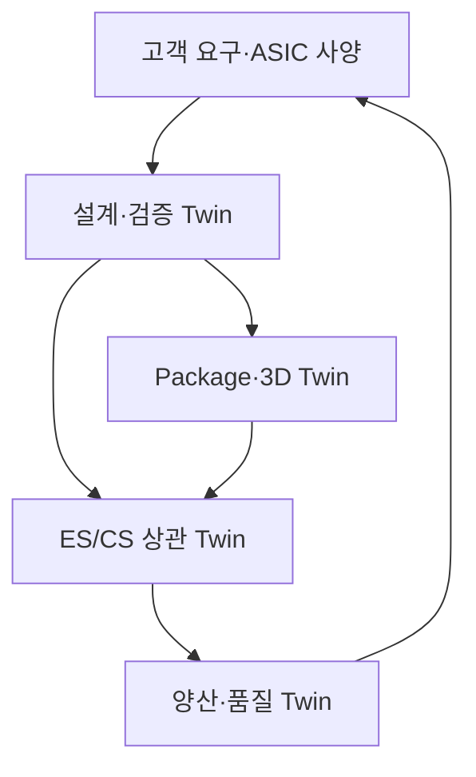
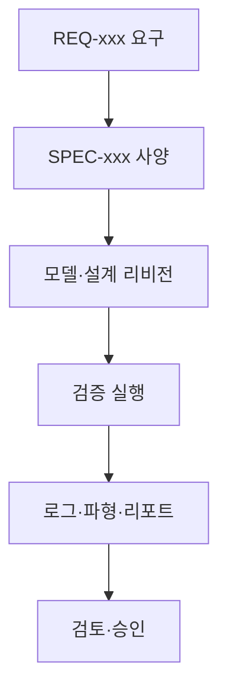
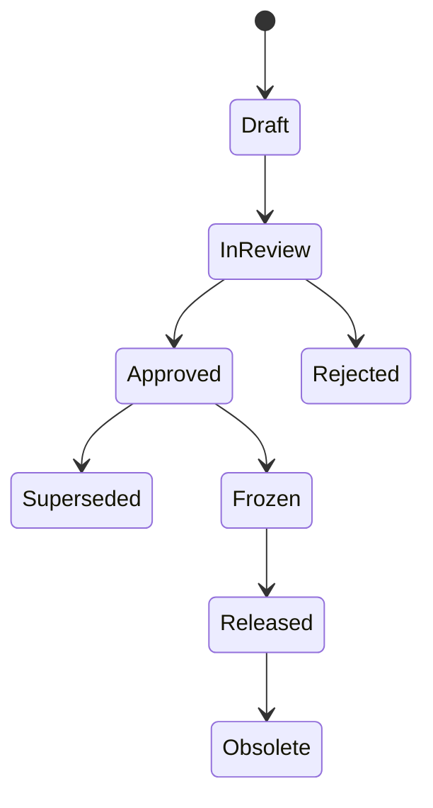

# AgentIC 기반 Alps Alpine ASIC Turnkey Digital Twin 고도화 개발지시서

> 문서 버전: v1.0  
> 작성 기준일: 2026-09-15  
> 대상 저장소: [bkimkr0139-blip/AgentIC](https://github.com/bkimkr0139-blip/AgentIC)  
> 목적: Alps Alpine의 9단계 ASIC 개발·샘플 평가·신뢰성 검증·양산 관리 절차와 센서 ASIC 포트폴리오를 AgentIC에 구현하기 위한 제품·소프트웨어·데이터·검증 지시서

---

## 0. 결론 및 개발 원칙

### 0.1 구현 가능성 판정

**구현 가능하다. 단, 현재 AgentIC를 그대로 확장하는 방식만으로는 생산용 ASIC 플랫폼이 되지 않는다.**

현재 저장소에서 재사용할 수 있는 자산은 다음과 같다.

- RTL→검증→합성→P&R→패키지→회로→PCB→제조 산출물→3D Twin으로 이어지는 27단계 워크플로 UI
- `education`, `prototype`, `manufacturing_review` 3개 모드
- `StageGate`, readiness report, `ResultMeta`, `ConfidenceBadge`
- Yosys, Icarus Verilog, Verilator, ngspice, KiCad CLI, OpenROAD 실행 어댑터의 기본 골격
- 프로젝트별 산출물, 파형, 회로도, PCB, GLB/3D 장면 및 AI Coach UI
- FastAPI, React, SQLAlchemy 기반의 빠른 PoC 구조

그러나 현재 구현은 다음 이유로 **교육·개념검증용 기반**으로 분류해야 한다.

- 데이터 모델이 `User–Mission–Project–EdaJob` 중심이며 ASIC 프로그램, 설계 기준선, 마스크 리비전, 웨이퍼 로트, ES/CS 샘플, 신뢰성 시험, 양산 수율 모델이 없다.
- EDA 도구가 없으면 `educational-mock`으로 대체되며, 일부 결과는 휴리스틱이다.
- `result_confidence=real_verified`는 “해당 도구가 실행되어 파싱됨”을 뜻할 뿐, foundry sign-off 또는 제품 승인과 동일하지 않다.
- 혼합신호·아날로그 설계, PDK/IP 보안, DRC/LVS/PEX, Monte Carlo, 코너 분석, EM/IR, 기능안전, AEC-Q100 증적 관리가 없다.
- 기본 SQLite·로컬 파일 구조와 단순 인증은 고객 설계정보 및 PDK를 다루는 기업 환경에 충분하지 않다.

따라서 제품명을 내부적으로 다음과 같이 구분한다.

| 명칭 | 정의 | 허용 용도 |
|---|---|---|
| AgentIC Education | mock 허용 학습 환경 | 교육·데모 |
| AgentIC Prototype | 실제 오픈소스 도구 중심 PoC | 아키텍처 비교·사전 검증 |
| AgentIC Enterprise Review | 상용/사내 EDA 연동, 증적·승인 중심 | 설계 검토·ES/CS·품질 협업 |
| Foundry Sign-off | foundry 승인 PDK와 정식 sign-off 도구 결과 | 테이프아웃 의사결정 |

**UI에서 Enterprise Review와 Foundry Sign-off를 절대로 같은 상태로 표현하지 않는다.** 최종 테이프아웃, 마스크 발주, 신뢰성 승인, 양산 전환은 반드시 권한을 가진 인간 승인자가 전자서명해야 한다.

### 0.2 최우선 PoC 범위

첫 PoC는 네 제품군 전체가 아니라 **정전용량 센서 AFE/SoC ASIC**을 대상으로 한다.

선정 이유:

1. AgentIC가 이미 디지털 RTL·회로 시뮬레이션·PCB·3D 흐름을 보유한다.
2. 정전용량 센서 IC는 센서 전극, 다채널 AFE, ADC, 보정 알고리즘, MCU/FW, SPI/UART를 한 워크플로에서 보여 줄 수 있다.
3. 기존 AirInput 3D 감지공간 Twin과 연결하면 “손가락/장갑/거리→전극 정전용량→AFE 코드→제스처 판정”의 추적 가능한 시스템 데모가 된다.
4. AEC-Q100 Grade 2 대응 자료 구조를 구축한 뒤 Grade 1·0 제품으로 확장할 수 있다.

2차 템플릿은 **전류 센서 신호조절 IC**, 3차는 **DC 모터 전류·전압 및 리플 검출 IC**, 4차는 **습도·기압·지자기 센서 신호조절 IC** 순서로 개발한다.

---

## 1. 목표 제품 정의

### 1.1 제품 비전

AgentIC를 단순 회로 생성 도구가 아니라 다음 다섯 Twin을 한 기준선 아래 연결하는 **ASIC Development Evidence Platform**으로 고도화한다.

1. **Requirements Twin**: 고객 요구, ASIC 사양, 검증 항목, 시험 결과의 양방향 추적
2. **Design Twin**: 아날로그·디지털·혼합신호 모델과 레이아웃 결과
3. **Package/3D Twin**: die, pad, bond wire/flip-chip, package, PCB, 센서 구조의 공간 모델
4. **Sample Correlation Twin**: pre-silicon 예측과 ES/CS 실측값의 비교 및 모델 보정
5. **Production Quality Twin**: wafer/package/test lot, 수율, 불량 bin, SPC, 변경점의 연계



### 1.2 비목표

이번 고도화만으로 다음을 자동 보장한다고 표현하지 않는다.

- AI가 생성한 회로의 테이프아웃 적합성 자동 승인
- 오픈소스 ngspice/OpenROAD 결과만으로 자동차용 ASIC sign-off 완료
- AEC-Q100 인증 또는 ISO 26262 준수 자동 획득
- 파운드리 PDK·제3자 IP를 외부 LLM에 전송하는 설계 자동화
- 실제 FAB/OSAT/MES를 대체하는 생산 실행 시스템

플랫폼은 **검토, 오케스트레이션, 증적 추적, 상관 분석, 승인 지원**을 담당하며, 정식 sign-off 계산은 승인된 EDA·시험 시스템이 수행한다.

---

## 2. Alps Alpine 9단계와 AgentIC 목표 기능 매핑

| Alps 단계 | 목표 워크스페이스 | 기존 AgentIC 재사용 | 필수 신규 개발 | 완료 게이트 |
|---|---|---|---|---|
| 1. 요구사양 검토 | Requirement Review | `spec_json`, AI Coach | 요구 ID, 출처, 우선순위, 안전등급, 변경 이력, ReqIF/CSV 입출력, trace matrix | 필수 요구 100% 검증 방법 연결, 미해결 충돌 0 |
| 2. ASIC 사양 수립 | Feasibility & Architecture | Stage Guide, 회로/RTL 편집 | 센서/AFE/ADC/보정/인터페이스 블록, FAB process·PDK·package 후보, 리스크·일정·NRE·단가 시나리오 | 아키텍처·공정·패키지·위험 승인 |
| 3. 개발계획 제안·Kick-off | Program Baseline | Project 생성 | WBS, milestone, 비용·단가 범위, RACI, 고객 승인, 기준선 동결 | Baseline 전자서명 |
| 4. ASIC 설계 | Design & Verification | RTL, lint, sim, synth, STA, P&R, 3D | analog/mixed-signal, AMS co-sim, PDK/IP vault, DRC/LVS/PEX, CDC/RDC/formal, corner/Monte Carlo, EM/IR | 계획된 검증 100%, waiver 승인, sign-off evidence 연결 |
| 5. ES 제조·평가 | Engineering Sample | Artifact, waveform | tapeout/mask/die/package/lot/sample 계보, bench data import, correlation dashboard, failure analysis | ES 평가 항목 합격 또는 승인 waiver |
| 6. ASIC 개선 | ECO & Test Program | stage rerun, build log | ECO 영향분석, mask revision, golden baseline, ATE test program 버전·coverage·limit | ECO closure, MP mask·test program 승인 |
| 7. CS·신뢰성 평가 | Commercial Sample & Qualification | readiness report | CS lot, AEC-Q100 시험 매트릭스, stress/read-point, sample size, lab evidence, deviation/CAPA | 필수 qualification 합격 및 품질 승인 |
| 8. 개발 완료 | Release & Evidence Pack | Project summary | 최종 사양·GDS/OASIS hash·mask·test·qualification·PPAP 연계 패키지, 변경 잠금 | 고객/설계/품질 공동 승인 |
| 9. 양산 | Production Quality | manufacturing artifact | foundry/OSAT/test partner, wafer/assembly/test lot, yield/bin/SPC, excursion, PCN/EOL | lot release 규칙 충족, 추적성 100% |

### 2.1 동시공학 구현 규칙

Alps Alpine의 concurrent engineering을 지원하되 “사양 미확정 상태에서 무제한 설계 진행”으로 구현하지 않는다.

- 요구·사양 항목은 `draft`, `provisional`, `approved`, `superseded` 상태를 가진다.
- provisional 사양으로 시작한 설계 결과에는 `assumption_id`가 반드시 연결된다.
- 가정 변경 시 영향받는 model, simulation, layout, test, cost 결과를 `stale`로 전환한다.
- 다음 단계 선행 착수는 허용하되, 테이프아웃 기준선에는 provisional 요구가 남을 수 없다.
- 변경 요청은 자동 영향분석 후 설계·품질·프로그램 책임자의 승인 경로를 탄다.

---

## 3. 목표 사용자와 권한

기존 `student | instructor | admin` 역할을 기업용 도메인 역할로 교체하거나 별도 tenant 모드에서 확장한다.

| 역할 | 주요 권한 |
|---|---|
| Customer Engineer | 요구 등록·검토·승인, 허용된 결과 열람 |
| Program Manager | 일정·비용·기준선·변경·파트너 관리 |
| System Architect | ASIC 사양·블록·인터페이스·검증 전략 승인 |
| Analog Designer | schematic/model/corner/Monte Carlo 결과 관리 |
| Digital Designer | RTL·lint·CDC/RDC·formal·synthesis 결과 관리 |
| Physical Designer | floorplan·P&R·DRC/LVS/PEX·EM/IR 관리 |
| Verification Engineer | test plan·coverage·regression·waiver 관리 |
| Product/Test Engineer | ES/CS 평가, ATE 프로그램, guard band, correlation |
| Quality/Reliability | AEC-Q100 matrix, deviation, CAPA, lot release |
| Partner User | 계약 범위 내 FAB/OSAT/lab 자료 업로드 |
| Approver | 지정 gate 전자서명; 작성자와 승인자 분리 |
| Auditor | 변경 불가 evidence와 감사 로그 열람 |

권한은 tenant, program, product, artifact classification 단위의 RBAC+ABAC로 구현한다. `PDK_RESTRICTED`, `THIRD_PARTY_IP`, `CUSTOMER_CONFIDENTIAL`, `EXPORT_CONTROLLED` 자료는 일반 AI 인덱싱과 브라우저 미리보기에서 제외할 수 있어야 한다.

---

## 4. 정보 구조 및 화면 설계

### 4.1 글로벌 내비게이션

기존 `/missions`, `/projects/:id` 교육 라우트는 유지하고 기업 모드를 다음처럼 추가한다.

```text
/programs
/programs/:programId/overview
/programs/:programId/requirements
/programs/:programId/architecture
/programs/:programId/design
/programs/:programId/verification
/programs/:programId/package-twin
/programs/:programId/samples
/programs/:programId/qualification
/programs/:programId/production
/programs/:programId/evidence
/programs/:programId/changes
/programs/:programId/audit
```

### 4.2 프로그램 Cockpit

한 화면에 다음만 우선 표시한다.

- 현재 Alps 9단계와 병행 중인 상세 작업
- 다음 gate, 책임자, 목표일, blocker
- 요구→검증→증적 coverage
- real/mock/superseded/stale 결과 비율
- PPA·noise·offset·temperature drift·yield·cost 핵심 지표
- ES/CS 상관 오차 및 신뢰성 시험 현황
- 최근 승인, waiver, ECO, lot excursion

### 4.3 Evidence Graph

요구 항목을 클릭하면 다음 연결을 한 화면에서 추적한다.



각 노드는 immutable ID, revision, hash, 생성도구·버전, 입력 snapshot, 실행 환경, 작성자, 승인자를 가진다.

### 4.4 3D Twin 화면

기존 `DigitalTwinPage.tsx`, `Scene3DViewer.tsx`, `Pcb3DViewer.tsx`를 재사용하되 다음 layer를 지원한다.

- die outline, pad ring, macro, standard-cell density, metal layers
- package substrate, lead/bump, bond wire, mold, thermal path
- PCB footprint, 주변 수동부품, 센서 전극/소자
- 선택한 net·pin·requirement·failure의 cross-highlight
- 온도, 전류밀도, 전압강하, 기생성분, 감도, SNR의 scalar field overlay
- design prediction과 ES/CS measurement를 겹쳐 보는 compare mode
- 모든 overlay에 source engine, dataset, timestamp, confidence 표시

3D 형상은 결과를 이해하는 보조 수단이며, 수치 합격 판정은 원본 sign-off report와 연결한다.

---

## 5. 제품 템플릿 상세 지시

### 5.1 Template A — 정전용량 센서 AFE/SoC ASIC

#### 블록 템플릿

- electrode matrix 및 shield/guard
- excitation/charge-transfer 또는 capacitance-to-digital front end
- multiplexer와 multi-channel scan controller
- programmable gain/filter, ADC, baseline tracking
- temperature/environment compensation
- touch/proximity/hover feature extraction
- MCU/DSP 또는 state machine, SRAM/OTP/NVM abstraction
- SPI/UART 및 필요 시 I2C option
- clock/reset/power management, diagnostic, test mode

#### 시뮬레이션 시나리오

- 손가락 거리, 면적, 유전율, 장갑 두께, 수분, 온도, 전극 공차 sweep
- channel-to-channel mismatch, parasitic capacitance, noise injection
- scan rate, latency, SNR, false positive/negative, power trade-off
- analog front-end SPICE + digital control RTL co-simulation
- sensor geometry/field solver 결과를 compact model parameter로 연결
- AirInput Twin의 3D 손가락 궤적을 시간축 capacitance stimulus로 변환

#### 합격 지표 예시

- 입력 범위, LSB/ENOB, noise floor, channel count, scan rate
- hover distance별 detection probability
- glove/environment corner별 오검출률
- 전력, wake-up latency, interface timing
- AEC-Q100 Grade 2 목표 온도 범위와 시험계획 연결

수치는 제품 사양에서 불러오며 플랫폼에 임의 기본 합격값을 하드코딩하지 않는다.

### 5.2 Template B — 전류 센서 신호조절 ASIC

#### 공통 블록

- GMR sensor element behavioral model
- sensor bias/activation
- low-noise amplifier, offset cancellation
- temperature compensation 및 trim
- output clamp, diagnostic, fail-safe
- analog output path 및 필요 시 digital trim interface

#### Magnetic proportional형

- current→magnetic field→GMR response→amplifier→analog output transfer chain
- linearity, offset, sensitivity, bandwidth, noise, temperature drift sweep

#### Magnetic balanced형

- feedback coil/driver와 closed-loop control model
- loop stability, response time, saturation, fault injection

#### 검증

- 자동차 inverter/BMS current profile replay
- power supply variation, external magnetic disturbance, sensor displacement
- clamp/fail-safe fault campaign 및 diagnostic coverage
- AEC-Q100 Grade 0 목표 시험 matrix 연결

### 5.3 Template C — DC Motor 전류·전압 및 리플 검출 ASIC

#### 블록 템플릿

- −10~+60 V 입력 보호·level shift 모델
- motor terminal voltage sensing
- current ripple signal extraction, filtering, comparator/pulse generation
- UART/single-wire serial interface
- power/reset/diagnostic/protection

#### Digital Twin 시나리오

- motor electrical/mechanical plant + wiring harness + ASIC behavioral model
- speed/load/commutation/PWM/temperature 변화
- ripple pulse와 실제 motor position/speed의 상관
- over/under-voltage, reverse/negative transient, open/short fault injection
- AEC-Q100 Grade 1 목표 시험 matrix 연결

### 5.4 Template D — 습도·기압·지자기 센서 신호조절 ASIC

#### 블록 템플릿

- sensor activation/bias
- analog amplifier/filter
- ADC
- calibration/temperature compensation
- digital calculation and memory
- I2C/SPI output

#### 검증 시나리오

- sensor element model과 ASIC corner의 조합 sweep
- offset/gain/nonlinearity/hysteresis/drift/noise
- calibration coefficient quantization과 memory fault
- interface protocol regression 및 power-mode transition
- pre-silicon response와 chamber/bench ES data correlation

---

## 6. 혼합신호·EDA 실행 아키텍처

### 6.1 Runner Contract 재설계

기존 `apps/api/app/services/eda/runners.py`의 공통 결과 shape를 확장하되 mock 함수와 실제 실행기를 분리한다.

```python
class ToolRunResult(BaseModel):
    run_id: UUID
    engine: str
    engine_version: str
    adapter_version: str
    execution_mode: Literal["sandbox", "on_prem_worker", "vendor_cloud"]
    inputs: list[ArtifactRef]
    outputs: list[ArtifactRef]
    command_manifest_ref: str
    environment_digest: str
    exit_code: int
    parser_status: Literal["ok", "partial", "failed"]
    result_confidence: Literal[
        "mock_only", "educational_estimate", "tool_generated",
        "independently_checked", "signoff_candidate", "approved_evidence"
    ]
    limitations: list[str]
    metrics: dict[str, float | int | str]
```

#### 필수 규칙

1. `education`에서만 mock fallback을 자동 허용한다.
2. `prototype`에서 fallback은 사용자가 명시적으로 허용하고 결과에 워터마크를 표시한다.
3. `enterprise_review`에서는 필수 도구 부재 시 **fail closed**한다.
4. `real_verified` 명칭은 모호하므로 `tool_generated` 또는 `independently_checked`로 세분화한다.
5. `approved_evidence`는 도구가 아니라 승인 workflow만 부여한다.
6. stdout/stderr, command manifest, tool version, license server alias, container/worker digest, input/output hash를 보존한다.
7. 라이선스 토큰, 실제 서버 주소, PDK 경로는 로그에서 마스킹한다.

### 6.2 어댑터 계층

```text
services/tool_adapters/
  base.py
  registry.py
  digital/
    verilator.py
    iverilog.py
    yosys.py
    openroad.py
  circuit/
    ngspice.py
    xyce.py
  commercial/
    command_proxy.py
    result_ingestors/
      ams.py
      drc_lvs.py
      pex.py
      em_ir.py
  lab/
    csv_import.py
    instrument_gateway.py
  manufacturing/
    foundry_adapter.py
    osat_adapter.py
    ate_adapter.py
```

상용 EDA는 웹 API 서버에서 직접 shell 실행하지 않는다. 방화벽 내부의 worker agent가 signed job manifest를 가져가 실행하고, 허용된 요약과 암호화된 artifact만 반환한다.

### 6.3 필요한 검증 클래스

| 도메인 | 실행/수집 대상 | PoC 허용 | 최종 승인 조건 |
|---|---|---|---|
| Digital RTL | lint, simulation, coverage, CDC/RDC, formal | 오픈소스+상용 adapter | 승인 도구와 plan coverage |
| Analog | DC/AC/transient/noise, corner, Monte Carlo | ngspice/Xyce | 승인 PDK·모델·도구 결과 |
| Mixed-signal | analog+RTL co-simulation | reduced model 가능 | 승인 AMS flow와 regression |
| Physical | synth, STA, P&R, DRC/LVS/PEX | Yosys/OpenROAD 데모 | foundry deck와 sign-off report |
| Power/Reliability | EM/IR, thermal, aging, ESD collateral | 결과 ingest 우선 | 담당자 승인 evidence |
| Package/Board | SI/PI/thermal/mechanical | simplified model | 승인 solver와 시험 상관 |
| Test | DFT, scan/MBIST, fault coverage, ATE | parser/metadata PoC | 승인 test program과 correlation |

### 6.4 PDK 및 IP 보안

- PDK/IP 파일은 object storage 일반 bucket, 브라우저, LLM prompt, vector DB에 저장하지 않는다.
- metadata catalog에는 `pdk_id`, foundry, node, revision, access policy, checksum alias만 저장한다.
- 실행 worker에 짧은 수명의 권한을 부여하고 종료 후 workspace를 폐기한다.
- AI는 PDK 원문 대신 승인된 design rule summary 또는 비식별 metric만 사용한다.
- 모든 다운로드·실행·결과 반출은 audit event를 남긴다.
- 고객 tenant 간 artifact·embedding·cache를 완전 분리한다.

---

## 7. 핵심 데이터 모델

기존 `Project`는 교육 프로젝트로 유지한다. 기업용은 별도 aggregate로 추가하여 마이그레이션 위험을 줄인다.

### 7.1 신규 엔터티

| 엔터티 | 필수 필드 |
|---|---|
| `Tenant` | id, name, region, retention_policy |
| `AsicProgram` | id, tenant_id, code, product_family, customer, lifecycle_stage, owner_id |
| `ProductVariant` | program_id, name, target_application, safety_level, temp_grade |
| `DesignRevision` | variant_id, revision, parent_revision_id, status, baseline_hash |
| `Requirement` | req_key, source, text, category, priority, status, verification_method |
| `TraceLink` | source_type/id, target_type/id, link_type, rationale |
| `ArchitectureBlock` | revision_id, block_type, interfaces, model_refs |
| `ProcessPackageOption` | foundry_alias, process_id, package_id, risk, lead_time_range, cost_range |
| `VerificationPlanItem` | req_id, method, environment, coverage_target, owner |
| `ToolRun` | engine/version, inputs, outputs, environment_digest, confidence |
| `ArtifactVersion` | classification, uri, sha256, size, mime, immutable, supersedes_id |
| `GateDecision` | gate, decision, conditions, approver, signed_at, evidence_set_id |
| `ChangeRequest` | reason, affected_baseline, impact_json, status, approvals |
| `TapeoutRelease` | revision_id, gds_ref, netlist_ref, reports, release_status |
| `MaskSetRevision` | tapeout_id, mask_revision, reason, supplier_ref |
| `WaferLot` | foundry_ref, wafer_count, process, start/end, genealogy |
| `AssemblyLot` | wafer_lot_ids, osat_ref, package, lot_status |
| `Sample` | lot_id, sample_type(ES/CS), unit_id, coordinates, disposition |
| `MeasurementDataset` | sample_ids, setup, conditions, schema, raw_ref, normalized_ref |
| `CorrelationRun` | prediction_ref, measurement_ref, metrics, model_revision |
| `TestProgramRevision` | platform, revision, limits, coverage, binary_hash, approval |
| `QualificationPlan` | target_grade, tests, lot/sample rules, labs |
| `QualificationResult` | test_id, condition, result, failures, evidence, disposition |
| `FailureCase` | sample/lot, symptom, analysis, root_cause, corrective_action |
| `ProductionLot` | supplier lots, test_program, yield, status, release_decision |
| `YieldSnapshot` | lot_id, wafer_map_ref, bin_counts, key params, timestamp |
| `PartnerExchange` | partner, package manifest, direction, receipt, validation |

### 7.2 상태 머신



산출물 자체의 상태와 gate 상태를 분리한다. 예를 들어 simulation report가 `Approved`여도 ASIC 프로그램은 ES gate 전일 수 있다.

### 7.3 데이터베이스·저장소 전환

- 로컬 개발: SQLite 유지 가능
- 공유 PoC 이상: PostgreSQL + Alembic 필수
- artifact: S3 호환 object storage, versioning, object lock 선택
- raw measurement: Parquet 우선, 스키마 registry 적용
- workflow: FastAPI process 밖의 durable queue/worker 사용
- 검색: 승인된 metadata와 비제한 문서만 index
- 모든 timestamp는 UTC 저장, UI에서 현지시간 변환

---

## 8. API 개발 지시

API는 `/api/v2`로 추가한다. 기존 교육 API의 breaking change를 피한다.

### 8.1 Program·Requirement

```http
POST   /api/v2/programs
GET    /api/v2/programs/{program_id}
POST   /api/v2/programs/{program_id}/variants
POST   /api/v2/revisions/{revision_id}/requirements:import
GET    /api/v2/revisions/{revision_id}/trace-matrix
POST   /api/v2/requirements/{requirement_id}/links
POST   /api/v2/revisions/{revision_id}/baseline
```

### 8.2 실행·증적

```http
POST   /api/v2/revisions/{revision_id}/runs
GET    /api/v2/runs/{run_id}
POST   /api/v2/runs/{run_id}/cancel
POST   /api/v2/runs/{run_id}/artifacts:complete
GET    /api/v2/artifacts/{artifact_id}/provenance
POST   /api/v2/gates/{gate_id}/decisions
GET    /api/v2/revisions/{revision_id}/readiness
```

### 8.3 Sample·Qualification·Production

```http
POST   /api/v2/lots:import
POST   /api/v2/samples:import
POST   /api/v2/measurements:upload-session
POST   /api/v2/correlations
POST   /api/v2/qualification-plans
POST   /api/v2/qualification-results:import
POST   /api/v2/test-programs
POST   /api/v2/production-lots/{lot_id}/release-decisions
GET    /api/v2/programs/{program_id}/quality-dashboard
```

### 8.4 Idempotency와 동시성

- 모든 생성/외부 import 요청에 `Idempotency-Key`를 지원한다.
- entity update는 `revision` 또는 ETag 기반 optimistic locking을 적용한다.
- gate 승인 대상 evidence set은 hash로 고정하고 승인 후 변경을 금지한다.
- 취소된 run의 늦은 callback은 상태를 되돌리지 못한다.

---

## 9. AI 기능 고도화

### 9.1 AI Agent 목록

| Agent | 입력 | 출력 | 자동 실행 한계 |
|---|---|---|---|
| Requirements Analyst | 고객 문서·회의 요약 | 요구 후보, 모순, 누락, 질문 | 원문 인용과 사용자 승인 필수 |
| Feasibility/Risk Agent | 사양·공정·패키지 후보 | 위험 register, trade-off | 비용·일정은 범위와 근거 표시 |
| Architecture Agent | 요구·template·model catalog | 블록 후보, interface, verification plan 초안 | 회로/사양 자동 승인 금지 |
| Verification Agent | requirement·test·coverage | coverage gap, regression 추천 | pass/fail 원본 변경 금지 |
| Review Agent | schematic/layout/report | 체크리스트, anomaly, 관련 증적 | waiver 발행 금지 |
| Correlation Agent | pre-silicon·ES/CS data | residual, outlier, model tuning 후보 | raw data 삭제·수정 금지 |
| Reliability Agent | qualification plan/result | 누락 시험, failure cluster, CAPA 초안 | AEC 판정 자동 승인 금지 |
| Yield Agent | wafer/bin/parametric data | excursion, spatial pattern, limit 검토 | lot disposition 자동 실행 금지 |
| Evidence Pack Agent | 승인된 artifact | 고객/품질용 index와 요약 | 미승인 자료 포함 금지 |

### 9.2 AI 안전 규칙

1. 모든 답변은 사용한 requirement, artifact, run ID를 citation으로 제공한다.
2. 데이터가 없으면 추정값을 사실처럼 만들지 않고 `insufficient_evidence`를 반환한다.
3. AI가 제안한 변경은 diff/patch로만 제공하며 인간 승인을 거쳐 적용한다.
4. 승인, waiver, mask release, lot release API는 AI service account에 부여하지 않는다.
5. 고객·PDK·IP 분류 정책을 prompt 조립 전에 적용한다.
6. 외부 모델 사용 여부, 모델명, region, retention 조건을 프로젝트 정책에 기록한다.
7. 모델 응답과 prompt metadata는 민감정보를 마스킹해 audit에 남긴다.
8. AI 품질 평가는 정확도뿐 아니라 traceability, unsupported claim rate, unsafe action rate로 측정한다.

### 9.3 AI 기반 3D Twin 고도화

- 자연어로 3D 형상을 “생성”하는 기능보다, 승인된 CAD/EDA 형상을 자동 조립·정렬하는 기능을 우선한다.
- AI는 layer 분류, net/requirement 연결, outlier hotspot 설명, camera preset 생성에 사용한다.
- 실제 치수와 clearance는 STEP/ODB++/GDS/package data에서 가져오며 생성형 모델의 mesh를 제조 기준으로 사용하지 않는다.
- ES/CS 실측으로 파라미터를 보정할 때 원본 모델과 calibrated model을 별도 revision으로 보존한다.

---

## 10. Gate 및 Readiness 재설계

기존 `services/readiness.py`의 점수형 gate를 evidence 기반 rule engine으로 교체한다.

### 10.1 Gate 결과 스키마

```json
{
  "gate_id": "G4_DESIGN_RELEASE",
  "status": "blocked",
  "policy_version": "alps-asic-v1.0",
  "evaluated_at": "2026-09-15T00:00:00Z",
  "checks": [
    {
      "check_id": "REQ_TRACE_COVERAGE",
      "status": "pass",
      "actual": 1.0,
      "target": 1.0,
      "evidence_refs": ["artifact:123", "run:456"]
    },
    {
      "check_id": "MOCK_RESULT_PRESENT",
      "status": "fail",
      "actual": 2,
      "target": 0,
      "blocking_refs": ["run:777", "run:778"]
    }
  ],
  "decision_required": true
}
```

### 10.2 공통 blocker

- 활성 baseline에 mock/educational result 존재
- 필수 requirement가 verification item 또는 evidence에 연결되지 않음
- 결과 입력 revision과 현재 baseline 불일치
- 승인 도구 version/PDK revision 불일치
- unresolved high-severity defect 또는 만료된 waiver
- artifact hash 검증 실패
- 승인자와 작성자가 동일하여 segregation-of-duties 위반
- ES/CS sample genealogy 누락
- qualification test의 lot/sample 조건 미충족

### 10.3 Readiness 레벨

| 레벨 | 의미 |
|---|---|
| `education_only` | mock 또는 예제 데이터 포함 |
| `prototype_evidence` | 실제 도구 결과이나 승인 PDK/sign-off 아님 |
| `engineering_review_ready` | 정해진 검토 evidence 충족 |
| `signoff_candidate` | 승인 도구/PDK 결과와 검토 완료, 최종 승인 대기 |
| `released` | 지정 승인자의 전자서명 완료 |

---

## 11. ES/CS Sample Correlation Twin

### 11.1 데이터 수집

CSV 업로드만 지원하지 말고 schema mapping과 단위 검증을 포함한다.

- sample ID, wafer/lot/package genealogy
- test setup, instrument ID, calibration date
- voltage, temperature, humidity, field/current/load 등 조건
- firmware/test program revision
- measured parameter, unit, limit, pass/fail
- raw waveform 또는 trace artifact

### 11.2 상관 분석

각 parameter에 대해 다음을 계산하고 시각화한다.

- prediction vs measurement scatter
- bias, MAE/RMSE, max error, R²(적합한 경우)
- temperature/voltage/process corner별 residual
- wafer map/package site별 공간 pattern
- ES→ECO→CS 개선 전후 비교
- model parameter tuning 후보와 신뢰구간

상관 기준은 parameter별 verification plan에 정의한다. AI가 임의 threshold를 정하지 않는다.

### 11.3 Failure Analysis

FailureCase는 증상→재현 조건→관련 requirement/design/run→물리/전기 분석→root cause→ECO/CAPA→재검증의 링크를 가진다. 동일 증상 clustering은 AI가 제안할 수 있지만 병합·종결은 품질 담당자가 승인한다.

---

## 12. AEC-Q100 및 신뢰성 관리

플랫폼은 AEC-Q100 시험을 “체크박스 목록”으로 하드코딩하지 않는다. 회사가 보유한 최신 승인 문서와 고객별 요구를 versioned policy/template로 등록한다.

필수 기능:

- product template별 목표 Grade 및 application profile
- test group, method, condition, duration/cycles, read point
- 요구 lot 수, sample 수, 허용 failure 수
- preconditioning, sequence dependency, re-use 제한
- 시험소, 장비, calibration, raw evidence
- fail/deviation/waiver/CAPA와 재시험 이력
- 시험계획 revision이 바뀔 때 기존 결과의 적용 가능성 재평가
- Grade 0/1/2 제품의 template 분리

자동차용 기능안전 대상이면 safety requirement, safety mechanism, diagnostic coverage, fault campaign, confirmation measure를 별도 domain으로 연계한다. AEC-Q100 합격과 기능안전 준수를 동일시하지 않는다.

---

## 13. 생산·품질 Twin

AgentIC는 MES를 대체하지 않고 최소 read-only/event integration으로 시작한다.

### 13.1 수집 항목

- foundry wafer lot/wafer ID, process revision, hold/release
- OSAT assembly lot, package material/process, rework
- wafer sort/final test program revision
- yield, bin distribution, key parametric statistics
- sample/qualification/return failure link
- deviation, excursion, MRB disposition, CAPA
- PCN, mask/test limit 변경, effective lot

### 13.2 품질 대시보드

- lot/wafer/site별 yield trend
- test bin Pareto
- parameter control chart와 rule violation
- 공정/마스크/test program revision 전후 비교
- 설계 corner prediction과 양산 분포 비교
- 이상 lot에서 관련 ECO, supplier, equipment metadata drill-down

AI anomaly는 알림 후보이며 lot hold를 자동 실행하지 않는다. hold/release는 외부 QMS/MES 또는 승인 workflow에서 수행한다.

---

## 14. 백엔드·인프라 변경 지시

### 14.1 권장 디렉터리

```text
apps/api/app/
  domains/
    programs/
    requirements/
    design/
    verification/
    samples/
    qualification/
    production/
    evidence/
  services/
    workflows/
    tool_adapters/
    artifact_store/
    policy_engine/
    ai_guardrails/
  workers/
  migrations/
```

### 14.2 필수 인프라

- PostgreSQL: transactional metadata와 JSONB
- S3-compatible storage: immutable artifact/versioning
- Redis 또는 broker: queue transport; durable workflow engine 또는 명시적 state machine
- isolated worker pools: digital, analog/AMS, physical, lab import
- OIDC/SAML SSO, MFA, SCIM 선택
- KMS/Vault: secrets와 signing keys
- OpenTelemetry 기반 trace/log/metric
- policy-as-code: gate, export, retention, AI access

Kubernetes는 첫 PoC의 필수조건이 아니다. 단일 온프레미스 배포에서도 API와 EDA worker는 프로세스·권한·파일시스템을 분리한다.

### 14.3 보안 금지사항

- Quick Tunnel을 고객/PDK 데이터 환경에 사용 금지
- 원본 EDA command에 사용자 문자열을 직접 삽입 금지
- artifact 경로를 클라이언트 입력으로 직접 신뢰 금지
- PDK·IP·netlist를 일반 애플리케이션 로그에 기록 금지
- SHA-256만으로 사용자 암호 저장 금지; 기업 SSO 또는 검증된 password hashing 사용
- 승인된 evidence 파일을 같은 key로 덮어쓰기 금지

---

## 15. 프런트엔드 변경 지시

### 15.1 재사용 대상

- `TopNav.tsx`: enterprise program context 추가
- `StageRoadmap.tsx`: 27단계를 Alps 9단계 아래 접는 2-level roadmap으로 확장
- `StageDetailPanel.tsx`, `StageGuideCard.tsx`: evidence/gate 탭 추가
- `ConfidenceBadge.tsx`: provenance와 승인 수준 표시
- `StaleBanner.tsx`: 변경 영향 및 rerun 목록 표시
- `DigitalTwinPage.tsx`, `Scene3DViewer.tsx`: die/package/sensor overlay 확장
- `LiveCircuitViewer.tsx`: analog value, bus, sensor stimulus 표시
- `ProjectSummaryPage.tsx`: release evidence pack 화면의 토대

### 15.2 신규 컴포넌트

```text
apps/web/src/enterprise/
  ProgramCockpitPage.tsx
  RequirementsMatrixPage.tsx
  ArchitectureWorkbenchPage.tsx
  VerificationMatrixPage.tsx
  EvidenceGraph.tsx
  GateDecisionPanel.tsx
  RevisionComparePanel.tsx
  SampleExplorerPage.tsx
  CorrelationDashboard.tsx
  QualificationMatrixPage.tsx
  YieldDashboardPage.tsx
  ArtifactProvenanceDrawer.tsx
  PolicyViolationBanner.tsx
```

### 15.3 UX 규칙

- 모든 결과 카드 상단에 engine/version, input revision, timestamp, confidence, approval 상태 표시
- `mock`, `stale`, `superseded` 결과는 색상뿐 아니라 아이콘·문구·워터마크로 구분
- 승인 버튼은 영향과 evidence hash를 확인한 뒤에만 활성화
- 긴 EDA 작업은 브라우저 연결이 끊겨도 계속되며 재접속 시 상태 복구
- 수치에는 단위와 조건을 항상 표시
- 3D 객체 클릭 시 연결된 requirement, net, simulation, sample measurement를 동일 selection context로 제공
- 일본어·영어·한국어 UI를 i18n key로 분리하고 기술 용어 glossary 제공

---

## 16. 기존 파일별 변경 지시

| 현재 파일 | 변경 내용 |
|---|---|
| `apps/api/app/models.py` | 교육 모델은 유지. 기업 모델을 `domains/*/models.py`로 분리하고 Alembic 도입 |
| `apps/api/app/config.py` | OIDC, object storage, queue, KMS, worker, data-classification 설정 추가; production validation |
| `apps/api/app/db.py` | runtime `ALTER TABLE` 제거 방향, Alembic revision만 허용 |
| `apps/api/app/services/result_meta.py` | confidence·approval·provenance 분리, `approved_evidence`는 workflow만 발급 |
| `apps/api/app/services/readiness.py` | 27단계 휴리스틱 점수에서 versioned evidence policy engine으로 교체 |
| `apps/api/app/services/eda/runners.py` | mock/real 혼재 제거, adapter registry와 isolated job으로 이동 |
| `apps/api/app/services/eda/external.py` | subprocess allowlist, resource limits, manifest signing, worker 이동 |
| `apps/api/app/services/ecad/circuit_sim.py` | analog/mixed-signal job spec, corners, Monte Carlo, unit/schema 추가 |
| `apps/api/app/services/ecad/pcb_3d.py` | package/die/sensor layer 및 result overlay 추가 |
| `apps/api/app/services/ai/*` | data policy, citation, tool permission, human approval guardrail 추가 |
| `apps/web/src/main.tsx` | `/programs/*` enterprise route와 권한 guard 추가 |
| `apps/web/src/pages/DigitalTwinPage.tsx` | five-twin navigation 및 measurement comparison 추가 |
| `apps/web/src/components/ConfidenceBadge.tsx` | tool result와 approval 상태를 서로 다른 badge로 표시 |
| `apps/web/src/components/StageRoadmap.tsx` | Alps 9단계/27세부단계 2단 구조와 병렬 진행 표시 |

---

## 17. 단계별 개발 로드맵

기간은 팀 구성과 상용 EDA·PDK 접근성에 따라 조정하며, 아래는 순서와 exit criteria를 정의한다.

### Phase 0 — 용어·경계 정비 (2주)

- 제품 모드 및 `signoff` 용어 정정
- mock fail-closed 정책
- threat model, data classification, PoC 제품 선정
- Alps 9단계와 내부 gate policy 초안

**Exit:** 모든 화면에서 교육 추정과 승인 evidence가 구분되고, enterprise mode에서 mock gate 통과가 불가능하다.

### Phase 1 — Enterprise Core (4~6주)

- Tenant/Program/Variant/Revision/Requirement/Trace/Gate/Artifact 모델
- PostgreSQL, Alembic, object storage, OIDC, audit
- Program Cockpit, Requirements Matrix, Evidence Graph
- durable job lifecycle

**Exit:** 요구→검증→artifact→승인의 end-to-end trace와 immutable baseline이 동작한다.

### Phase 2 — Capacitive AFE/SoC Vertical Slice (6~8주)

- 제품 template와 behavioral sensor model
- analog SPICE + digital RTL orchestration
- AirInput 3D trajectory→capacitance stimulus bridge
- corner sweep와 결과 overlay
- architecture/verification plan AI 초안

**Exit:** 하나의 요구 변경이 AMS 결과와 3D Twin을 stale 처리하고 재실행 후 trace가 복구된다.

### Phase 3 — ES/CS Correlation (6~8주)

- lot/sample genealogy, measurement import, schema/unit validation
- prediction-vs-measurement correlation
- failure case, ECO, model calibration
- ES→ECO→CS revision compare

**Exit:** blind fixture dataset으로 재현 가능한 correlation report와 승인 이력이 생성된다.

### Phase 4 — Qualification & Test (6~10주)

- versioned AEC-Q100 policy template
- qualification matrix, lab evidence, deviation/CAPA
- ATE test program revision, limits, coverage, sample correlation
- current sensor Grade 0 / motor IC Grade 1 templates

**Exit:** 목표 Grade에 따른 필수 증적 누락이 gate blocker로 정확히 작동한다.

### Phase 5 — Production Quality Integration (8~12주)

- foundry/OSAT/test partner import adapter
- yield/bin/SPC dashboard, excursion workflow
- lot release decision integration
- retention, disaster recovery, performance hardening

**Exit:** synthetic 또는 승인된 비식별 생산 dataset으로 lot genealogy·yield anomaly·ECO 영향 추적을 시연한다.

### Phase 6 — Enterprise Validation

- 보안·침투·권한·감사 시험
- 대용량 regression 및 artifact 부하 시험
- 승인 EDA 결과 parser validation
- SOP, 운영 runbook, backup/restore, incident drill
- 일본 본사 PoC acceptance와 확장 의사결정

---

## 18. 테스트 전략과 인수 기준

### 18.1 자동 테스트

- unit: policy rule, unit conversion, parser, state transition
- contract: 각 EDA/lab/partner adapter의 golden fixture
- integration: requirement→run→artifact→gate→approval
- E2E: 네 제품 template의 대표 시나리오
- security: tenant isolation, IDOR, command injection, path traversal, malicious archive, SSRF
- resilience: worker loss, retry, duplicate callback, object store failure, DB failover
- performance: 1만 requirements, 10만 artifacts, 대형 waveform/measurement lazy loading

### 18.2 Golden Dataset

원본 고객/PDK 데이터 대신 합법적으로 사용 가능한 synthetic reference를 만든다.

- 정전용량 16-channel AFE + 간단한 scan RTL
- GMR proportional/balanced behavioral model
- motor ripple input waveform
- humidity/pressure/geomagnetic sensor transfer function
- 각 template의 passing/failing corners
- ES/CS measurement mock은 반드시 `synthetic_fixture`로 표시

### 18.3 필수 인수 기준

1. enterprise mode에서 필수 실행기가 없으면 mock으로 넘어가지 않고 차단된다.
2. 모든 수치 결과가 input revision, tool/version, condition, unit, artifact hash에 연결된다.
3. requirement 1건의 변경 시 영향받는 run/evidence/gate가 5초 내 stale 표시된다.
4. 승인된 evidence는 원본 수정·덮어쓰기가 불가능하고 새 revision만 생성된다.
5. ES/CS raw data와 정규화 data가 분리 보존되고 변환 lineage를 추적할 수 있다.
6. AEC-Q100 template version 변경 시 기존 qualification의 재평가 항목이 표시된다.
7. 3D Twin의 hotspot을 클릭하면 원본 report metric과 sample measurement로 이동한다.
8. tenant A 사용자는 tenant B의 metadata·artifact·AI context에 접근할 수 없다.
9. AI 응답은 근거 ID를 제시하며 근거 없는 pass/fail 또는 승인 결정을 생성하지 않는다.
10. gate 승인에는 권한, 역할분리, 고정 evidence hash, 전자서명, 감사 로그가 적용된다.
11. long-running EDA job은 API 재시작·브라우저 종료 후에도 복구된다.
12. 기존 교육용 27단계 미션과 테스트는 회귀 없이 유지된다.

### 18.4 PoC 데모 시나리오

1. 고객이 “장갑 착용, 지정 거리에서 hover 검출” 요구를 등록한다.
2. AI가 관련 AFE/ADC/scan/algorithm 사양과 검증 누락을 제안한다.
3. 설계자는 승인된 template로 analog+digital simulation을 실행한다.
4. AirInput 3D 궤적이 capacitance stimulus와 ADC code, gesture state로 연결된다.
5. 온도·장갑 두께 corner에서 SNR requirement 미달이 검출된다.
6. gain/scan parameter ECO 후 영향받는 evidence가 재생성된다.
7. synthetic ES measurement를 가져와 simulation bias를 상관 분석한다.
8. calibrated model revision으로 CS prediction을 생성한다.
9. Grade 2 qualification matrix와 미완료 항목이 gate에 표시된다.
10. 승인자는 evidence pack hash를 검토하고 조건부 gate 결정을 내린다.

---

## 19. KPI

PoC 이전에 baseline을 먼저 측정하고 이후 개선율을 계산한다. 근거 없는 고정 절감률을 제안서에 넣지 않는다.

| 영역 | KPI |
|---|---|
| 요구 품질 | ambiguous requirement rate, trace coverage, change impact 누락률 |
| 개발 속도 | gate별 cycle time, rerun lead time, 승인 대기시간 |
| 검증 | planned test coverage, first-pass rate, stale evidence aging |
| 상관 | parameter별 prediction error, outlier closure time |
| 품질 | ES→CS defect escape, qualification closure time, repeat failure rate |
| 양산 | yield, bin Pareto 변화, excursion detection-to-disposition time |
| AI | citation coverage, unsupported claim rate, accepted suggestion rate, unsafe action rate |
| 플랫폼 | job success/retry, artifact integrity, audit completeness, tenant isolation incidents |

PoC 성공 조건은 “AI가 회로를 자동 생성했다”가 아니라 다음 세 가지로 정의한다.

- 변경 영향과 증적 추적 시간이 실제로 줄었는가
- pre-silicon과 ES/CS의 불일치를 더 일찍 발견했는가
- gate 결정에 필요한 근거가 한 화면에서 재현 가능한가

---

## 20. 개발팀 실행 체크리스트

### P0 — 즉시

- [ ] Enterprise mode에서 mock fallback 차단
- [ ] `real_verified`를 tool execution과 approval로 분리
- [ ] Alps 9단계 상위 roadmap과 gate ID 정의
- [ ] Program/Revision/Requirement/Trace/Artifact/Gate schema 구현
- [ ] PostgreSQL·Alembic·object storage·OIDC·audit 적용
- [ ] command execution을 isolated worker로 이동
- [ ] PDK/IP/고객 데이터 분류·AI 차단 정책 구현

### P1 — 정전용량 ASIC Vertical Slice

- [ ] capacitive AFE/SoC block template
- [ ] SPICE/RTL 공동 job graph
- [ ] AirInput 3D trajectory stimulus bridge
- [ ] corner sweep·SNR·latency 결과 dashboard
- [ ] 요구→모델→run→artifact trace
- [ ] sample import·correlation·calibrated model revision

### P2 — 자동차용 확장

- [ ] GMR current sensor proportional/balanced template
- [ ] motor ripple IC 및 −10~+60 V 시나리오
- [ ] fault injection과 fail-safe evidence
- [ ] AEC-Q100 Grade 0/1/2 versioned qualification template
- [ ] test program revision 및 guard-band workflow

### P3 — 생산 연계

- [ ] foundry/OSAT/ATE import contract
- [ ] wafer/assembly/test lot genealogy
- [ ] yield/bin/SPC dashboard
- [ ] deviation/excursion/CAPA workflow
- [ ] release evidence pack과 retention/restore 검증

---

## 21. 제안 시 핵심 메시지

알프스알파인 본사에는 다음처럼 설명한다.

> AgentIC 고도화안은 기존 MBD와 concurrent engineering을 대체하는 새 EDA가 아닙니다. 고객 요구, 시스템 모델, 아날로그·디지털 설계 검증, 3D package/sensor Twin, ES/CS 실측, AEC-Q100 증적, 양산 품질 데이터를 하나의 변경 추적 가능한 기준선으로 연결하는 개발 의사결정 플랫폼입니다. AI는 사양 누락·검증 공백·상관 이상을 조기에 찾아 제안하지만, sign-off와 품질 승인은 원본 증적을 근거로 담당자가 수행합니다.

첫 시연은 정전용량 센서 AFE/SoC와 AirInput 3D 감지공간 Twin을 연결한다. 이후 전류 센서, 모터 리플 검출, 환경·지자기 센서 ASIC으로 템플릿을 확장한다.

---

## 22. 참조한 현재 AgentIC 구현

본 지시서는 저장소의 다음 구현을 기준으로 작성했다.

- [AgentIC README](https://github.com/bkimkr0139-blip/AgentIC/blob/main/README.md)
- [현재 데이터 모델](https://github.com/bkimkr0139-blip/AgentIC/blob/main/apps/api/app/models.py)
- [EDA runner](https://github.com/bkimkr0139-blip/AgentIC/blob/main/apps/api/app/services/eda/runners.py)
- [ResultMeta](https://github.com/bkimkr0139-blip/AgentIC/blob/main/apps/api/app/services/result_meta.py)
- [Readiness](https://github.com/bkimkr0139-blip/AgentIC/blob/main/apps/api/app/services/readiness.py)
- [API 설정](https://github.com/bkimkr0139-blip/AgentIC/blob/main/apps/api/app/config.py)
- [Web route](https://github.com/bkimkr0139-blip/AgentIC/blob/main/apps/web/src/main.tsx)
- [기존 PCB·Digital Twin 고도화 지시서](https://github.com/bkimkr0139-blip/AgentIC/blob/main/AgentIC_PCB_DigitalTwin_UIUX_Advanced_Upgrade_Instructions.md)

Alps Alpine의 상세 제품 사양, 최신 품질 기준, 고객별 요구, 승인 PDK·EDA 도구 조건은 실제 PoC 착수 시 회사 담당자가 제공·확정해야 한다. 본 문서의 Grade별 제품 매핑과 기능 목록은 사용자가 제공한 Alps Alpine ASIC 기술 설명을 기반으로 하며, 인증 완료를 의미하지 않는다.

---

## 부록 A. Definition of Done

기능은 다음 조건을 모두 만족해야 완료로 처리한다.

- 코드와 migration이 review됨
- tenant/role/data-classification test 통과
- API schema와 UI state에 loading/error/empty/stale/superseded 처리 존재
- unit/contract/integration/E2E test 추가
- tool output parser에 golden fixture와 malformed fixture 존재
- provenance·hash·audit event 확인
- AI 기능은 근거·권한·거부 시나리오 test 포함
- 운영 runbook, rollback, backup/restore 절차 업데이트
- 제품/설계/품질 담당자의 acceptance 기록

## 부록 B. Pull Request 분할 권고

1. `feat/enterprise-domain-model`
2. `feat/artifact-provenance-store`
3. `feat/evidence-policy-gates`
4. `refactor/isolated-eda-adapters`
5. `feat/program-cockpit-trace-matrix`
6. `feat/capacitive-asic-template`
7. `feat/airinput-stimulus-bridge`
8. `feat/sample-correlation-twin`
9. `feat/qualification-matrix`
10. `feat/production-quality-import`

각 PR은 schema/API/UI/test/migration/rollback을 함께 포함하며, 대규모 단일 PR로 합치지 않는다.
