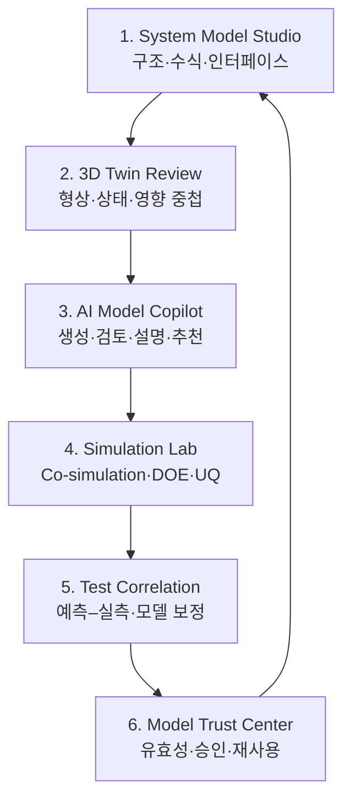
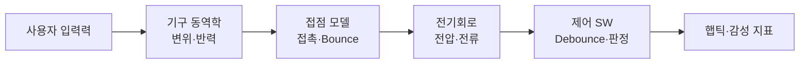
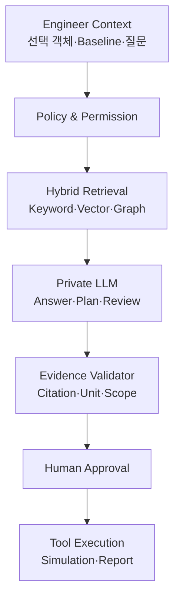

# ALPS ALPINE AI·3D System Modeling 고도화 개발지시서 v1.0

> **대상 시스템:** ALPS ALPINE Engineering Digital Twin Workbench(AA-ETW)  
> **목적:** 알프스알파인의 원리 기반 System Modeling/MBD를 AI와 3D 디지털 트윈으로 확장하여 설계·검증·시험·의사결정에 실질적 가치를 제공  
> **기준일:** 2026-09-14  
> **문서 성격:** 기존 AA-ETW 개발지시서의 추가개발·고도화 부속 지시서  
> **고객 검증:** 실제 모델, 물성, 시험기준, 상용 도구 및 보안정책은 알프스알파인 담당자 협의 후 확정

---

## 0. 개발팀에 내리는 핵심 지시

알프스알파인이 공개한 System Modeling의 핵심은 단순한 3D 시각화가 아니라 다음 세 가지다.

1. 기계·전자·소프트웨어를 하나의 공통 모델 언어로 연결한다.
2. 에너지 보존, 물리 법칙, 제어이론을 통해 “왜 이렇게 동작하는가”를 설명한다.
3. 물리 시제품 이전에 반복 검증하여 문제 발견을 앞당기고 재작업을 줄인다.

이번 고도화는 이 철학을 그대로 유지하면서 아래 기능을 추가한다.

- **3D Twin:** 제품 형상 위에 힘, 변위, 신호, 에너지 흐름, 상태, 요구사항 및 시험결과를 공간적으로 중첩한다.
- **AI Model Copilot:** 모델 생성 보조, 변수·단위 검토, 영향분석, 시나리오 추천, 결과 설명, 예측–실측 불일치 분석을 수행한다.
- **Multi-domain Co-simulation:** 기계–전자–제어 소프트웨어의 연결조건과 시간축을 관리하고 동시 검증한다.
- **Model Credibility:** 모델의 출처, 가정, 유효범위, 검증수준, 불확실성을 관리한다.
- **Closed-loop Learning:** 시뮬레이션과 실제 시험·양산 결과의 차이를 모델·규칙·AI에 지속적으로 환류한다.

AI가 물리 법칙을 대체하거나 최종 설계·품질 승인을 자동으로 내리게 만들지 않는다. AI가 제시하는 모든 계산식, 파라미터, 영향항목과 대안에는 **근거, 신뢰도, 적용범위, 검증상태와 사람의 승인 이력**을 남겨야 한다.

---

## 1. 고도화 목표

### 1.1 고객에게 제공할 실질적 가치

| 현재 System Modeling의 강점 | 추가 고도화 | 현업 가치 |
|---|---|---|
| 기계·전자·소프트웨어 공통 모델 | 3D 객체와 모델 블록의 양방향 연결 | 모델의 실제 부품 위치와 영향을 즉시 파악 |
| 원리 기반 수학 모델 | AI 방정식·단위·가정 검토 | 모델 작성 오류와 설명 비용 감소 |
| 시제품 전 가상검증 | AI 시나리오 생성·DOE·불확실성 분석 | 놓친 조건을 조기에 탐색 |
| 공유 모델을 통한 병렬개발 | 웹 리뷰·3D 주석·변경 영향지도 | 부서 간 해석 차이와 인수인계 손실 감소 |
| 모델과 시험의 반복 검증 | 예측–실측 자동 정렬·잔차 원인분석 | 모델 신뢰성과 재사용성 향상 |
| 자동차 조작감·제어 성능 모델링 | 감성어–F–S 곡선–제어응답 연결 | 사용자 체감과 공학변수를 함께 최적화 |
| 모델 자체의 납품·공유 확대 | Model package, FMU, 접근통제, 승인 | 고객·협력사와 IP를 보호하며 협업 |

### 1.2 최종 사용자 경험

엔지니어가 3D 제품에서 특정 스위치 또는 부품을 선택하면 관련 요구사항, 수학 모델, RLC 등가회로, 제어 로직, F–S 곡선, 시험 데이터, 과거 불량과 변경 이력이 같은 화면에 연결되어야 한다. 파라미터를 변경하면 허용된 범위 안에서 시뮬레이션을 실행하고, 3D 애니메이션·곡선·신호·에너지 흐름이 동시에 갱신되어야 한다.

AI에게 “돔 두께를 줄이면 클릭감과 접점 신호에 어떤 영향이 예상되는가?”라고 질문하면 AI는 일반론을 말하는 대신 다음을 제시해야 한다.

- 직접 영향을 받는 기계 파라미터
- F–S 곡선과 에너지 변화 예상
- 접점 바운스와 전기 신호에 대한 영향 후보
- 변경이 필요한 모델·시험·요구사항
- 근거로 사용한 내부 모델과 과거 시험
- 확정된 사실, 모델 기반 예측, 검증이 필요한 가설의 구분
- 권장 재해석·시험 시나리오와 승인 요청

---

## 2. 고도화 제품 구조

### 2.1 6개 핵심 모듈



### 2.2 설계 원칙

- 3D 모델, 시스템 모델, 회로 모델, 제어 모델을 하나의 파일로 억지 통합하지 않는다.
- 각 전문 모델은 원래 도구와 포맷을 유지하고, 공통 ID·인터페이스·파라미터·Trace로 연결한다.
- 웹은 설계 의사결정과 협업의 중심이며 정밀 CAD/CAE/EDA 계산은 검증된 외부 Solver 또는 전용 Worker에서 수행한다.
- 3D는 계산 결과의 표현 수단이자 부품 중심 탐색 인터페이스로 사용한다.
- AI는 모델과 증적을 탐색하고 도구를 오케스트레이션하지만, 계산 결과를 임의로 생성하지 않는다.

---

## 3. 대표 제품 트윈: TACT Switch 및 차량용 Shifter

### 3.1 TACT Switch 트윈 구성

| 도메인 | 모델·데이터 | 대표 입력 | 대표 출력 |
|---|---|---|---|
| 3D/기구 | Housing, Stem, Metal dome, Contact, 공차 | 형상, 재료, 두께, 조립조건 | 변형, 응력, Stroke, 접촉상태 |
| 동역학 | 질량–스프링–댐퍼 또는 원리 기반 모델 | 힘, 속도, 경계조건 | 변위, 반력, 진동, 에너지 |
| 등가회로 | 기구 동작의 RLC 등가모델 | R/L/C, 입력 | 과도응답, 공진, 감쇠 |
| 전기 | 접점저항, 회로, Debounce 입력 | 접촉상태, 전압, 온도 | 전류, 접점 Bounce, 신호 품질 |
| 제어 SW | Debounce·입력판정·햅틱 제어 | Sampling, Threshold, Filter | 인식시간, 오검출, 제어출력 |
| 감성 | F–S 곡선과 Kansei map | 작동력, Click ratio, Stroke | 명확함, 가벼움, 고급감 후보 |
| 시험 | F–S, 내구, 온습도, 진동, 접점 | 장비·환경·샘플·Cycle | 실측 곡선, 편차, 합격판정 |

### 3.2 Shifter 트윈 확장

- Lever/Actuator/구동부/센서/ECU/햅틱 알고리즘을 3D Assembly와 System block으로 연결한다.
- 조작 입력 → 기계 운동 → 센서 신호 → 제어 판단 → 진동 출력 → 사용자 피드백의 인과 흐름을 한 Timeline에서 표시한다.
- 정상·저온·고온·노화·공차 조합별 반응을 비교한다.
- 조작감 목표와 제어 안정성 목표가 충돌할 경우 Pareto 후보와 근거를 표시한다.
- 실제 차량 또는 HIL 데이터가 없으면 “설명용 합성 시나리오”로 명확히 표시한다.

---

## 4. System Model Studio 추가개발

### SM-01 다중 도메인 모델 캔버스

- Mechanical, Electrical, Control SW, Thermal, Human/Kansei 영역을 색상과 아이콘으로 구분한다.
- Block, Port, Signal, Physical connector, Parameter, Equation, Requirement를 표현한다.
- 각 연결에 방향, 물리량, 단위, Sampling/Step, 초기조건, 범위를 정의한다.
- 같은 물리량이 서로 다른 단위를 사용하면 저장 전에 경고하고 명시적 변환을 요구한다.
- 3D Assembly tree의 부품과 Model block을 Drag & Drop으로 연결한다.

### SM-02 원리·방정식 관리

- 수식을 LaTeX로 표시하고 원본 모델 코드 또는 FMU 변수와 연결한다.
- 각 Equation에 물리 법칙, 변수 정의, 단위, 가정, 경계조건, 출처, 작성자, 검토자를 기록한다.
- Energy flow를 입력·저장·손실·출력으로 구분해 Sankey 또는 3D Overlay로 표현한다.
- Dimension analysis와 단위 일관성 검사를 자동 수행한다.
- 모델이 경험식, 데이터 기반 Surrogate, First-principles, Hybrid 중 무엇인지 명시한다.

### SM-03 Model interface contract

- 입력/출력 변수명, 타입, 단위, 범위, 시간 의미, 결측 처리, 오류코드를 계약으로 관리한다.
- FMU/FMI 또는 고객사 표준 포맷 Import 시 Contract를 자동 추출하고 차이를 표시한다.
- 모델 버전 변경으로 Port나 단위가 달라지면 영향받는 Co-simulation과 시험을 자동 표시한다.

### SM-04 모델 구조·거동 동시 탐색

- 구조 관점: 부품·서브시스템·인터페이스·소유 부서
- 거동 관점: 상태, 이벤트, 신호, 에너지, 시간 응답
- 요구사항 관점: 목표, 검증방법, Evidence, 상태
- 같은 선택 객체를 세 관점에서 동기화하여 부서별 해석 차이를 줄인다.

---

## 5. 3D Digital Twin Review 추가개발

### DT-01 3D 의미 객체화

- STEP Assembly의 Part/Instance/PMI를 추출하고 공통 Twin Object ID를 부여한다.
- 원본 CAD와 웹용 glTF/GLB 파생본을 분리하며 변환 계보와 Hash를 저장한다.
- 각 3D 객체에 BOM, Requirement, Model block, Parameter, Simulation result, Test, Issue를 연결한다.
- 형상만 있고 의미 연결이 없는 객체는 “Unmapped”로 표시한다.

### DT-02 결과 Overlay

- 변위·응력·온도·전위·에너지·상태를 3D 색상맵, Vector, Streamline, Label로 표시한다.
- 결과 범례에는 단위, 최소/최대, 시간, Scenario, Model/Solver version을 항상 노출한다.
- 변형 배율은 실제 배율과 시각 강조 배율을 구분 표시한다.
- 시간응답은 3D Animation과 그래프 Cursor를 동기화한다.
- Pass/Fail 색상만 사용하지 않고 상태 아이콘과 텍스트를 병행한다.

### DT-03 원인–영향 경로 표시

- 사용자가 부품이나 파라미터를 선택하면 직접 영향과 간접 영향 경로를 표시한다.
- 예: `Dome thickness → stiffness → F–S curve → contact bounce → debounce latency → tactile rating`.
- 각 Edge에 관계 유형, 근거, 모델 버전, 신뢰도, 검증상태를 표시한다.
- AI가 추론한 Edge와 사람이 승인한 Edge를 시각적으로 구분한다.

### DT-04 Variant·시간 비교

- Baseline A/B를 겹쳐 형상, 파라미터, 결과 및 요구사항 충족 여부를 비교한다.
- 제품 수명 Cycle에 따른 초기–노화–고장 직전 상태를 Timeline으로 비교한다.
- 변경되지 않은 객체는 접고, 변경·영향·미검증 객체를 우선 표시한다.

### DT-05 협업 Review

- 3D 위치 기반 Pin, Markup, 단면, 측정, Screen capture, Review thread를 제공한다.
- Comment는 특정 Revision과 Camera state에 고정한다.
- Comment 해결 시 근거가 된 변경·재해석·시험을 연결한다.
- 고객·협력사 공유 시 원본 CAD 다운로드 없이 허용된 3D 파생본과 FMU만 열람하도록 한다.

---

## 6. AI Model Copilot 추가개발

### AI-01 Model Builder Assistant

AI가 다음 초안을 만들 수 있게 하되 엔지니어 승인 전에는 공식 모델로 사용하지 않는다.

- 자연어 요구사항에서 후보 변수, 상태, 인터페이스, 제약 추출
- 물리 현상의 Block diagram과 Equation 후보 생성
- 기존 승인 모델 중 재사용 가능한 Submodel 추천
- RLC 등가모델의 구조 후보와 변수 설명
- 시험 데이터 컬럼과 모델 변수의 Mapping 후보
- Model card와 검증계획 초안

생성 시 반드시 “원리 기반”, “과거 유사모델 기반”, “일반 지식 기반”을 구분한다. 물성·공차·안전 임계값은 고객 승인 데이터가 없으면 빈 값 또는 확인 필요로 남긴다.

### AI-02 Model Review Agent

- 단위·차원 불일치
- 정의되지 않은 변수와 연결되지 않은 Port
- Algebraic loop, 초기조건 누락, 비현실적 Parameter range 후보
- 요구사항 대비 검증 시나리오 누락
- 모델 적용범위를 벗어난 실행
- 동일 목적 모델 간 결과 불일치
- 승인되지 않은 모델·규칙·시험 데이터 사용

Review 결과는 오류, 경고, 제안으로 구분하며 각 항목에 근거 객체와 해결방법을 제시한다.

### AI-03 Scenario & DOE Planner

- 요구사항, 공차, 환경, Failure mode를 기반으로 검증 시나리오 후보를 만든다.
- 이미 검증된 조합과 미검증 조합을 구분한다.
- 변수가 많을 때 민감도와 위험도를 고려해 우선순위를 정한다.
- 실행 전에 예상 Job 수, 계산자원, 시간, 비용과 중단조건을 제시한다.
- 사용자가 승인한 Scenario만 Simulation Orchestrator에 제출한다.

### AI-04 Explainable Result Analyst

결과 설명은 다음 순서로 생성한다.

1. 관찰된 변화
2. 관련 입력·중간상태·출력
3. 물리식 또는 제어 관계
4. 직접 근거와 유사 과거 사례
5. 불확실성 및 다른 가능한 원인
6. 확인을 위한 추가 해석 또는 시험

AI가 그래프 모양만 보고 인과관계를 확정하지 않도록 한다. 인과관계는 승인된 모델 구조, 실험설계 또는 전문가 승인 근거가 있을 때만 “확인”으로 표시한다.

### AI-05 Model–Test Gap Investigator

- 예측과 실측의 시간축, 단위, Offset, Sampling을 먼저 정렬한다.
- 구간별 잔차와 온도·샘플·장비·Lot·Cycle의 관계를 탐색한다.
- 가능한 원인을 모델 구조 오류, Parameter 오류, 경계조건 오류, 시험 오류, 데이터 정렬 오류로 분류한다.
- 각 원인 후보에 재현 가능성, 근거, 추가 확인방법을 붙인다.
- 보정 Parameter를 제안하되 Calibration용 데이터와 Validation용 데이터를 분리한다.

### AI-06 Engineering Knowledge Graph

다음 관계를 최소 Ontology로 구현한다.

```text
Requirement VERIFIES_BY TestCase
Requirement SATISFIED_BY ModelElement
Component REPRESENTED_BY GeometryArtifact
Component IMPLEMENTS ModelElement
Parameter AFFECTS Metric
SimulationRun USES ModelVersion
SimulationRun PRODUCES Result
TestRun PRODUCES Measurement
Measurement VALIDATES ModelVersion
ChangeRequest IMPACTS Component|Model|Test|Requirement
FailureMode MITIGATED_BY DesignControl|TestCase
Approval FREEZES Baseline
```

관계의 출처는 Imported, Rule-derived, AI-inferred, Human-approved로 구분한다. AI-inferred 관계는 승인 전까지 Gate Evidence로 사용할 수 없다.

### AI-07 RAG와 접근통제

- 문서 검색 전에 Project, Product family, Security classification 권한을 필터링한다.
- 승인된 최신 Baseline을 기본 검색 대상으로 하고, 과거/초안 모델은 명시적으로 선택할 때만 포함한다.
- 답변 문장마다 Artifact ID, Revision, 페이지/섹션 또는 객체 위치를 연결한다.
- 근거가 부족하면 답을 만들어내지 않고 필요한 모델·시험·문서를 요청한다.
- 외부 범용 모델에 고객 데이터가 학습 또는 보존되지 않도록 Private inference 또는 승인된 AI Gateway를 사용한다.

---

## 7. Multi-domain Simulation Lab 추가개발

### SL-01 Co-simulation Orchestrator

- Mechanical, Electrical, Control/FMU 모델의 실행 순서, 통신 Step, Event, 초기조건을 관리한다.
- FMI 기반 연결을 우선하며 상용도구는 공식 API 또는 Export artifact Adapter로 연결한다.
- 각 실행은 불변 Baseline Manifest와 컨테이너 이미지 Digest에 고정한다.
- 실패 시 Solver log, 실패 단계, 입력조건, 재시도 이력을 보존한다.
- 결과가 없는 실패 작업을 AI가 성공으로 요약하지 못하게 상태를 강제한다.

### SL-02 TACT Switch 대표 연성 시뮬레이션



- 각 단계의 신호와 단위를 Interface Contract에 정의한다.
- 기구 거동의 RLC 등가모델과 상세 기구해석을 동일 시나리오에서 비교할 수 있게 한다.
- 상세해석은 기준 모델, RLC/Surrogate는 빠른 탐색 모델로 구분한다.
- 두 모델의 오차가 허용범위를 넘으면 빠른 모델을 공식 의사결정에 사용하지 못하게 한다.

### SL-03 Uncertainty Quantification

- 재료 물성, 돔 두께, 조립공차, 접점저항, 온도, 노화 등 불확실 변수의 분포와 출처를 관리한다.
- Monte Carlo 또는 Latin Hypercube 실행을 지원한다.
- 단일 예측값뿐 아니라 분포, 신뢰구간, 요구사항 위반 확률을 표시한다.
- 데이터가 부족한 분포는 “가정”으로 표시하고 승인받는다.

### SL-04 Surrogate model

- 반복 해석 비용이 큰 경우 승인된 고정밀 결과를 학습 데이터로 사용한다.
- 학습 데이터 범위, Feature, 성능, Out-of-distribution 탐지를 Model card에 기록한다.
- 유효범위 밖에서는 예측을 차단하거나 “검증 불충분” 상태로 표시한다.
- Surrogate 갱신은 Staging → Golden test → SME 승인 → Production 승격 절차를 따른다.

---

## 8. Test Correlation·Closed-loop 고도화

### TC-01 시험 데이터 계약

- Test plan, Sample/Lot, Equipment, Calibration, Operator, Environment, Timestamp, Unit, Sampling rate를 필수 메타데이터로 정의한다.
- Raw data는 불변 저장하고 정제·정렬·필터링 결과를 파생 데이터로 별도 보존한다.
- 처리 스크립트, Parameter와 실행환경을 기록하여 재현 가능하게 한다.

### TC-02 예측–실측 상관성 화면

- 동일 축에 Simulation, ES/CS sample, 양산 샘플을 중첩한다.
- RMSE, MAE, 최대오차, Peak 위치, Hysteresis area, 구간별 오차를 계산한다.
- 전체 평균만으로 숨겨지는 구간 오차를 보여준다.
- 허용오차는 Model type, 제품 단계, 출력 Metric별로 고객 SME가 설정한다.

### TC-03 모델 신뢰도 등급

모델을 단일 정확도 숫자로 표현하지 않고 아래 축으로 관리한다.

| 평가축 | 질문 |
|---|---|
| 목적 적합성 | 이 모델이 어떤 결정을 위해 만들어졌는가? |
| Verification | 수식·코드·Solver 구현이 의도대로 동작하는가? |
| Validation | 실제 시험과 정의된 범위에서 일치하는가? |
| Uncertainty | 입력·모델·측정 불확실성이 정량화됐는가? |
| Coverage | 온도·공차·수명 등 적용범위를 얼마나 검증했는가? |
| Traceability | 요구사항·데이터·실행·승인 이력이 연결됐는가? |

각 축을 Evidence와 함께 평가하고 `Draft → Verified → Validated for Purpose → Approved for Reuse → Retired` 상태를 사용한다.

### TC-04 양산·고장분석 환류

- QMS/MES/검사·FA 데이터를 설계 Parameter와 Model element에 연결한다.
- 불량 증가를 발견하면 관련 Model validity와 시험 Coverage를 재검토한다.
- AI는 유사 Failure pattern과 설계·공정 원인 후보를 제시하되 CAPA 확정은 품질 담당자가 승인한다.
- 현장 결과로 모델을 자동 덮어쓰지 않고 새 Calibration candidate를 생성한다.

---

## 9. 신규 화면 설계

### 9.1 화면 목록

| ID | 화면 | 핵심 목적 |
|---|---|---|
| E01 | System Twin Cockpit | 3D·시스템 구조·핵심 KPI·신뢰도 종합 |
| E02 | Multi-domain Model Canvas | 기계·전자·SW Block과 Interface 편집 |
| E03 | Principle & Equation Inspector | 수식, 단위, 가정, 에너지 흐름 검토 |
| E04 | 3D Physics Review | 형상 위 결과·상태·Trace 중첩 |
| E05 | Causal Impact Explorer | 변경 원인부터 요구사항·시험까지 경로 탐색 |
| E06 | AI Model Copilot | 생성 보조·검토·설명·추가시험 추천 |
| E07 | Co-simulation Scenario Builder | 모델 연결, 조건, Step, 실행계획 설정 |
| E08 | DOE & Uncertainty Explorer | 민감도·분포·위반확률·Pareto 비교 |
| E09 | Model–Test Correlation | 예측–실측 정렬·잔차·보정 후보 |
| E10 | Model Trust Center | Model card, Evidence, 상태, 승인·재사용 |

### 9.2 System Twin Cockpit 구성

화면을 다음 5개 영역으로 구성한다.

1. **중앙:** 선택 제품의 3D Twin
2. **좌측:** Assembly/System model tree와 Domain filter
3. **우측:** 선택 객체의 Requirement, Parameter, Result, Test, Issue
4. **하단:** 시간응답 그래프와 Event timeline
5. **상단:** Baseline, Scenario, Model trust, Gate 상태

AI 채팅은 별도 전체화면이 아니라 현재 선택 객체와 Scenario를 Context로 받는 보조 패널로 제공한다. 사용자는 AI가 어떤 객체와 자료를 보고 있는지 항상 확인할 수 있어야 한다.

### 9.3 직접 조작 기능

- 3D 부품 선택 → 연결된 Model block과 신호 강조
- Model block 선택 → 3D 부품과 관련 곡선 강조
- 그래프 Peak 선택 → 해당 시점 3D 상태로 이동
- Parameter slider 변경 → 빠른 Surrogate Preview
- “정식 검증 실행” → 고정밀 Solver Job과 승인 흐름
- Baseline A/B Toggle → 형상·곡선·요구 충족 Diff
- AI 설명의 근거 클릭 → 문서 구간 또는 객체로 이동

---

## 10. 데이터 모델 추가

| 엔터티 | 주요 필드 |
|---|---|
| `SystemModel` | purpose, domains, owner, status, validity_scope |
| `ModelElement` | type, domain, geometry_object_id, parent_id |
| `Equation` | expression, variables, units, assumptions, source |
| `PortContract` | direction, quantity, unit, range, timing_semantics |
| `EnergyFlow` | source, sink, quantity, loss_type, equation_id |
| `GeometryObject` | source_artifact, assembly_path, stable_id, properties |
| `ParameterDefinition` | unit, range, distribution, source, sensitivity |
| `ModelCard` | purpose, limitations, solver, training_data, metrics |
| `ValidityEnvelope` | temperature, load, tolerance, lifecycle, evidence |
| `CausalRelation` | source, target, relation_type, evidence, confidence, state |
| `CorrelationAnalysis` | model_run, test_run, alignment, metrics, residuals |
| `CalibrationCandidate` | base_model, dataset, proposed_values, validation_status |
| `ModelReviewFinding` | category, severity, evidence, resolution, reviewer |

공통 ID는 CAD 파일명이나 모델 내부 Label에 의존하지 않는다. 원본 도구의 ID, 내부 Stable UUID, 고객 Business ID를 Mapping table로 관리한다.

---

## 11. API·이벤트 추가

```http
POST /api/v1/system-models
POST /api/v1/system-models/{id}/elements
POST /api/v1/system-models/{id}/validate
POST /api/v1/system-models/{id}/versions
POST /api/v1/geometry-artifacts/{id}/semantic-map
GET  /api/v1/twins/{variant_id}/scene
GET  /api/v1/twins/{variant_id}/impact-paths
POST /api/v1/co-simulation-plans
POST /api/v1/co-simulation-runs
POST /api/v1/doe-plans
POST /api/v1/correlation-analyses
POST /api/v1/calibration-candidates
POST /api/v1/ai/model-drafts
POST /api/v1/ai/model-reviews
POST /api/v1/ai/gap-investigations
GET  /api/v1/model-cards/{model_version_id}
POST /api/v1/model-cards/{id}/promotions
```

### 주요 이벤트

```text
ModelVersionCreated
ModelValidationFailed
PortContractChanged
GeometryMappingChanged
SimulationPlanApproved
SimulationRunCompleted
CorrelationThresholdExceeded
CalibrationCandidateCreated
ModelValidityChanged
ModelApprovedForReuse
BaselineFrozen
```

모든 이벤트에 `tenant_id`, `project_id`, `variant_id`, `baseline_id`, `actor_id`, `correlation_id`, `occurred_at`, `schema_version`을 포함한다.

---

## 12. 기술 구현 지침

### 12.1 3D Pipeline

1. CAD 원본 업로드 및 Malware/Hash 검사
2. Assembly/PMI/속성 추출
3. Stable object mapping
4. LOD별 Tessellation
5. glTF/GLB + metadata index 생성
6. 결과 Field를 객체/Vertex/Element와 연결
7. Browser streaming과 GPU pick 구현
8. 변환기 버전과 결과 Hash 저장

Three.js는 표현 계층으로만 사용하고 형상 연산은 OCCT 또는 고객 승인 CAD Kernel에서 수행한다. 대형 Assembly는 Frustum culling, Instancing, Mesh compression, LOD, 지연 로딩을 적용한다.

### 12.2 Simulation Execution

- Solver별 OCI Image와 Version allowlist를 운영한다.
- Job은 비특권, Read-only FS, 제한된 CPU/RAM/GPU/실행시간, 기본 Network deny로 실행한다.
- 입력 Artifact는 읽기 전용으로 Mount하고 출력 디렉터리만 쓰기 허용한다.
- Random seed, Solver option, OS/library version을 Manifest에 포함한다.
- 동일 Golden input의 재실행 결과가 허용오차를 벗어나면 Release를 차단한다.

### 12.3 AI Architecture



- AI Gateway에서 Model routing, Token/DLP policy, Prompt template, Audit를 관리한다.
- Engineering document, Graph, Simulation result를 별도 Retriever로 두고 결과를 합성한다.
- Tool call은 JSON schema로 검증하고 Read action과 Execute action 권한을 분리한다.
- 실행형 Agent는 계획 미리보기와 비용·시간 추정을 제시하고 승인을 받아야 한다.

---

## 13. 보안·IP 보호 고도화

- 모델과 CAD 원본을 보안등급별로 분리하고 파생 3D 및 FMU의 공개범위를 별도 관리한다.
- 공급사에는 Black-box FMU 또는 축약 3D만 제공할 수 있어야 한다.
- 원본 다운로드, Screen capture, Export, AI 질의, Simulation 실행을 각각 별도 권한으로 둔다.
- 중요 화면에는 사용자·프로젝트·시각 워터마크를 선택 적용한다.
- AI Index에도 원본과 동일한 ACL을 복제하고 권한 변경 시 재색인 또는 즉시 필터링한다.
- 고객 데이터와 모델은 외부 AI 학습에 사용하지 않는다.
- 모델·파라미터 Export는 승인 Workflow와 감사로그를 거친다.
- Prompt injection 문서가 Tool 실행을 유도하지 못하도록 검색 문서는 명령이 아닌 데이터로 취급한다.

---

## 14. AI·모델 품질 검수 기준

### 14.1 모델 검수

- MV-01: 모든 변수에 타입·단위·범위·출처가 있다.
- MV-02: 연결 Port의 단위와 시간 의미가 호환된다.
- MV-03: 방정식과 계산 코드가 Golden case에서 일치한다.
- MV-04: 모델 유효범위 밖 실행이 경고 또는 차단된다.
- MV-05: 동일 Baseline과 실행환경에서 결과가 재현된다.
- MV-06: Calibration과 Validation 데이터가 분리된다.
- MV-07: 승인된 모델만 공식 Gate Evidence로 사용된다.

### 14.2 3D 검수

- DV-01: 원본 Assembly와 웹 Assembly의 부품 수·계층 Mapping이 검증된다.
- DV-02: 선택 객체가 관련 모델·결과·시험과 정확히 연결된다.
- DV-03: 색상 범례, 단위, 변형 배율, Scenario가 항상 표시된다.
- DV-04: A/B Diff에서 추가·삭제·변경·미변경이 구분된다.
- DV-05: 3D Animation과 시간 그래프의 Cursor가 허용 오차 내 동기화된다.

### 14.3 AI 검수

- AV-01: 사실 주장마다 열람 가능한 근거가 연결된다.
- AV-02: 권한 없는 Artifact의 존재·제목·요약도 노출되지 않는다.
- AV-03: 없는 물성, 공차, 시험결과를 생성하지 않는다.
- AV-04: AI 추론과 사람 승인 사실을 구분한다.
- AV-05: Model validity 밖의 질문에는 경고와 추가검증을 제시한다.
- AV-06: Tool 실행은 사용자가 승인한 계획과 Parameter 범위 안에서만 수행된다.
- AV-07: Prompt injection과 악성 문서 테스트에서 권한·정책 우회가 없어야 한다.

### 14.4 AI 평가셋

대표 제품에 대해 최소 150개 문항을 구성한다.

| 분류 | 최소 수 | 평가 내용 |
|---|---:|---|
| 사실검색 | 25 | 모델·요구·시험 근거 정확성 |
| 다중 도메인 추론 | 30 | 기계–전자–SW 영향 연결 |
| 단위·수식 검토 | 20 | 차원·범위·가정 오류 탐지 |
| 변경 영향 | 25 | 재해석·재시험 항목 Recall |
| 결과 설명 | 20 | 관찰·근거·가설 구분 |
| 거부·범위 | 15 | 근거부족·유효범위 밖 처리 |
| 권한·보안 | 15 | 비인가 정보와 Tool 차단 |

---

## 15. 실증 KPI

고정 절감률을 먼저 약속하지 않는다. 최근 유사 제품개발의 Baseline을 확정한 뒤 PoC와 같은 정의로 비교한다.

| 가치 영역 | KPI | 측정 방법 |
|---|---|---|
| 이해 속도 | 모델 구조 이해시간 | 신규 검토자가 원인–영향을 설명하기까지 소요시간 |
| 병렬 협업 | 부서 간 질의 왕복 | Review당 기계·전자·SW 재질의 횟수 |
| Front-loading | 조기 발견률 | Design freeze 전 발견된 중요 Issue 비율 |
| 재작업 | 후기 변경량 | 상세설계 이후 변경된 Model/Requirement/Test 수 |
| 모델 신뢰 | Correlation coverage | 핵심 출력 중 실측 검증된 항목 비율 |
| 모델 정확 | 예측–실측 오차 | Metric별 RMSE·최대오차·허용범위 충족률 |
| 시험 효율 | 미중복 시험률 | 기존 Evidence 재사용으로 생략된 중복 시험 수 |
| 재사용 | 승인 모델 재사용률 | 신규 Variant에서 Approved model 사용 비율 |
| AI 품질 | Grounded response rate | 유효 근거가 있는 사실 주장 비율 |
| 승인 효율 | Evidence 준비시간 | Gate 제출자료 수집·정리 중위시간 |

---

## 16. 16주 PoC 내 고도화 일정

기존 AA-ETW 16주 PoC 일정과 별도 프로젝트로 분리하지 않고 다음 Workstream으로 병행한다.

| 기간 | Workstream | 구현 내용 | Exit Gate |
|---|---|---|---|
| 1~2주 | Discovery | 대표 Switch/Shifter, 모델·시험·도구·KPI·보안 확인 | Twin Charter 승인 |
| 3~4주 | Semantic Foundation | 공통 ID, Model card, Port contract, Ontology | 샘플 Trace 완성 |
| 5~7주 | 3D Twin | CAD 변환, 의미 Mapping, 3D 결과·곡선 동기화 | 대표 Assembly 검수 |
| 6~9주 | System Model | 다중 도메인 Canvas, 수식·단위·Interface 검사 | Golden model 검증 |
| 8~11주 | Simulation Lab | Co-simulation, DOE, UQ, Result package | Golden run 재현 |
| 10~13주 | AI Copilot | Model review, Impact, Result explanation, Gap 분석 | AI 평가셋 통과 |
| 11~14주 | Test Loop | 실측 정렬, Correlation, Calibration candidate | SME 상관성 승인 |
| 14~15주 | Trust & Gate | Model trust, Evidence, 승인·재사용 | Gate 차단조건 통과 |
| 16주 | UAT/Demo | 일본어 검수, 성능·보안, Executive scenario | 고객 Acceptance |

고객의 실제 모델·시험자료 또는 SME 검증이 늦어지면 플랫폼 구현과 공학적 유효성 승인을 구분해 보고한다. 합성 데이터만으로 공학적 정확도가 검증되었다고 주장하지 않는다.

---

## 17. 우선순위와 개발 Backlog

### Must

- Stable Twin Object ID와 3D–Model–Requirement–Test 연결
- Multi-domain Model Canvas와 Port/단위 검증
- 3D 결과 Overlay 및 그래프 시간 동기화
- TACT Switch 기구→접점→회로→SW 연성 시나리오
- Model card, Validity envelope, Baseline Manifest
- AI 근거형 Model review와 Change impact
- 예측–실측 Correlation과 불변 Raw data
- 승인 Gate, 권한, 감사로그, 온프레미스 배포

### Should

- DOE와 불확실성 분석
- RLC 등가모델과 상세모델 정확도 비교
- Surrogate preview와 OOD 경고
- 3D 기반 Review thread와 협력사 제한 공유
- Model–test 잔차 원인 후보 분석

### Could

- 자연어 요구에서 모델 구조 초안 생성
- Kansei map과 설계 Parameter 추천
- 양산 검사·FA 데이터 환류
- AR/VR 기반 3D Review
- 제품군별 자동 Template 추천

### Won't in first PoC

- 범용 정밀 CAD/CAE/EDA 전체 재개발
- AI에 의한 무승인 설계 확정
- 실차 안전기능의 자동 인증·적합 판정
- 운영 생산설비의 AI 직접제어
- 검증되지 않은 생성형 3D를 공식 설계원본으로 사용

---

## 18. 대표 데모 시나리오

### “왜 이 스위치의 느낌과 신호가 달라졌는가?”

1. TACT Switch Baseline A를 System Twin Cockpit에서 연다.
2. 3D에서 Metal dome을 선택하고 F–S 곡선, RLC 등가모델, 접점 신호와 요구사항을 확인한다.
3. Variant B의 Dome 두께와 재료 변경을 A/B Diff로 표시한다.
4. AI에게 변경 영향과 필요한 검증을 질문한다.
5. AI가 물리 관계, 과거 Evidence, 미검증 항목과 Simulation plan을 제안한다.
6. 엔지니어가 Parameter와 비용·시간을 확인한 후 실행을 승인한다.
7. Co-simulation 결과를 3D 변형, F–S 곡선, 접점 Bounce, Debounce latency로 동시에 확인한다.
8. DOE에서 요구를 만족하는 후보와 불확실성 범위를 비교한다.
9. 시제품 실측값을 업로드해 예측–실측 잔차를 표시한다.
10. AI가 Gap 원인 후보와 추가시험을 제시하고 SME가 Calibration candidate를 승인한다.
11. 보정 후 결과, Model trust와 잔여 위험을 검토하여 Gate를 승인한다.

### 데모 합격 조건

- 한 변경이 3D·수식·회로·SW·시험에 미치는 경로를 3클릭 이내 확인
- AI의 모든 사실 주장에 유효한 근거 또는 “검증 필요” 표시
- 3D와 시간 그래프의 동기화
- Variant A/B와 보정 전/후 모델 비교
- Validity envelope 밖 입력의 차단 또는 명시적 경고
- 승인 전 필수 Evidence 누락 시 Gate 차단
- 일본어 기준으로 전체 시나리오 중단 없이 수행

---

## 19. 개발 에이전트 실행 프롬프트

```text
너는 Model-Based Development, multi-physics simulation, 3D engineering UX,
AI safety에 경험이 있는 Solution Architect이자 Senior Engineer다.

기존 “ALPS ALPINE Engineering Digital Twin Workbench”에
AI·3D System Modeling 고도화 기능을 추가한다.

[핵심 목표]
알프스알파인의 원리 기반 System Modeling을 3D 제품 형상과 연결하고,
AI가 모델 작성 보조, 단위·가정 검토, 변경 영향분석, 시나리오 추천,
결과 설명, 예측–실측 Gap 분석을 근거와 함께 수행하도록 한다.

[필수 Vertical Slice]
TACT Switch의 사용자 입력력 → 기구 변위·반력 → 접점 상태·Bounce →
전기 신호 → Debounce/제어 판단 → F-S/Kansei 지표 흐름을 구현한다.
3D 객체, System model, Simulation, 시험값과 요구사항이 공통 ID로 연결되어야 한다.

[필수 기능]
1. Multi-domain Model Canvas와 Port contract
2. 수식·변수·단위·가정·에너지 흐름 관리
3. STEP Assembly의 의미 객체화와 glTF 파생본
4. 3D physics/result overlay와 시간 그래프 동기화
5. Co-simulation, DOE, 불확실성 분석
6. Model card, Validity envelope, Model trust state
7. AI Model builder/reviewer/impact/result/gap assistant
8. 시험 Raw data 계보와 예측–실측 Correlation
9. Baseline, 승인 Gate, RBAC/ABAC, Append-only Audit

[금지사항]
- Three.js를 정밀 CAD Kernel로 취급하지 않는다.
- React Flow 화면 객체를 공학 데이터 원장으로 사용하지 않는다.
- LLM이 Simulation 숫자나 물성·공차·규격값을 임의 생성하지 않는다.
- AI가 안전·품질·규격 적합을 최종 승인하지 않는다.
- Calibration 데이터와 Validation 데이터를 혼용하지 않는다.
- 모델 유효범위 밖 예측을 정상 결과처럼 표시하지 않는다.
- 고객 설계·시험 데이터를 외부 범용 AI 학습에 사용하지 않는다.
- 승인된 Baseline, Raw data와 감사로그를 덮어쓰지 않는다.

[구현 방식]
1. 저장소와 기존 기능을 먼저 조사하고 재사용/변경/신규 항목을 구분한다.
2. Domain model, DB migration, API, UI, Worker, Test, Acceptance를 연결해 계획한다.
3. Golden model과 Golden test data를 먼저 정의한다.
4. 각 기능은 권한, 계보, 오류처리, 관측성, 일본어를 포함한 Vertical Slice로 구현한다.
5. AI 출력은 JSON schema, 근거 검증, 권한 필터, Human approval을 통과시킨다.
6. Solver는 고정 이미지와 제한된 Sandbox에서 실행하고 재현성 정보를 남긴다.
7. lint, typecheck, unit, integration, E2E, Golden simulation, security test를 실행한다.
8. 구현 증거, 테스트 결과, 미구현·제한사항을 구분해 보고한다.

[완료 보고]
- 사용자에게 새롭게 제공되는 가치
- 화면별 구현 상태
- 데이터·API·Worker 변경
- AI 평가 및 Golden simulation 결과
- 보안·라이선스 영향
- Known limitations
- 고객 데모 절차
```

---

## 20. 고객 제안 메시지

본 고도화는 알프스알파인의 System Modeling 기술을 외부 솔루션으로 대체하려는 제안이 아니다. 이미 보유한 기계·전자·소프트웨어 모델링 역량과 원리 기반 해석을 웹 3D 공간에서 연결하고, AI를 통해 모델 검토·영향분석·시험 상관성·지식 재사용을 가속하는 공동개발 제안이다.

가장 중요한 차별점은 “AI가 설계해 준다”가 아니라 다음에 있다.

> **엔지니어가 만든 신뢰할 수 있는 모델을 AI가 더 쉽게 찾고, 연결하고, 검토하고, 설명하며, 실제 시험결과로 계속 개선할 수 있게 한다.**

이를 통해 모델이 단순 해석 파일이 아니라 설계·시험·품질·협업을 연결하는 재사용 가능한 기업 자산이 되도록 한다.

---

## 21. 참고 근거

- Alps Alpine, [System Modeling Technology](https://tech.alpsalpine.com/e/technology-info/system-modeling/) — 기계·전자·소프트웨어 통합, 원리 기반 모델링, 시제품 전 가상검증, MBD와 Front-loading.
- Alps Alpine, [Kansei Engineering](https://tech.alpsalpine.com/e/technology-info/kansei/) — TACT Switch의 F–S 곡선과 감성·물리량 연결.
- Alps Alpine, [ASIC Design Technology](https://tech.alpsalpine.com/e/technology-info/asic/) — 회로·레이아웃 설계, 시뮬레이션, 샘플·신뢰성 평가, 시험·고장분석.
- Alps Alpine, [Production Technology](https://tech.alpsalpine.com/e/technology-info/production-process-design/) — 생산 자동화, 자체 설비, AI 검사·측정과 생산데이터 분석.
- Alps Alpine, [EMC Evaluation Technology](https://tech.alpsalpine.com/e/technology-info/emc/) — 자동차 전자제품의 국제규격 시험과 설계 피드백.

