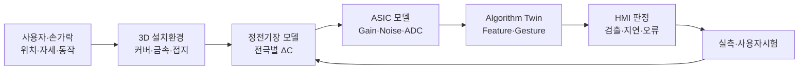

# ALPS ALPINE AirInput™ 3D Interaction Field Twin 구현지시서 v1.0

> **대상 시스템:** ALPS ALPINE Engineering Digital Twin Workbench(AA-ETW)  
> **개발 목표:** 손가락·장갑·표면재질·전극·센서 IC·알고리즘을 연결하여 AirInput™의 3차원 감지공간과 입력판정을 가상검증  
> **기준일:** 2026-09-14  
> **문서 성격:** 차세대 HMI 전략 시연 및 제품개발 PoC 구현지시서  
> **주의:** 실제 전극·ASIC·알고리즘·시험 데이터와 IP 범위는 고객 확인 후 적용한다.

---

## 0. 개발팀 최우선 지시

AirInput Twin을 손가락 애니메이션이나 제품 소개용 3D 콘텐츠로 만들지 않는다. 구현해야 할 핵심은 **손가락의 3D 위치와 움직임이 전극별 정전용량 변화, ASIC 신호, 알고리즘 Feature와 최종 입력판정으로 변환되는 전체 감지 체인**이다.

시스템은 다음 질문에 답해야 한다.

1. 특정 전극 형상과 장착조건에서 실제 감지 가능공간은 어디인가?
2. 손가락 거리·각도·속도·장갑이 센서 채널과 제스처 판정에 어떤 영향을 주는가?
3. 커버 재질·두께, 금속 프레임, 접지와 환경 노이즈 때문에 어느 영역에서 미검출·오검출이 발생하는가?
4. 센서 구조, ASIC 설정과 알고리즘 Threshold를 어떻게 조정하면 목표 HMI 성능을 만족하는가?
5. 시뮬레이션 감지공간과 실제 스캔·사용자시험 결과의 차이는 무엇인가?

Three.js는 결과를 보여주는 Viewer이지 전기장 Solver가 아니다. 고정밀 정전기장/정전용량 계산, ASIC Behavioral model과 실제 알고리즘 실행을 별도 Worker로 구성한다. AI는 고정밀 결과를 대체하지 않고, 시나리오 설계·빠른 Surrogate·이상영역 설명·추가시험 추천을 담당한다.

---

## 1. 제품 가치와 제안 포지셔닝

알프스알파인은 AirInput™을 장착 위치에 최적화된 센서, 고감도 정전용량 ASIC, 검출 데이터를 해석하는 알고리즘의 결합으로 설명한다. 장갑 착용 상태의 터치, 다점 감지, 화면에서 떨어진 손의 접근·후퇴 동작까지 감지하며, 향후 그립·핸들 형태의 3차원 HMI로 확장할 가능성도 제시하고 있다.

따라서 이 Twin의 핵심 메시지는 다음과 같다.

> **보이지 않는 정전용량 감지공간을 3D로 가시화하고, 센서–ASIC–알고리즘의 설계 Trade-off를 실제 사용자 조건과 함께 검증하는 Strategic HMI Development Workbench.**

### 1.1 고객 가치

- 전극·표면·장착 구조를 제작하기 전 감지영역 비교
- 장갑·손 자세·접근방향·환경 변화의 Corner case 탐색
- 센서 Channel 신호와 알고리즘 판정과정의 동시 설명
- 오검출·미검출 위험영역의 3D 시각화
- 고정밀 해석과 빠른 AI Surrogate를 결합한 반복설계
- 실제 공간 스캔·사용자시험을 통한 모델 보정
- 차량·의료·엘리베이터·ATM 등 설치환경별 HMI Template 재사용

### 1.2 첫 PoC 대상

- 평면 또는 완만한 곡면 AirInput Module 1종
- 전극 Layout 2개 Variant
- 커버 재질/두께 2개 이상
- Bare finger와 대표 Glove 조건
- 접근·후퇴·Hover·Swipe 중 2개 제스처
- 기준온습도와 Noise condition 1개
- 실제 또는 합성 3D Position–Raw channel–판정 Dataset

첫 PoC에서는 자동차 기능안전 입력을 직접 제어하지 않는다. 설명·설계검증용 Shadow 환경으로 한정한다.

---

## 2. Interaction Field Twin 개념



### 2.1 Twin 계층

| 계층 | 목적 | 대표 데이터 |
|---|---|---|
| Geometry Twin | 센서·전극·커버·장착부·손 형상 | STEP, Mesh, material, electrode ID |
| Electrostatic Field Twin | 손 위치별 정전용량 변화 계산 | Potential, field, capacitance matrix, ΔC |
| ASIC Behavioral Twin | 채널 신호와 노이즈·포화 모델링 | Gain, offset, ADC, filter, SNR |
| Algorithm Twin | 실제 Feature/Threshold/분류 로직 재현 | code/model version, features, confidence |
| Interaction Twin | 동작·제스처·사용자·환경 시나리오 | trajectory, glove, speed, posture |
| Test Twin | Robot scan·환경·사용자시험과 상관성 | raw signal, position, label, result |
| Quality Twin | 생산편차와 Calibration 결과 | electrode/assembly tolerance, lot, yield |

### 2.2 상태 구분

- **Design nominal:** 도면·설계값 기준
- **Manufactured sample:** 실측 치수·Calibration 반영
- **High-fidelity simulation:** 승인된 정전기장 Solver 결과
- **Fast preview:** 고정밀 결과를 학습한 Surrogate
- **Measured:** Robot scan 또는 사용자시험 실측
- **Unvalidated:** 합성·추정·유효범위 밖 결과

사용자가 색상과 Label로 상태를 혼동하지 않게 한다.

---

## 3. 물리·신호·알고리즘 모델

### IF-01 3D Geometry Model

- 센서 전극, PCB/FPC, 커버, 접착층, 금속 프레임, 접지, 주변 부품을 의미 객체로 관리한다.
- 전극별 Stable ID와 ASIC Channel ID를 Mapping한다.
- 손가락·손·장갑은 Parametric model로 거리, 각도, 크기, 재질을 설정한다.
- CAD 원본과 해석 Mesh, 웹용 glTF를 분리 저장한다.
- 전극·커버·접지 변경 전후를 A/B Diff로 표시한다.

### IF-02 Electrostatic Field Model

- Quasi-static 가정의 적용 가능 범위를 고객 SME와 정의한다.
- 전극 전위, 경계조건, 재료 유전율, 접지, 인접 금속을 입력한다.
- 출력은 전극별 Self/Mutual capacitance 또는 고객 센서 구조에 맞는 ΔC로 표준화한다.
- Field/Potential, 등감도면, 감지 Volume과 사각지대를 생성한다.
- Mesh 수렴성, Solver tolerance, 경계영역 크기와 결과 민감도를 기록한다.

### IF-03 ASIC Behavioral Model

- Channel mapping, excitation, Gain, offset, ADC resolution, filter, saturation, Noise를 모델링한다.
- 실제 회로 IP가 제한되면 Input–output Behavioral black box로 시작한다.
- 온도·전압·Lot·Calibration에 따른 Parameter set을 버전 관리한다.
- Raw count와 정규화된 Feature를 구분한다.
- 모델이 실제 IC Sign-off를 대체하지 않음을 명시한다.

### IF-04 Algorithm Twin

- 실제 펌웨어/알고리즘과 동일 버전 또는 승인된 Reference implementation을 실행한다.
- Baseline subtraction, filtering, tracking, feature extraction, gesture decision 단계를 분리한다.
- Threshold, window, state transition, confidence와 reject 조건을 노출한다.
- 알고리즘 변경 전후의 동일 Scenario replay를 지원한다.
- 입력 Raw data, code/model hash, Parameter set, 출력 Label과 실행로그를 저장한다.

### IF-05 Human Interaction Model

- Bare finger, Glove, 손 크기, 접근각도, 속도, Hover 시간과 경로를 Scenario로 관리한다.
- 다점 입력 시 손가락 간 간격과 순서를 포함한다.
- 실제 User study와 합성 Trajectory를 구분한다.
- 개인 식별 영상 대신 비식별 Trajectory·Landmark·센서신호를 우선 저장한다.

### IF-06 Environment Model

- 커버 재질·두께·곡률
- 물·기름·약품 등 표면 상태
- 온도·습도·전원변동
- 금속·배선·디스플레이·인접 HMI
- 차량 전장 노이즈 또는 설치환경별 간섭

PoC에서 모든 환경을 구현하지 않고 위험과 데이터 확보 가능성에 따라 2~3개 조건을 선택한다.

---

## 4. 3D 감지공간 표현

### VF-01 Sensitivity Volume

- 3D 공간의 각 지점에서 전극별 ΔC, 합성 감도, SNR과 검출확률을 표시한다.
- Iso-surface로 50%, 90%, 고객 기준 감지경계를 표현한다.
- 값이 없는 영역과 낮은 신뢰도의 보간영역을 구분한다.
- 단일 민감도 색상맵뿐 아니라 Channel contribution을 선택해 확인한다.

### VF-02 Dead Zone / False Trigger Map

- 미검출, 불안정검출, 오검출, 다중해석 가능영역을 3D Volume으로 표시한다.
- 위험영역을 클릭하면 관련 손 경로, Raw signal, ASIC 상태와 알고리즘 판정을 표시한다.
- 실제 시험에서 재현된 위험과 Simulation 예측만 있는 위험을 구분한다.

### VF-03 Trajectory Replay

- 손가락 3D Trajectory와 시간별 Channel signal, Feature, State, 판정을 동기화한다.
- 그래프 Cursor 이동 시 손 위치와 감지 Volume Slice가 갱신된다.
- 입력 인식 지연, 판정 변경, Reject 발생 지점을 Timeline에 표시한다.

### VF-04 A/B Design Compare

- 전극 Layout, 커버, 접지, ASIC/Algorithm Parameter Variant를 비교한다.
- 동일 Trajectory에 대해 감지거리, SNR, 지연, 오류와 소비전력 관련 지표를 동일 축에 표시한다.
- 어떤 Variant가 항상 우수하다고 단정하지 않고 목적과 제약별 Trade-off를 보여준다.

---

## 5. 핵심 화면

| ID | 화면 | 핵심 기능 |
|---|---|---|
| AI01 | Interaction Field Cockpit | 3D 감지공간, Scenario, KPI, 위험 종합 |
| AI02 | Sensor Geometry Studio | 전극·커버·접지·손 모델 구성과 A/B Diff |
| AI03 | Field Simulation Setup | 재료·경계·Mesh·Solver·Parameter 설정 |
| AI04 | 3D Sensitivity Explorer | Field, ΔC, SNR, Detection Volume, Slice |
| AI05 | ASIC Signal Lab | Channel Raw count, Gain, Noise, Filter, Saturation |
| AI06 | Algorithm Twin Studio | Feature, State, Threshold, Decision replay |
| AI07 | Gesture Scenario Builder | Trajectory·Glove·환경·다점 조건 작성 |
| AI08 | Dead Zone Analyzer | 미검출·오검출·불안정 영역과 원인 후보 |
| AI09 | Test Correlation | Robot scan·사용자시험과 Simulation 중첩 |
| AI10 | AI HMI Copilot | 설계비교·시나리오·Gap·추가시험 추천 |
| AI11 | Production Calibration | Lot·Channel 편차, Calibration, 품질분포 |
| AI12 | Model Trust & Gate | 유효범위, Evidence, 승인·재사용 |

### 5.1 Cockpit 레이아웃

1. 중앙: 센서·커버·손과 3D Sensitivity volume
2. 좌측: Geometry/Channel/Algorithm tree와 Layer filter
3. 우측: 선택 객체의 Parameter, Requirement, Test, Risk
4. 하단: Channel signal, Feature, State, Decision timeline
5. 상단: Variant, Scenario, Model state, Baseline, Gate

AI 패널에는 현재 선택된 전극, 손 위치, Scenario, Baseline을 명시한다. AI가 어떤 Context를 사용했는지 숨기지 않는다.

---

## 6. Simulation·실시간 Preview 아키텍처

### 6.1 두 단계 계산

| 구분 | High-fidelity | Fast Preview |
|---|---|---|
| 목적 | 설계 검증·Golden data 생성 | 대화형 탐색·UX Demo |
| 엔진 | 승인 정전기장 FEM/BEM Solver | Surrogate/Interpolation |
| 실행 | 서버 격리 Worker | GPU/CPU API 또는 Browser 제한 실행 |
| 결과 | 공식 Evidence 후보 | 참고·탐색 결과 |
| 승인 | Model/Solver 검증 필요 | 유효범위·오차 표시 필수 |

### 6.2 High-fidelity Pipeline

1. Geometry와 재료·경계조건 고정
2. Mesh 생성과 품질검사
3. 손 위치·자세 Batch 생성
4. 전극별 정전용량/전기장 계산
5. 결과 정규화와 ASIC 입력 변환
6. Algorithm Twin replay
7. Detection metric과 3D Field package 생성
8. Baseline Manifest·Solver log·Hash 저장

### 6.3 Fast Surrogate

- 입력: 손 위치/각도, Glove, 커버, 전극 Variant, 환경 Parameter
- 출력: Channel ΔC, SNR, 감지확률 또는 고정된 중간 Feature
- 학습은 승인된 Simulation과 실측 데이터로 제한한다.
- 학습범위와 Validation metric을 Model card에 기록한다.
- OOD 입력은 차단하거나 “검증 불충분”으로 표시한다.
- Preview 결과로 공식 Gate를 통과시킬 수 없다.

### 6.4 실행 보안·재현성

- Solver·Algorithm은 고정 OCI Image와 Digest로 실행한다.
- 비특권, Read-only FS, CPU/RAM/GPU/시간제한, Network deny를 적용한다.
- Random seed, Mesh option, Solver tolerance, Model/Code version을 저장한다.
- 동일 Golden input의 결과가 허용오차 밖이면 Release를 차단한다.

---

## 7. AI HMI Copilot

### AI-01 감지공간 분석

- 감도저하·Dead zone·False trigger 영역을 검출하고 공간적 패턴을 설명한다.
- 관련 전극, 커버, 접지, 손 자세, Channel signal과 알고리즘 상태를 근거로 연결한다.
- Field 결과 없이 3D 그림만으로 원인을 생성하지 않는다.

### AI-02 설계대안 추천

- 목표 감지거리, 오류율, 표면재질, 전극면적, 소비전력 등의 제약을 입력받는다.
- 전극 Layout·커버·Gain·Threshold 후보를 제시한다.
- 후보마다 예상 효과, 부작용, 계산근거, 불확실성과 재검증 항목을 표시한다.
- AI가 CAD·펌웨어·ASIC 설정을 직접 확정하거나 적용하지 않는다.

### AI-03 Scenario 생성

- Requirement, 사용환경, 과거 불량과 미검증 영역을 기반으로 시나리오 후보를 만든다.
- Bare/Glove, 거리, 속도, 각도, 다점, 온습도, Noise 조합을 우선순위화한다.
- 실행 Job 수, 시간, 자원, 중단조건을 미리 보여주고 승인을 받는다.

### AI-04 Model–Test Gap 분석

- 3D Position, 시간축, Channel ID, 단위, Offset과 Sampling을 먼저 정렬한다.
- 잔차를 공간·Channel·환경·사용자·시간 기준으로 분석한다.
- Geometry, 재료, 경계조건, ASIC Parameter, Algorithm, 시험정렬 오류로 원인 후보를 분류한다.
- Calibration용과 독립 Validation용 데이터를 분리한다.

### AI-05 설명 가능한 판정

제스처 판정에 대해 다음을 표시한다.

- 입력 Trajectory와 관련 Channel
- 사용 Feature와 값
- State transition과 Threshold
- 최종 판정·Confidence·Reject 사유
- 모델/알고리즘 버전
- Simulation 또는 실측 Evidence

Black-box AI 분류기를 사용할 경우 Feature attribution만으로 인과를 확정하지 않는다.

### AI-06 금지 규칙

- 근거 없는 유전율·노이즈·감지거리·오류율 생성 금지
- 모델 유효범위 밖 결과를 정상 예측으로 표시 금지
- 비인가 전극·ASIC·알고리즘 IP 검색·노출 금지
- AI의 무승인 CAD/펌웨어/ASIC Parameter 적용 금지
- 실제 사용자시험 Label과 합성 Label 혼용 금지

---

## 8. 시험·상관성 설계

### 8.1 Robot Scan 권장 구성

- 3축 이상 위치 제어와 손가락 Phantom 또는 승인 Target
- 위치, 각도, 속도와 반복횟수
- Bare/Glove/재질 조건
- 전극별 Raw channel 동기 수집
- 온습도·전원·Noise 조건
- 장비 ID, Calibration, 좌표계 변환

장비는 고객 보유설비와 안전정책에 맞춘다. 플랫폼에서 장비를 직접 제어하기 전에는 파일 Import 또는 승인된 Adapter로 시작한다.

### 8.2 User Study

- 의도한 Gesture 성공률, Completion time, 오작동, 학습성, 피로와 주관평가를 수집한다.
- 개인 영상과 생체정보는 최소수집·비식별·동의·보존정책을 적용한다.
- 연령·손 크기·Glove 등 대표 조건의 Coverage를 관리한다.
- User study 결과는 물리 센서 성능과 별도로 보고한다.

### 8.3 상관성 Metric

- 전극별 ΔC/Raw count RMSE·최대오차
- 감도 Volume의 Intersection over Union 또는 고객 합의 Metric
- 위치별 검출·미검출 일치율
- SNR 차이와 Peak 위치 오차
- Gesture precision, recall, confusion matrix
- 판정 지연과 Jitter
- False activation/False rejection
- Calibration 전후 독립 Validation 성능

허용기준과 표본수는 고객 SME가 승인한다.

---

## 9. 생산·품질 확장

### 9.1 생산편차 연결

- 전극 Pattern 치수·정렬
- 센서/PCB/FPC 적층 위치
- 커버·접착층 두께와 기포
- 접지·Shield 조립
- ASIC Channel Gain/Offset/Noise
- 최종 Calibration Parameter
- 제품별 감지공간/기능검사 결과

### 9.2 Calibration Twin

- 제품·Lot·Channel별 Calibration 전/후 Raw signal과 판정을 보존한다.
- Calibration Parameter의 분포와 Drift를 관리한다.
- 특정 Parameter가 과도하게 보정되는 Unit을 이상으로 표시한다.
- Calibration 실패를 전극·조립·ASIC·환경 원인 후보와 연결한다.
- 자동 보정값 적용은 고객 승인 Rule과 장비 인터페이스 검증 후 단계화한다.

### 9.3 품질 분석

- Lot/Line/설비/전극 Variant/커버/ASIC Lot별 검출성능 비교
- Dead zone 유형과 3D 위치별 불량 분류
- 조립공차와 감지 Volume 변화의 상관 분석
- 현장 불량·반품·FA를 설계 Scenario와 시험 Coverage로 환류

---

## 10. 데이터 모델·API

### 10.1 핵심 엔터티

| 엔터티 | 주요 내용 |
|---|---|
| SensorGeometry / Electrode / Cover / Ground | 형상·재료·Channel mapping |
| HandModel / GloveModel / Trajectory | 사용자·동작 시나리오 |
| FieldModel / Mesh / BoundaryCondition | 정전기장 모델과 실행조건 |
| ASICBehaviorModel / ChannelConfig | Gain·offset·noise·filter |
| AlgorithmVersion / Feature / DecisionRule | 코드·모델·Threshold·상태 |
| InteractionScenario | Geometry+User+Environment+Algorithm 구성 |
| FieldRun / SignalRun / AlgorithmRun | 실행과 입출력 계보 |
| SensitivityVolume / DeadZone | 3D 결과와 신뢰도 |
| RobotScan / UserStudy / Measurement | 실측·Label·장비·환경 |
| CorrelationAnalysis / CalibrationCandidate | 예측–실측·보정 이력 |

### 10.2 API 예시

```http
POST /api/v1/sensor-geometries
POST /api/v1/electrodes/{id}/channel-mappings
POST /api/v1/interaction-scenarios
POST /api/v1/field-runs
GET  /api/v1/field-runs/{id}/volumes
POST /api/v1/trajectory-replays
POST /api/v1/algorithm-runs
POST /api/v1/robot-scans/import
POST /api/v1/user-studies/import
POST /api/v1/correlation-analyses
POST /api/v1/calibration-candidates
POST /api/v1/ai/dead-zone-analysis
POST /api/v1/ai/scenario-plans
POST /api/v1/ai/design-options
GET  /api/v1/model-cards/{model_version_id}
```

모든 결과에는 Geometry, Material, Boundary, Mesh, Solver, ASIC, Algorithm, Scenario와 Dataset의 정확한 버전을 포함한다.

---

## 11. 검수 기준

### 11.1 기능 검수

- AC-01: 전극·커버·접지·손 모델이 3D에서 의미 객체로 선택된다.
- AC-02: 손가락 이동에 따라 전극별 ΔC/Raw signal/판정이 시간 동기화된다.
- AC-03: 3D Sensitivity volume과 Dead zone을 Scenario별 비교할 수 있다.
- AC-04: High-fidelity와 Fast preview가 명확히 구분되고 오차가 표시된다.
- AC-05: Algorithm A/B가 동일 Raw data에서 Replay된다.
- AC-06: Robot scan 또는 Golden measurement와 Simulation이 상관분석된다.
- AC-07: AI 설명의 사실 주장은 열람 가능한 Field/Signal/Test 근거에 연결된다.
- AC-08: 유효범위 밖 입력은 차단되거나 “검증 불충분”으로 표시된다.
- AC-09: 필수 검증·Evidence 누락 시 Model approval Gate가 차단된다.

### 11.2 Golden Dataset

최소 다음 Scenario를 포함한다.

- 중앙 정상 접근/후퇴
- 가장자리 감도저하
- Bare finger와 Glove
- 커버 두께 Variant
- 금속/접지 영향
- Noise에 의한 False trigger
- 유사 Gesture 간 혼동
- 유효범위 밖 위치·속도

각 Scenario에는 Geometry, Trajectory, Raw channel, 판정, 기대상태와 SME 검토결과를 포함한다.

### 11.3 AI 평가

- Field/Signal 사실검색
- 설계변경 영향
- Scenario 누락 탐지
- Dead zone 원인 후보
- Model–test Gap
- 유효범위 밖 거부
- 권한 없는 ASIC/Algorithm 정보 차단
- Tool 실행 승인 우회 차단

권한 유출은 0건이어야 하며, 근거 없는 수치 생성은 Release blocker로 처리한다.

---

## 12. 실증 KPI

| 영역 | KPI | 측정 방법 |
|---|---|---|
| 설계 | 감지공간 검토시간 | Geometry 변경부터 검토결과 승인까지 |
| 가상검증 | Scenario coverage | 전체 위험조건 중 시제품 전 검증된 비율 |
| 상관성 | Field/Signal 오차 | 위치·Channel별 RMSE·최대오차 |
| HMI 성능 | Gesture accuracy | Precision, recall, confusion matrix |
| 안정성 | False trigger/reject | 합의된 시나리오당 오류율 |
| 응답성 | 판정 지연 | 입력 Event부터 판정까지 분포 |
| 품질 | Calibration 이상률 | 과도보정·실패 Unit 비율 |
| 재사용 | Scenario/Model 재사용률 | 신규 Variant의 승인자산 재사용 비율 |
| AI | Grounded recommendation | SME 승인된 근거형 추천 비율 |

고정 개선률을 먼저 약속하지 않고 현재 제품개발 Baseline과 동일 조건으로 측정한다.

---

## 13. 16주 PoC 일정

| 기간 | 작업 | Exit Gate |
|---|---|---|
| 1~2주 | 센서·ASIC·알고리즘·시험·IP Discovery | Twin Charter와 공개범위 승인 |
| 3~4주 | Geometry/Channel/Algorithm 공통 ID와 데이터 계약 | 샘플 Signal E2E Trace |
| 5~7주 | 3D Sensor Studio와 Trajectory Replay | Geometry–Channel Mapping 검수 |
| 6~9주 | Field Solver Pipeline과 3D Volume | Golden field 재현 |
| 8~11주 | ASIC Behavioral·Algorithm Twin과 A/B Replay | 신호–판정 동기 검수 |
| 9~12주 | Surrogate Preview·OOD·Scenario Builder | High/fast 오차 검증 |
| 11~13주 | Robot/User data, Correlation, Calibration | SME 상관성 승인 |
| 12~14주 | AI HMI Copilot과 평가셋 | 근거·권한·거부 시험 통과 |
| 15주 | 보안·성능·복구·일본어 QA | Release candidate 승인 |
| 16주 | UAT·전략 데모·KPI 평가 | PoC Acceptance |

### 고객 의존사항

- 전극·커버·장착부 Geometry와 재료정보
- Channel mapping과 Raw signal 정의
- ASIC Behavioral interface 또는 승인 Black-box
- 알고리즘 Reference implementation과 Version
- Robot scan/사용자시험 또는 합성 Golden data
- 목표 감지거리·오류·지연·환경 Requirement
- IP·외부반출·AI·영상/개인정보 정책

자료가 없으면 UI·데이터·오케스트레이션만 검증하며 감지 정확도를 완료로 주장하지 않는다.

---

## 14. 개발 에이전트 실행 프롬프트

```text
너는 capacitive sensing, electrostatic simulation, HMI algorithm,
3D engineering UX와 AI safety에 경험이 있는 Solution Architect이자 Senior Engineer다.

AA-ETW에 “AirInput 3D Interaction Field Twin”을 구현한다.

[목표]
손가락 위치·동작 → 3D 정전기장/전극별 ΔC → ASIC 신호 → Feature →
Algorithm state → Gesture 판정 → 실측 상관성의 전체 감지 체인을 구현한다.

[첫 Vertical Slice]
전극 Layout A/B, Bare/Glove, 중앙/가장자리 접근 Scenario를 구성한다.
3D Trajectory → Sensitivity volume → Channel signal → Algorithm replay →
Dead zone → Robot/Golden test correlation → Model Gate를 End-to-End로 구현한다.

[필수]
- Geometry/Electrode/Channel Stable ID
- 3D Sensitivity volume, Dead zone, Trajectory replay
- High-fidelity Solver와 Fast surrogate의 명확한 분리
- ASIC Behavioral model과 실제/참조 Algorithm version 실행
- Raw signal과 파생 Feature의 불변 계보
- A/B Variant와 Model–test correlation
- 근거형 AI 분석·시나리오·설계대안 추천
- Validity envelope, OOD, Human approval
- RBAC/ABAC, Audit, 일본어 UI, 온프레미스 배포

[금지]
- Three.js로 전기장 계산 금지
- LLM이 ΔC·유전율·노이즈·감지거리 숫자를 임의 생성하는 것 금지
- Fast preview를 공식 검증결과로 사용 금지
- AI가 CAD/ASIC/Algorithm Parameter를 무승인 적용하는 것 금지
- 합성·실측·사용자 데이터를 혼용하는 것 금지
- 권한 없는 ASIC·Algorithm IP 노출 금지

[작업]
1. 기존 저장소와 모델·데이터·Solver·알고리즘 인터페이스를 조사한다.
2. 재사용/수정/신규 항목과 IP·라이선스 위험을 보고한다.
3. Domain model→DB→API→3D UI→Worker→AI→Test→Acceptance를 연결한다.
4. Golden geometry/trajectory/signal/decision dataset을 먼저 고정한다.
5. 동일 Scenario의 Simulation·Surrogate·실측 오차를 자동 회귀시험한다.
6. lint/typecheck/unit/integration/E2E/security/권한 테스트를 실행한다.
7. 구현 증거, 모델 유효범위와 미구현·제한사항을 구분해 보고한다.
```

---

## 15. 최종 제안 메시지

AirInput 3D Interaction Field Twin은 제품 외관을 보여주는 3D 데모가 아니다. 눈에 보이지 않는 감지공간과 센서–ASIC–알고리즘의 동작을 가시화하고, 손가락·장갑·표면재질·설치환경의 다양한 조합을 시제품 전에 검토하는 차세대 HMI 개발 플랫폼이다.

첫 PoC에서 증명해야 할 것은 “손이 움직인다”가 아니라 다음 세 가지다.

1. 손의 3D 동작이 실제 Channel 신호와 알고리즘 판정으로 연결되는가?
2. 미검출·오검출 영역을 Simulation과 실측으로 비교할 수 있는가?
3. 설계변경 시 어떤 전극·ASIC·알고리즘·시험이 영향을 받는지 근거로 추적되는가?

이 기준을 충족하면 AirInput은 단순 센서 모듈을 넘어 차량·의료·공공시설의 다양한 설치환경에 재사용할 수 있는 **전략적 HMI 설계·검증 자산**으로 확장될 수 있다.

---

## 참고자료

- Alps Alpine, [Electrostatic Technology and AirInput™](https://tech.alpsalpine.com/e/technology-info/capacitance/)
- Alps Alpine, [System Modeling Technology](https://tech.alpsalpine.com/e/technology-info/system-modeling/)
- Alps Alpine, [ASIC Design Technology](https://tech.alpsalpine.com/e/technology-info/asic/)
- Alps Alpine, [EMC Evaluation Technology](https://tech.alpsalpine.com/e/technology-info/emc/)

