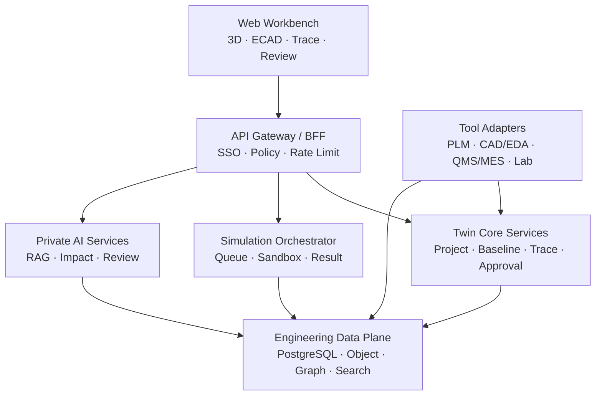

# ALPS ALPINE Engineering Digital Twin Workbench 개발지시서 v1.0

> **부제:** 스위치·센서·햅틱·차량용 전자모듈의 설계–가상검증–시제품 시험–양산 피드백을 연결하는 웹 기반 엔지니어링 워크벤치
>
> **문서 목적:** 일본 본사 대상 PoC 제안 및 개발팀 구현 기준서  
> **작성 기준일:** 2026-09-13  
> **문서 상태:** 제안·PoC 개발 기준 초안 / 고객 현행 시스템·보안정책 확인 후 확정

---

## 0. 개발팀에 내리는 최우선 지시

이 프로젝트를 단순한 3D 뷰어나 자연어 기반 회로 자동생성 데모로 만들지 않는다. 핵심은 알프스알파인이 이미 보유한 기계·전자·소프트웨어 모델링, ASIC 설계, 시험·분석, 생산기술 자산을 연결하여 아래 질문에 근거와 이력으로 답하는 **Engineering Decision Workbench**를 만드는 것이다.

1. 이 설계변경이 요구사항, 회로, 기구, 제어 소프트웨어, 시험 항목에 어떤 영향을 주는가?
2. 물리 시제품 제작 전에 어떤 위험을 가상검증으로 제거할 수 있는가?
3. 시뮬레이션 예측과 실제 시험값은 얼마나 일치하며, 불일치 원인은 무엇인가?
4. 이전 유사제품의 설계·불량·대책을 재사용할 수 있는가?
5. 누가 어떤 근거로 설계와 시험결과를 승인했는가?

AI는 설계자를 대체하거나 안전·품질 승인을 자동 확정하지 않는다. AI의 역할은 검색, 비교, 설명, 초안 생성, 이상 탐지, 영향분석 및 대안 추천이며, 모든 중요 결과는 **근거·신뢰도·모델/도구 버전·사람의 승인**을 남겨야 한다.

---

## 1. 제안 배경과 알프스알파인 적합성

알프스알파인은 Components, Sensor & Communication, Mobility의 3개 사업을 중심으로 하드웨어와 소프트웨어 통합을 추진하고 있으며, 센서와 클라우드를 결합한 솔루션 사업도 명시하고 있다.[^1] 특히 공식 기술자료는 다음 역량을 공개하고 있어 본 워크벤치의 도입 명분과 직접 연결된다.

- **System Modeling/MBD:** 기계·전자·소프트웨어를 공통 모델에서 논의하고, 물리 시제품 전에 시스템 거동을 검증해 초기 문제 발견과 재작업 감소를 추진한다.[^2]
- **스위치·햅틱 감성공학:** TACT Switch™의 조작감은 힘–스트로크(F–S) 곡선 등 물리량과 감성어를 연결해 평가한다.[^3]
- **ASIC 설계·검증:** 센서용 ASIC을 약 20년간 설계해 왔고, 회로·레이아웃 설계, 시뮬레이션, ES/CS 평가, 신뢰성 평가, 양산시험으로 이어지는 개발 흐름을 운영한다.[^4]
- **생산기술·AI:** 다양한 제품의 생산 자동화와 공정 일반화, 자체 생산설비, 검사·측정용 사내 AI, 생산데이터 분석을 추진한다.[^5]
- **자동차 EMC:** ECU·센서·통신모듈·디스플레이·오디오를 대상으로 국제 규격 기반 EMC 평가와 시험–설계 피드백을 사내에서 수행한다.[^6]

따라서 제안 메시지는 “알프스알파인에 없는 설계기술을 제공한다”가 아니라 다음과 같이 정의한다.

> **기존 전문도구와 사내 기술자산은 유지하고, 모델·시험·품질 데이터를 제품 변형별 디지털 스레드로 연결하여 Front-loading과 재사용을 가속하는 안전한 웹 워크벤치를 공동 구축한다.**

### 1.1 용어 교정

- “다량 소품종”이 아니라 제품 특성에 따라 **다품종 대량생산**, **고변형 제품군**, 또는 **High-mix production**으로 표현한다.
- “AI 자동 회로설계”를 전면에 내세우지 않는다. PoC에서는 **설계 규칙 점검, 유사설계 검색, 파라미터 대안 추천, 넷리스트 초안 및 변경 영향분석**을 우선한다.
- “디지털 트윈”은 예쁜 3D 복제물이 아니라 **요구사항·형상·회로·거동 모델·시험·실측·이력을 연결하고 실제 결과로 보정되는 모델 집합**으로 정의한다.

---

## 2. 제품 비전과 제안 명칭

### 2.1 가칭

**ALPS ALPINE Engineering Twin Workbench (AA-ETW)**  
일본어 제안 표기: **設計・検証デジタルツイン・ワークベンチ（仮称）**

### 2.2 한 문장 가치 제안

스위치·센서·햅틱·차량용 모듈의 요구사항, 3D/회로/제어 모델, 시뮬레이션, 시험결과와 품질 이력을 하나의 웹 공간에서 비교·추적하여 **양산 전 위험을 앞당겨 발견하고 설계 재사용과 승인 속도를 높이는 엔지니어링 디지털 트윈 플랫폼**.

### 2.3 제안 원칙

1. **Connect, not replace:** 기존 EDA/CAD/CAE/PLM/MES/QMS/시험장비를 대체하지 않고 어댑터로 연결한다.
2. **Evidence before answer:** AI 답변은 원문, 시험결과, 규칙, 시뮬레이션 로그 등 근거를 제시한다.
3. **Human approval:** 설계 동결, 규격 적합 판정, 양산 승인에는 사람의 전자승인이 필수다.
4. **Model validity:** 모든 결과에 모델 유효범위, 버전, 입력조건, Solver 버전을 기록한다.
5. **On-premises first:** 핵심 설계 IP는 온프레미스 또는 폐쇄형 프라이빗 클라우드에 둔다.
6. **Open core + commercial adapters:** PoC는 오픈소스로 속도를 확보하되, 양산 단계는 기존 상용도구와 라이선스 정책을 존중한다.

---

## 3. PoC 대상과 범위

### 3.1 권장 PoC 제품

**1순위: 자동차용 TACT Switch™ 또는 햅틱 입력모듈의 Variant Design**

선정 이유:

- 기계(F–S 곡선, 돔 형상, 공차), 전자(접점·저항·신호), 소프트웨어(입력 판정·디바운스), 감성(명확함·고급감), 시험(내구·온도·진동)을 하나의 트윈으로 보여줄 수 있다.
- 설계변수와 사용자 체감 사이의 연결이 직관적이어서 경영진 데모 효과가 높다.
- 공식 공개된 System Modeling 및 Kansei Engineering 방향과 정확히 맞는다.[^2][^3]

**2순위: 센서 + 신호처리 ASIC/AFE 모듈**

- 입력 센서 모델, 아날로그 프런트엔드, ADC, 보정 알고리즘, 온도 특성, 차량 규격을 연결하는 다중 도메인 검증에 적합하다.
- 다만 PDK, 파운드리 IP, 실제 회로 데이터의 보안·라이선스 제약이 크므로 2단계가 적절하다.

### 3.2 PoC 필수 범위

- 제품/Variant 프로젝트 생성 및 기준선(Baseline) 관리
- 요구사항 등록·추적 및 Verification Matrix
- STEP 또는 glTF 기반 3D 조립체 조회, 부품 선택, 단면/측정/주석
- KiCad 샘플 회로 업로드, ERC 결과 및 ngspice 분석 실행
- 파라미터 Sweep/DOE, 결과 비교, 기준 위반 표시
- F–S 곡선 또는 센서 응답 곡선의 예측값–실측값 비교
- 시험계획, CSV/JSON 실측 업로드, 모델 보정 이력
- AI 설계 검토 Copilot: 근거 기반 질의, 유사사례 검색, 변경 영향분석
- 설계 Review/Approval Gate 및 감사로그
- 일본어/영어 UI, 한국어는 운영·개발 지원용으로 선택 제공
- 온프레미스 배포 가능한 컨테이너 패키지

### 3.3 PoC 제외 범위

- 상용 IC PDK를 이용한 트랜지스터 수준 Place & Route 전체 자동화
- 파운드리 Tape-out 승인 또는 AEC-Q100/ISO 26262 적합성 자동 판정
- 범용 브라우저 네이티브 CAD/EDA를 처음부터 완전 재구현
- 실제 생산라인을 제어하는 폐루프 자동제어
- AI가 사람 승인 없이 BOM/회로/시험기준을 확정하는 기능
- “시제품 50% 감소”, “개발기간 60% 단축” 같은 사전 보장

---

## 4. 사용자와 권한

| 역할 | 주요 목적 | 권한 예시 |
|---|---|---|
| Program Manager | 일정·Gate·변경 영향·KPI 관리 | 프로젝트/기준선 조회, Gate 요청 |
| System Architect | 요구사항과 다중 도메인 구조 관리 | 시스템 모델, Interface, Trace 생성 |
| Mechanical Engineer | 형상·재료·공차·기구해석 | CAD 버전, 파라미터, CAE 결과 등록 |
| Electrical/ASIC Engineer | 회로·넷리스트·모델·전기검증 | 회로 버전, SPICE/ERC 결과 관리 |
| Software/Control Engineer | 제어모델·SIL/HIL 결과 관리 | 소프트웨어 빌드·FMU·시험 연결 |
| Test/EMC Engineer | 시험계획·장비·실측·판정 | 시험 실행, Raw data, 보고서 등록 |
| Quality Engineer | 규격·FMEA·부적합·대책 관리 | 규칙세트, NCR/CAPA, 품질 승인 |
| Manufacturing Engineer | 공정능력·DFM·양산 피드백 | 공정 파라미터, 검사·수율 데이터 연결 |
| Reviewer/Approver | 단계별 독립 검토와 승인 | 승인·반려·조건부 승인 |
| Platform Admin | 조직·권한·연동·운영 | RBAC, SSO, Connector, Audit 관리 |

RBAC에 프로젝트·제품군·보안등급 기반 ABAC를 결합한다. “열람 가능”과 “원본 다운로드 가능”을 분리하고, 공급사/협력사는 허가된 모델의 파생본 또는 FMU만 보도록 제한할 수 있어야 한다.

---

## 5. 핵심 업무 흐름

### 5.1 기본 설계–검증 흐름

1. 기존 제품 또는 템플릿에서 새 Variant를 생성한다.
2. 고객 요구사항과 내부 규격을 등록하고 설계변수 및 검증항목에 연결한다.
3. CAD/ECAD/제어모델을 업로드하거나 기존 도구에서 동기화한다.
4. 시스템이 버전·단위·인터페이스·필수 메타데이터를 검증한다.
5. AI가 유사제품, 과거 결함, 미연결 요구사항, 변경 영향 후보를 제시한다.
6. 엔지니어가 해석 시나리오와 파라미터 범위를 승인한다.
7. 워커가 SPICE/기구/시스템 Co-simulation 작업을 격리 실행한다.
8. 결과를 요구 기준과 비교하고 Pass/Fail/Review Required로 표시한다.
9. 시제품 시험값을 업로드해 예측–실측 오차와 모델 신뢰도를 계산한다.
10. 차이가 허용치를 넘으면 원인 가설과 재검증 작업을 생성한다.
11. Review Gate에서 근거 패키지를 검토하고 승인·반려·조건부 승인한다.
12. 승인된 Baseline을 고정하고 다음 단계 또는 양산 시스템으로 전달한다.

### 5.2 설계변경 영향분석

- 입력: 변경요청(ECR), 변경 부품/파라미터, 사유, 목표 적용일
- 자동 추적: Requirements → System element → CAD/ECAD/Software → Simulation → Test → BOM/Process
- 출력: 직접 영향, 2차 영향, 재시험 필요 항목, 변경 전후 성능, 미확인 위험
- 승인 전 조건: 필수 재검증 완료, 근거 링크 유효, 승인자 분리, 변경 패키지 해시 고정

### 5.3 모델–실측 보정 루프

- 예측 곡선과 시험 Raw data를 동일 단위·좌표·Sampling 기준으로 정규화한다.
- RMSE, MAE, 최대오차, 상관계수 및 영역별 오차를 계산한다.
- 모델 파라미터 보정은 제안값과 사용 데이터셋을 기록하고 사람이 승인한다.
- 보정 전/후 모델은 별도 버전으로 유지하며 Raw data를 덮어쓰지 않는다.
- Validity Envelope 밖의 예측에는 “Extrapolation / 검증 불충분” 경고를 표시한다.

---

## 6. 화면 및 UX 요구사항

### 6.1 화면 맵

| ID | 화면 | 핵심 구성 |
|---|---|---|
| S01 | Portfolio Dashboard | 제품군, 프로젝트 단계, 위험, 최근 승인, 재사용 후보 |
| S02 | Project Twin Home | Variant 개요, Digital Thread, 최신 Baseline, 품질상태 |
| S03 | Requirements & Trace | 요구사항 트리, 추적 매트릭스, 미연결/미검증 경고 |
| S04 | 3D Design Review | 조립체 트리, 3D 뷰, 단면·측정·주석, 버전 Diff |
| S05 | ECAD/SPICE Workbench | 회로/넷리스트, ERC, 분석 설정, 파형·측정값 |
| S06 | System Model Canvas | 도메인 블록, Interface, FMU 연결, 단위 검사 |
| S07 | Experiment Studio | DOE/Sweep, Scenario, Solver 설정, 실행 큐 |
| S08 | Result Compare | Variant/버전 비교, 목표 대비, 민감도, 오차 |
| S09 | Test & Correlation | 시험계획, 실측 업로드, 예측–실측 중첩, 보정 이력 |
| S10 | AI Engineering Copilot | 근거형 Q&A, 영향분석, 유사사례, 검토 체크리스트 |
| S11 | Review & Gate | 제출물 체크, 검토 코멘트, 승인/반려/조건부 승인 |
| S12 | Quality/FMEA | Failure mode, 원인·영향, Control, Simulation/Test 링크 |
| S13 | Connector Center | PLM/EDA/CAD/QMS/MES/시험장비 연결상태와 동기화 |
| S14 | Admin & Audit | 사용자·권한·보안등급·모델 레지스트리·감사로그 |

### 6.2 UX 규칙

- 3D, 회로, 그래프, 요구사항에서 같은 부품 ID를 선택하면 나머지 패널도 해당 객체로 동기화한다.
- 모든 결과 카드에 **입력 Baseline, 도구/모델 버전, 실행시각, 실행자, 상태, 신뢰도, 근거 링크**를 노출한다.
- Pass는 녹색만으로 표현하지 말고 아이콘·텍스트를 함께 사용한다.
- 일본어를 기준 언어로 설계하며 단위, 숫자, 날짜, 소수점, 전각/반각 표기를 검수한다.
- 대용량 3D는 LOD, 지연 로딩, 부품 단위 Streaming으로 1차 화면을 빠르게 연다.
- AI 답변에는 “근거 있음/근거 부족/추정” 상태와 인용 위치를 표시한다.
- 중요한 변경은 전후 Diff와 영향 범위를 확인해야 저장 또는 승인 요청이 가능하다.

---

## 7. 기능 상세 요구사항

### FR-01 제품·Variant·Baseline 관리

- 제품군 → 제품 → Variant → Revision → Baseline 계층을 제공한다.
- Branch, Merge Request, Tag 방식의 설계 협업을 지원하되 Git을 모르는 사용자를 위한 업무용 UI를 제공한다.
- Baseline에는 요구사항, 형상, 회로, 모델, 소프트웨어, 시험계획, 규칙세트의 정확한 버전을 Manifest로 고정한다.
- Baseline 이후 원본은 불변으로 유지하고 변경은 새 Revision에서만 수행한다.

### FR-02 요구사항과 추적성

- 요구사항 ID, 원문, 출처, 우선순위, 검증방법, 안전/규제 등급, 소유자, 상태를 관리한다.
- ReqIF Import/Export를 우선 지원하고 CSV/Excel은 보조로 제공한다.
- 양방향 Trace와 Coverage를 계산한다.
- AI가 자연어 요구사항의 모호성, 단위 누락, 검증 불가능 표현을 표시하되 자동 수정하지 않는다.

### FR-03 3D 설계 검토

- STEP/STP, IGES, STL, OBJ, glTF/GLB 업로드를 지원하되 원본과 웹용 파생본을 구분 저장한다.
- 서버에서 OCCT 기반 Tessellation과 메타데이터 추출을 수행하고, 브라우저는 Three.js로 표시한다.
- 치수·질량·Bounding box·간섭 후보·부품 속성·BOM 연결을 제공한다.
- PoC에서 완전한 피처 기반 CAD 편집은 구현하지 않고, 승인된 파라미터 변경 요청과 외부 CAD 왕복 연동에 집중한다.

### FR-04 회로·SPICE 검증

- KiCad 프로젝트 또는 SPICE Netlist를 가져오고 Parser로 부품·Net·모델·분석설정을 구조화한다.
- ERC/필수 모델/전원·접지/단위/범위 검사를 수행한다.
- ngspice를 서버 격리 워커에서 실행하여 DC, AC, Transient, Noise, Temperature/Sweep를 지원한다.
- 브라우저 WASM은 교육·빠른 Preview에 한정하고, 재현성 있는 공식 PoC 결과는 서버 측 고정 이미지/버전에서 실행한다.
- 상용 EDA와의 연계는 원본 파일 직접 해석보다 공급사 API, 중립 포맷, Export artifact 기반 Adapter를 우선한다.

### FR-05 시스템 모델과 Co-simulation

- 기계·전자·제어·열 모델을 Block/Port/Parameter로 구성한다.
- FMI 3.0 기반 FMU Import, Model Exchange/Co-simulation 메타데이터 검사, 단위·Step size·초기조건 관리를 지원한다. FMI는 동적 시뮬레이션 모델 교환을 위한 공개 표준이며 다양한 도구가 지원한다.[^7]
- PoC에서는 한 개의 대표 시나리오만 End-to-End로 검증하고, 모델 IP 보호가 필요한 경우 Binary FMU를 허용한다.
- Solver 발산, 시간초과, Event loop, 단위 불일치를 사용자에게 이해 가능한 오류로 변환한다.

### FR-06 DOE·최적화

- 변수별 단위, 하한/상한, 이산값, 고정값, 제약식을 정의한다.
- Grid/Random/Latin Hypercube를 지원하고, 고급 Bayesian Optimization은 선택 기능으로 둔다.
- Pareto front, 민감도, 제약 위반, 후보안 비교를 표시한다.
- AI 추천안은 목적함수, 제약, 학습 데이터 범위와 불확실성을 함께 제시한다.

### FR-07 시험·상관성

- 시험계획–시험실행–Raw data–가공 데이터–판정–보고서의 계보를 유지한다.
- CSV/JSON/Parquet 업로드와 장비 Adapter를 지원한다.
- 시험 데이터는 원본 불변 저장, 처리 스크립트 버전, Calibration 정보, 장비 ID, 환경조건을 기록한다.
- EMC의 경우 시험규격·방법·한계값과 결과를 연결하되 인증 판정은 권한 있는 시험 담당자가 수행한다.

### FR-08 AI Engineering Copilot

- **RAG:** 승인된 요구사항, 설계 가이드, 과거 Review, FMEA, 시험보고서, 부적합/CAPA를 보안 범위 내 검색한다.
- **Change Impact:** Knowledge graph의 Trace를 따라 영향 객체와 재시험 후보를 제시한다.
- **Design Review:** 체크리스트 누락, 규칙 위반, 유사 결함, 범위 밖 예측을 찾는다.
- **Authoring Assist:** 시험계획·Review 요약·변경 설명 초안을 만든다.
- **Tool Agent:** 사용자가 승인한 분석계획만 Simulation API로 제출한다.
- 답변은 문서/객체 ID와 위치를 인용하며, 근거가 없으면 생성하지 않고 확인 필요로 표시한다.
- 고객 설계 데이터는 외부 범용 모델 학습에 사용하지 않는다.

### FR-09 Review·승인·감사

- Gate 예시: Concept → Design Ready → Virtual Verification Complete → Prototype Test Complete → Production Readiness.
- Gate별 필수 산출물·승인 역할·독립성·조건부 승인 만료일을 설정한다.
- 전자서명, 승인 사유, 반려 항목, 재제출 이력을 보존한다.
- 감사로그는 Append-only로 관리하고 Export 가능한 증적 패키지를 생성한다.

### FR-10 Connector Framework

- PLM/PDM, ALM, CAD/CAE, EDA, MES/QMS, Object Storage, Git, SSO, 시험장비를 플러그인 방식으로 연결한다.
- Connector는 Pull/Push 방향, 데이터 소유권, 동기화 주기, 충돌정책, 재시도, Dead-letter Queue를 명시한다.
- Source of Truth를 객체 유형별로 설정하고 양방향 무제한 수정은 금지한다.

---

## 8. 기술 아키텍처

### 8.1 논리 구성



### 8.2 배포 구조

- 고객사 사설망 Kubernetes 또는 보안정책에 따라 OpenShift/VM 기반으로 배포한다.
- Web/API, Core service, AI inference, Simulation worker, Data plane을 별도 Namespace/Network policy로 분리한다.
- Simulation job은 비특권 컨테이너, Read-only root FS, CPU/RAM/시간 제한, 네트워크 차단을 기본으로 한다.
- 외부 LLM 사용 시 고객이 승인한 Gateway만 통과시키며 DLP, Prompt/Response logging 정책, 비밀정보 마스킹을 적용한다.
- 완전 폐쇄망 모드에서는 로컬 임베딩·LLM·패키지 미러·모델 레지스트리를 제공한다.

### 8.3 권장 기술 스택

| 계층 | PoC 권장 기술 | 선정 이유·주의 |
|---|---|---|
| Web | React + TypeScript + Vite/Next.js | 복잡한 상태·다국어·컴포넌트화 |
| 3D Viewer | Three.js 또는 React Three Fiber | glTF 파생본 시각화; 정밀 CAD Kernel 아님 |
| Graph/Canvas | React Flow | Trace/System block UI용; 실제 전기 의미는 Domain Model에서 관리 |
| Chart | Apache ECharts/Plotly | 파형·DOE·예측–실측 비교 |
| API | FastAPI + Pydantic | Python 해석·AI 생태계와 연결 용이 |
| Workflow | Temporal 우선, 경량 PoC는 Celery | 장기 실행·재시도·승인대기에는 Durable workflow가 유리 |
| Queue/Cache | Redis 또는 RabbitMQ | 작업상태·이벤트 전달; 영구 업무상태 저장소로 쓰지 않음 |
| DB | PostgreSQL | 프로젝트·버전·승인·메타데이터 |
| Graph | PostgreSQL + recursive CTE로 시작, 필요 시 Neo4j | PoC 과설계 방지, Trace 복잡도에 따라 확장 |
| Search | OpenSearch | 문서·메타데이터·감사 검색 |
| Object | S3 호환 저장소 | 원본 CAD, FMU, 결과, 시험 Raw data; 제품 라이선스 별도 검토 |
| CAD 처리 | Open CASCADE Technology | CAD 형상/변환 기반; LGPL 2.1 + exception 조건 검토 필요[^8] |
| ECAD | KiCad CLI + ngspice | KiCad는 CLI와 ngspice 통합을 제공함[^9][^10] |
| System model | FMI 3.0 + FMPy, 선택적으로 OpenModelica | 도구 중립 Co-simulation |
| AI | 사내 승인 LLM + Embedding + vLLM/Triton 선택 | 모델은 교체 가능하게 Gateway 추상화 |
| Observability | OpenTelemetry + Prometheus + Grafana + Loki | Job/AI/Connector 전 구간 추적 |
| Identity | OIDC/SAML, 고객 IAM 연동 | MFA·조건부 접근·조직 권한 |

### 8.4 오픈소스 사용 원칙

- 프로젝트 시작 전에 OSS 목록, 버전, 라이선스, 링크 방식, 수정 여부, 배포 형태를 담은 **OSS Review Sheet**를 작성한다.
- AGPL/GPL 구성요소는 배포·네트워크 제공 조건을 법무와 검토하고, 교체 가능한 Adapter로 격리한다.
- SBOM(SPDX 또는 CycloneDX), 취약점 스캔, 출처 및 Notice 파일을 Release Gate에 포함한다.
- `ngspice-wasm`, 특정 3D 생성 모델, GitHub 예제 프로젝트의 유지보수 상태와 상용 사용 조건은 착수 시 재검증한다.
- 오픈소스는 기능 가능성을 뜻할 뿐 자동차·반도체 Sign-off 자격을 자동 제공하지 않는다.

---

## 9. 데이터·디지털 스레드 설계

### 9.1 핵심 엔터티

| 엔터티 | 필수 관계 |
|---|---|
| ProductFamily / Product / Variant / Revision | 제품 계층과 변경 이력 |
| Requirement | Source, VerificationMethod, Trace |
| Component / Assembly / Interface | CAD/ECAD/BOM/System 요소 연결 |
| Artifact / ArtifactVersion | 원본, 파생본, Hash, 보안등급, Tool version |
| Model / ModelVersion / ParameterSet | 모델 유효범위와 입력 파라미터 |
| Scenario / SimulationRun / ResultMetric | 실행조건, Solver, Log, 결과 |
| TestPlan / TestRun / Measurement | 장비, 환경, Calibration, Raw data |
| CorrelationRecord | 예측–실측 정렬, 오차, 승인상태 |
| ChangeRequest / ImpactItem | 변경 이유, 영향·재검증 범위 |
| Review / Approval / Gate | 검토 의견, 전자서명, 상태 전이 |
| FailureMode / NCR / CAPA | 결함·원인·대책·재발방지 |
| ProvenanceEvent / AuditEvent | 생성·변환·실행·승인의 전 계보 |

### 9.2 식별·버전 원칙

- 모든 객체에 불변 UUID와 사람이 읽는 Business ID를 함께 부여한다.
- 파일명은 식별자가 아니며 SHA-256으로 무결성을 검증한다.
- Derived artifact는 `generated_from`, 실행 ID, 변환기 버전, 파라미터를 기록한다.
- 단위는 내부 표준 단위와 원본 단위를 함께 보존하고 UCUM 호환 표현을 사용한다.
- 삭제는 기본 Soft delete + Retention 정책을 따르며 승인 Baseline과 감사로그는 임의 삭제할 수 없다.

### 9.3 최소 API 예시

```http
POST   /api/v1/projects
POST   /api/v1/projects/{id}/variants
POST   /api/v1/artifacts/uploads
POST   /api/v1/baselines
GET    /api/v1/twins/{variant_id}/graph
POST   /api/v1/simulation-runs
GET    /api/v1/simulation-runs/{id}
POST   /api/v1/test-runs/{id}/measurements
POST   /api/v1/correlations
POST   /api/v1/change-requests/{id}/impact-analysis
POST   /api/v1/ai/review
POST   /api/v1/gates/{id}/submit
POST   /api/v1/gates/{id}/decisions
GET    /api/v1/audit-events
```

모든 변경 API에 Idempotency-Key, Actor, Project scope, Correlation ID를 적용한다. 대형 파일은 API 서버를 경유하지 않고 사전서명 업로드를 사용하되, 업로드 완료 후 Malware scan과 Hash 검증이 끝나야 Artifact로 승격한다.

---

## 10. AI 설계 및 안전 통제

### 10.1 AI 처리 파이프라인

1. 사용자·프로젝트 권한을 먼저 확인한다.
2. 질문을 업무 의도, 대상 제품/Revision, 요구 출력으로 구조화한다.
3. 키워드 + Vector + Graph 탐색으로 근거 후보를 수집한다.
4. 보안등급·승인상태·최신 Baseline을 기준으로 재정렬한다.
5. LLM이 답변/체크리스트/영향 후보를 생성한다.
6. Citation validator가 객체 ID와 원문 구간의 존재를 검증한다.
7. 정책 엔진이 금지 동작, 범위 밖 계산, 승인 우회를 차단한다.
8. 최종 결과에 근거, 신뢰도, 미확인 항목, 사용 모델 버전을 붙인다.

### 10.2 금지 규칙

- AI가 ISO 26262, AEC-Q100, EMC 규격의 최종 적합 판정을 확정하지 않는다.
- 근거가 없는 부품 수치, 재료 물성, 허용오차, 시험 결과를 생성하지 않는다.
- 권한 없는 프로젝트의 유사사례를 제목·요약 형태로도 노출하지 않는다.
- 생성된 Netlist/Script를 검토 없이 공식 Simulation 또는 장비로 전송하지 않는다.
- Public LLM으로 고객 설계 원문, PDK, BOM, 고객명, 시험 Raw data를 전송하지 않는다.

### 10.3 AI 평가셋

- 실제 고객 데이터 대신 비식별 또는 합성 데이터로 1차 평가한다.
- 최소 100개 질문을 Fact lookup, Cross-document reasoning, Impact analysis, Ambiguity detection, Refusal, Access control로 구분한다.
- 측정값: Citation precision/recall, Unsupported claim rate, 권한 누출 0건, Top-k 영향항목 recall, 엔지니어 유용성 점수.
- 모델/Prompt/Retriever 변경 시 동일 평가셋으로 회귀시험하고 결과를 Model Registry에 남긴다.

---

## 11. 보안·품질·운영 요구사항

### 11.1 보안

- 고객 IAM 기반 SSO, MFA, 최소권한, 직무분리, 정기 권한 재인증
- TLS 1.2 이상, 저장데이터 암호화, KMS/HSM 연동 옵션
- 프로젝트·분류등급별 Download/Export/Print/Clipboard 정책
- CAD/문서 워터마크, 외부 공유 만료, 원본 반출 승인
- Secret vault, 키 회전, 서비스 계정 만료, 관리자 Break-glass 감사
- SAST/DAST/SCA, Container/IaC scan, SBOM, 서명 이미지, Admission policy
- Prompt injection, 악성 문서, 데이터 유출, Tool misuse를 포함한 AI Red Team
- 모든 Connector와 Simulation worker의 outbound network 기본 차단

### 11.2 비기능 요구사항

| 구분 | PoC 목표 | Production 후보 목표 |
|---|---|---|
| 일반 화면 응답 | P95 2초 이내 | P95 1.5초 이내 |
| 3D 최초 표시 | 100MB 원본 기준 파생본 10초 이내 | 제품별 LOD 기준 정의 |
| 동시 사용자 | 30명 | 부서/거점 수요로 산정 |
| Simulation 동시 작업 | 10 Job | Worker 수평 확장 |
| 가용성 | 업무시간 99.5% | 99.9% 이상 협의 |
| RPO/RTO | 24h / 8h | 1h / 4h 이하 협의 |
| 감사로그 | PoC 전 기간 | 고객 보존정책에 따라 5~10년 검토 |
| 다국어 | 일본어·영어 | 한국어 포함 확장 |

수치는 PoC 환경과 실제 파일 크기, Solver 부하를 기준으로 재산정한다. Simulation 완료시간은 회로/모델별 기준 시나리오로 별도 SLA를 둔다.

### 11.3 관측성과 운영

- 사용자 요청 → API → Workflow → Worker → Solver → Storage 전 구간 Trace ID 유지
- 대시보드: API 오류, Queue wait, Simulation 실패, Solver별 시간, Connector lag, AI citation 실패, 저장소 증가율
- Runbook: Solver hang, 파일 변환 실패, Connector credential 만료, Index 지연, 모델 rollback, 데이터 복구
- Admin이 서비스 중단 없이 모델/규칙세트를 Staging → 승인 → Production으로 승격할 수 있어야 한다.

---

## 12. PoC 시나리오

### 12.1 대표 데모: TACT Switch Variant 최적화

**목표:** 기존 스위치의 조작감을 유지하면서 높이 또는 소재를 변경한 파생모델을 검토한다.

1. 기준 제품의 Requirement, 3D, F–S 곡선, 회로, 시험결과를 불러온다.
2. “더 명확한 클릭감, 오작동 방지, 지정 수명 만족” 요구사항을 등록한다.
3. 돔 두께/재료/Stroke/접점 저항 등 허용 파라미터 범위를 지정한다.
4. 3D에서 변경 부품과 간섭·치수 차이를 확인한다.
5. System model과 SPICE/기구 응답 시뮬레이션을 실행한다.
6. DOE 결과에서 요구범위를 만족하는 후보 3개와 Trade-off를 비교한다.
7. AI가 과거 유사 Variant와 결함/시험 누락 가능성을 근거와 함께 제시한다.
8. 엔지니어가 후보 1개를 선택하고 시제품 시험계획을 승인한다.
9. 실측 F–S/접점 데이터를 업로드하여 예측과 중첩한다.
10. 오차 원인을 분석하고 모델 보정 후 재실행한다.
11. Gate 화면에서 추적성, 검증 Coverage, 잔여 위험을 검토하고 승인한다.

### 12.2 데모 성공 조건

- 요구사항에서 관련 설계·시뮬레이션·시험까지 3클릭 이내 탐색
- Variant 2개 이상을 동일 축과 동일 단위로 비교
- 동일 Baseline과 Tool image에서 재실행 시 결과가 정의된 허용오차 내 재현
- AI 답변의 모든 사실 주장에 열람 가능한 근거 연결
- 실제 시험 Raw data와 변환 결과, 보정 모델의 계보 확인
- 승인 전 필수 증적 누락 시 Gate 차단
- 일본어 UI에서 핵심 데모가 중단 없이 완료

---

## 13. 16주 PoC 개발계획

| 단계 | 기간 | 핵심 작업 | Exit Gate |
|---|---:|---|---|
| 0. Discovery | 1~2주 | 현행 툴·데이터·보안·제품 선정, KPI Baseline, 데이터 반출 등급 | PoC Charter, 대상 데이터 승인 |
| 1. Foundation | 3~4주 | IAM/RBAC, 프로젝트·Artifact·버전, 저장소, 감사, CI/CD | 기본 보안·업로드 E2E |
| 2. Twin Viewer | 5~7주 | 3D 변환/뷰, 요구사항 Trace, Variant/Baseline, Diff | 대표 CAD·Trace 시나리오 통과 |
| 3. Simulation | 6~10주 | KiCad/ngspice, 파라미터 Sweep, Result compare, Job sandbox | Golden circuit 재현성 통과 |
| 4. Test Loop | 9~12주 | 시험업로드, 예측–실측 상관, 보정 이력, FMEA 연결 | Golden dataset 오차 계산 검증 |
| 5. AI Copilot | 10~13주 | 권한형 RAG, 영향분석, Review 초안, AI 평가셋 | 근거·권한·거부 평가 통과 |
| 6. Approval & Hardening | 13~15주 | Gate, 전자승인, 보안·성능·복구·일본어 QA | UAT 후보 Release 승인 |
| 7. UAT & Executive Demo | 16주 | 사용자 교육, UAT, KPI 비교, 확장안·ROI 산정 | 고객 PoC Acceptance |

### 13.1 권장 수행팀

| 역할 | 투입 예시 | 책임 |
|---|---:|---|
| Product/Engineering Lead | 1 | 고객 요구, 제품 범위, Acceptance |
| Solution Architect | 1 | 전체 구조, 보안·연동·NFR |
| Frontend/3D Engineer | 2 | Workbench, 3D, Graph, Chart |
| Backend/Platform Engineer | 2 | Core, Workflow, Data, Connector |
| Simulation/CAE Engineer | 1~2 | SPICE/FMI/상관성, Golden model |
| AI/ML Engineer | 1~2 | RAG, Impact, 평가·Guardrail |
| QA/DevSecOps | 1~2 | 자동화, 보안, 배포, 운영성 |
| Alps Alpine Domain SMEs | 각 분야 Part-time | 모델·규칙·시험·판정 검증 |

고객 SME가 제공되지 않으면 기술 데모는 만들 수 있어도 공학적 유효성 검증은 완료할 수 없다. 이 의존성을 계약과 일정에 명시한다.

---

## 14. 검수 기준(Acceptance Criteria)

### 14.1 기능 검수

- AC-F01: 승인된 샘플 STEP 파일을 변환하고 조립체 트리·속성·주석을 표시한다.
- AC-F02: 샘플 KiCad/Netlist에서 ERC와 지정 SPICE 분석을 실행하고 Golden result와 비교한다.
- AC-F03: Requirement–Model–Simulation–Test 간 Trace가 양방향으로 조회된다.
- AC-F04: Variant 변경 전후와 영향을 받은 검증항목을 보여준다.
- AC-F05: 시험 Raw data를 보존하고 예측–실측 오차를 검증된 계산식으로 산출한다.
- AC-F06: Gate 필수자료가 누락되면 승인 요청 또는 승인을 차단한다.
- AC-F07: AI 답변은 근거 링크를 제공하고 권한 없는 근거는 검색·노출하지 않는다.

### 14.2 품질 검수

- Unit/Integration/E2E 테스트와 Golden simulation 회귀시험 자동화
- 권한 상승, 수평·수직 IDOR, 악성 파일, Prompt injection, Worker escape 시험
- 일본어 네이티브 검수: 용어, 줄바꿈, 정렬, 날짜·단위·오류메시지
- 접근성: 키보드 탐색, 명도 대비, 색상 외 상태 표시
- 백업 복구 리허설과 감사증적 Export 성공
- SBOM, 취약점 예외승인, OSS Notice, 배포·운영 Runbook 제출

### 14.3 완료 정의(Definition of Done)

기능 구현만으로 완료 처리하지 않는다. 코드 리뷰, 테스트, 보안검사, 문서, Observability, 다국어, 권한검사, 데이터 계보, 고객 SME 검증이 모두 충족되어야 완료다.

---

## 15. KPI와 ROI 측정

효과를 사전에 고정 수치로 보장하지 않고, Discovery 단계에서 최근 프로젝트의 Baseline을 정한 뒤 동일 정의로 비교한다.

| KPI | 산식/측정 방법 |
|---|---|
| 설계변경 영향분석 Lead Time | 변경요청 등록부터 영향항목 승인까지의 중위시간 |
| Virtual verification coverage | 시제품 전 완료된 검증항목 / 전체 검증항목 |
| First-pass prototype success | 주요 요구를 추가 설계변경 없이 통과한 1차 시제품 비율 |
| Physical prototype iteration | 제품 Variant당 물리 시제품 반복 횟수 |
| Late defect escape | Design freeze 이후 발견된 설계기인 결함 수 |
| Model–test correlation | 핵심 출력별 RMSE/최대오차 및 허용범위 충족률 |
| Requirement trace coverage | 양방향 Trace와 검증 근거가 있는 요구사항 비율 |
| Reuse rate | 승인 모델·시험·설계규칙을 재사용한 신규 Variant 비율 |
| Review preparation time | Gate 증적 수집·보고서 작성 소요시간 |
| AI grounded answer rate | 사실 주장 중 유효 근거로 검증된 비율 |

ROI는 `회피된 시제품·시험 비용 + 재작업 절감 + 검토시간 절감 + 일정 단축의 기회가치 - 구축·운영·라이선스 비용`으로 계산한다. 절감액에는 고객 재무팀이 동의한 단가만 사용한다.

---

## 16. 주요 위험과 대응

| 위험 | 영향 | 대응 |
|---|---|---|
| 범위가 IC EDA·CAD 전체 재구현으로 확대 | 일정·비용 폭증 | Viewer/Orchestrator/Trace 중심, 기존도구 Adapter 원칙 |
| 모델은 있으나 유효범위·버전이 불명확 | 잘못된 의사결정 | Model card, Validity envelope, Baseline 강제 |
| 시험데이터의 단위·시간축·Calibration 불일치 | 상관분석 오류 | Import contract, 단위 정규화, 데이터 품질 Gate |
| 상용도구 파일 포맷·라이선스 제약 | 연동 차단 | 공식 API/중립 포맷/Headless license 사전 확인 |
| OSS 라이선스 또는 공급망 취약점 | 배포 중단 | OSS Review, SBOM, 교체 가능한 Adapter |
| AI 환각과 설계 IP 유출 | 품질·보안 사고 | Citation, 권한형 검색, Private inference, DLP, 승인 |
| 실시간 생산 Twin까지 조기 확대 | PoC 실패 | Engineering Twin부터 시작, Operational Twin은 2단계 |
| 고객 SME·데이터 제공 지연 | 공학 검증 불가 | Dependency Gate, 합성 Golden dataset, 일정 변경규칙 |
| 일본 본사 사용자 UX/용어 부적합 | 수용성 저하 | 일본어 IA/용어집, 현지 사용자 5명 이상 UAT |

---

## 17. PoC 이후 확장 로드맵

### Phase 2: Engineering Digital Thread 확장

- 상용 PLM/ALM/EDA/CAE 연동
- 센서 + ASIC/AFE + 보정 소프트웨어 Co-simulation
- EMC 시험계획·결과·설계대책 연결
- Supplier collaboration 및 FMU 기반 IP 보호
- 자동 보고서와 고객/OEM별 Evidence package

### Phase 3: Production Digital Twin

- MES/QMS/설비/AI 검사 데이터 연결
- 설계 파라미터–공정 파라미터–검사결과–불량의 계보
- 공정 이상 탐지, 가상 공정조건 비교, DFM 피드백
- 설비 제어는 읽기 전용 Shadow → 추천 → 승인 실행 순으로 단계화

### Phase 4: Closed-loop Knowledge Platform

- Field return, FA, CAPA를 설계 규칙과 시험계획에 환류
- 제품군별 Template/Feature universe와 재사용 추천
- Model registry·평가셋·규칙세트의 지속 개선
- 경영진 Portfolio 관점의 Quality/Cost/Delivery 변화 추적

---

## 18. 고객에게 요청할 사전자료

1. PoC 후보 제품 1종과 공개/비식별 가능한 Variant 2개
2. 요구사항, BOM, STEP/glTF, 회로/Netlist, 시험계획 및 실측 데이터 샘플
3. 사용 중인 PLM/PDM, CAD/CAE, EDA, ALM, QMS/MES, SSO 목록과 버전
4. 파일 포맷, API, Headless execution 및 라이선스 제약
5. 데이터 분류·반출·보존·암호화·AI 사용 정책
6. 성공 KPI의 현재 Baseline과 측정 담당자
7. System/Mechanical/Electrical/Software/Test/Quality SME와 승인자
8. 일본어 용어집, 디자인 시스템, 접근성/브라우저 표준

자료가 없을 경우 합성 데이터로 UI/플랫폼 기능만 검증하며, 공학적 정확도와 ROI는 검수 범위에서 제외한다.

---

## 19. 개발 산출물

- PoC Charter 및 Scope/Dependency Matrix
- 사용자 여정, 화면설계서, 일본어 용어집
- System Architecture, Threat Model, Data Flow Diagram
- API/OpenAPI, Event schema, Connector contract
- Engineering data model 및 Digital Thread ontology
- 실행 가능한 Web application 소스코드
- CAD/ECAD/FMI 변환·Simulation worker 이미지
- AI prompt/policy, 평가셋, Model card, 평가보고서
- 자동 테스트, Golden simulation/test dataset
- SBOM, OSS/license 검토표, 보안시험 결과
- 배포 스크립트/Helm chart 또는 고객 표준 배포 패키지
- 운영·백업·복구·장애대응 Runbook
- UAT 시나리오, Acceptance 결과, KPI 전후 비교
- Executive Demo script 및 PoC 확장 제안서

---

## 20. 개발 착수용 Master Prompt

아래 지시는 Codex/Claude Code 등 개발 에이전트에 전달할 때 사용한다.

```text
너는 산업용 엔지니어링 플랫폼의 Solution Architect이자 Senior Full-stack Engineer다.
이 저장소에서 “ALPS ALPINE Engineering Twin Workbench” PoC를 구현한다.

[제품 목표]
스위치·센서·햅틱·차량용 전자모듈의 요구사항, 3D/회로/시스템 모델,
시뮬레이션, 시제품 시험, 변경 및 승인 이력을 하나의 Digital Thread로 연결한다.
기존 CAD/EDA/CAE/PLM을 대체하지 않고 Adapter와 중립 포맷으로 연결한다.

[우선 구현]
1. Project/Product/Variant/Revision/Baseline
2. Requirement와 양방향 Trace
3. STEP→glTF 파생 변환 및 3D Review
4. KiCad/Netlist Import, ERC, ngspice Job
5. Parameter sweep와 Result comparison
6. CSV 시험값과 예측–실측 Correlation
7. 근거 기반 AI Review/Impact analysis
8. Review Gate, 전자승인, Append-only Audit
9. 일본어/영어 UI, 온프레미스 컨테이너 배포

[절대 원칙]
- AI와 시뮬레이션 결과는 최종 안전·규격 적합 판정이 아니다.
- 모든 결과에 입력 Baseline, 도구/모델 버전, 실행환경, 로그, 근거를 남긴다.
- 승인 Baseline과 Raw data는 덮어쓰지 않는다.
- 권한 확인을 검색/RAG보다 먼저 수행한다.
- 외부 LLM으로 고객 설계 데이터를 보내지 않는다.
- 대형·비신뢰 파일과 Solver는 네트워크 차단된 비특권 Sandbox에서 처리한다.
- React Flow는 화면 표현이며 회로/시스템 의미의 원장은 Domain Model이다.
- Three.js는 Viewer이며 정밀 CAD Kernel으로 취급하지 않는다.
- 브라우저 WASM Preview와 공식 재현 Simulation 실행을 구분한다.
- 근거 없는 성능수치, 물성값, 규격판정을 생성하지 않는다.

[작업 방식]
1. 기존 코드·문서·AGENTS.md·테스트·배포구조를 먼저 조사한다.
2. 현재 상태, 재사용 가능 모듈, Gap, 위험을 보고한다.
3. Epic→Story→Task, DB/API/UI/Test/Acceptance가 연결된 실행계획을 작성한다.
4. Vertical slice 단위로 구현하고 각 Slice에서 권한·감사·계보·오류처리를 포함한다.
5. Golden dataset과 재현 가능한 Solver container로 자동 회귀시험한다.
6. 모든 변경 후 lint/typecheck/unit/integration/E2E/security scan을 수행한다.
7. 기능을 완료했다고 주장하기 전에 실제 실행 증거와 남은 제한을 보고한다.

[첫 Vertical Slice]
“TACT Switch Variant A와 B를 생성하고, 요구사항–3D 부품–SPICE 결과–F-S 시험값을
연결하여 변경 전후 비교 후 Gate 승인을 완료하는 흐름”을 End-to-End로 구현한다.

[완료 보고 형식]
- 구현한 사용자 가치
- 변경 파일/DB migration/API
- 실행 및 테스트 결과
- 보안·라이선스 영향
- 알려진 제한과 다음 작업
- 데모 절차
```

---

## 21. 의사결정 제안

본사 첫 제안은 대규모 통합 구축 계약이 아니라 **16주 공동 PoC**로 제시한다. 첫 미팅의 목표는 솔루션 설명보다 다음 세 가지 합의를 얻는 것이다.

1. 대표 제품과 실제로 반복되는 설계변경 문제 1개 선정
2. 기존 System Modeling/MBD 및 시험 흐름에서 끊기는 데이터·승인 지점 확인
3. 현재 Baseline과 PoC Acceptance/KPI 공동 확정

가장 강한 데모는 “자연어로 3D를 생성했다”가 아니라, **한 설계변경이 요구사항·기구·회로·감성·시험에 미치는 영향을 추적하고, 실제 시험값으로 모델을 보정한 뒤 근거 패키지로 승인하는 전체 흐름**이다. 이것이 알프스알파인의 공개 전략인 MBD, Front-loading, 하드웨어–소프트웨어 통합, 사내 평가 역량을 가장 자연스럽게 확장한다.

---

## 참고자료

[^1]: Alps Alpine, [Our Business](https://www.alpsalpine.com/e/company/business/) — Components, Sensor & Communication, Mobility 및 sensor + cloud, AI/IoT/data 활용 방향.
[^2]: Alps Alpine, [System Modeling Technology](https://tech.alpsalpine.com/e/technology-info/system-modeling/) — 기계·전자·소프트웨어 통합 모델, MBD, 초기 가상검증과 Front-loading.
[^3]: Alps Alpine, [Kansei Engineering](https://tech.alpsalpine.com/e/technology-info/kansei/) — TACT Switch™, F–S 곡선, 감성어와 물리량의 연결.
[^4]: Alps Alpine, [ASIC Design Technology](https://tech.alpsalpine.com/e/technology-info/asic/) — ASIC 설계·시뮬레이션·샘플·시험·고장분석 및 자동차 규격 대응.
[^5]: Alps Alpine, [Production Technology](https://tech.alpsalpine.com/e/technology-info/production-process-design/) — 자동화, 공정 일반화, 자체 설비, AI 검사·측정, 생산데이터 분석.
[^6]: Alps Alpine, [EMC Evaluation Technology](https://tech.alpsalpine.com/e/technology-info/emc/) — 자동차 전자제품 EMC 시험, 국제 규격, 시험–설계 피드백.
[^7]: Modelica Association Project, [Functional Mock-up Interface](https://fmi-standard.org/) — 동적 시뮬레이션 모델 교환과 Co-simulation을 위한 공개 표준.
[^8]: Open Cascade, [Open CASCADE Technology](https://dev.opencascade.org/) — CAD/CAM/CAE용 오픈소스 기반과 LGPL 2.1 additional exception.
[^9]: KiCad, [Command-Line Interface](https://docs.kicad.org/8.0/en/cli/cli.html) — 자동화 가능한 `kicad-cli` 기능.
[^10]: KiCad, [SPICE Simulation](https://www.kicad.org/discover/spice/) — Schematic Editor와 ngspice 통합.

