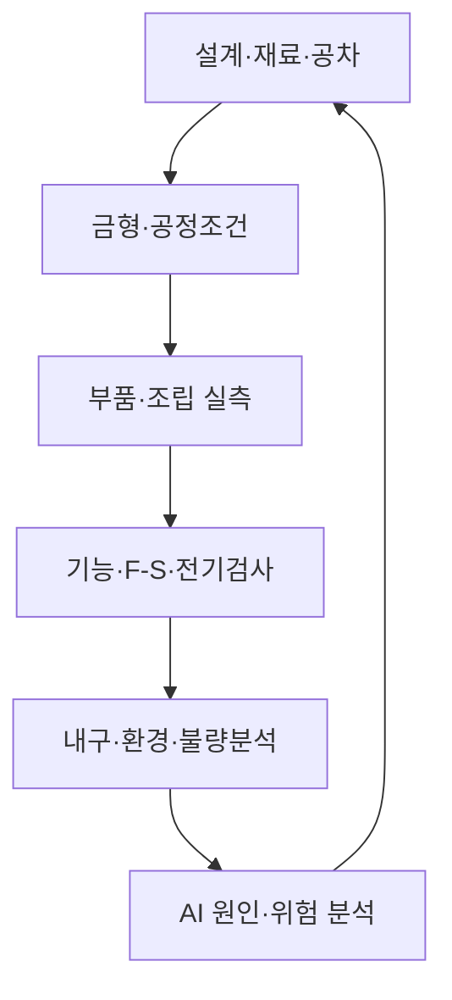

# ALPS ALPINE TACT Switch™ Product–Process Twin 고도화 개발지시서 v1.0

> **대상 시스템:** ALPS ALPINE Engineering Digital Twin Workbench(AA-ETW)  
> **개발 목표:** TACT Switch™의 제품설계, 금형·성형/프레스, 조립, 검사, 내구시험과 Lot 품질을 하나의 디지털 스레드로 연결  
> **기준일:** 2026-09-14  
> **문서 성격:** PoC 및 후속 Production Ready 고도화 실행지시서  
> **주의:** 실제 부품구조·공정순서·관리한계·검사기준은 고객 SME와 확인 후 확정한다.

---

## 0. 개발팀 최우선 지시

이 시스템을 TACT Switch의 3D 모형이나 단순 설비 모니터링 화면으로 만들지 않는다. 최종 사용자가 다음 질문에 데이터와 근거로 답할 수 있는 **Product–Process–Quality Decision Twin**을 구현한다.

1. 금형·재료·부품공차가 F–S 곡선, 접점 Bounce, 저항, 조작감과 수명에 어떤 영향을 주는가?
2. 설계변경이 금형, 공정조건, 검사기준과 기존 Variant에 어떤 영향을 주는가?
3. 불량 Lot가 어느 금형 Cavity, 설비, 공정조건, 검사값과 연결되는가?
4. 시뮬레이션 예측과 실제 검사·내구시험의 차이는 무엇이며 모델을 어떻게 보정해야 하는가?
5. 양산 전에 공차조합과 극한조건에서의 품질위험을 얼마나 앞당겨 확인할 수 있는가?

AI는 불량·원인·합격 여부를 임의로 확정하지 않는다. 모든 추천과 예측에 데이터 범위, 근거, 신뢰도, 모델 버전과 승인자를 남긴다. 실제 설비 제어는 PoC 범위에서 제외하고 **읽기 전용 Shadow → 추천 → 사람 승인** 순서로 단계화한다.

---

## 1. 사업 가치와 적용 근거

알프스알파인은 스위치에서 긴 작동수명, 접점 마모, 전도성, 그리스, 스프링·고무와 조작감을 함께 다루고 있으며, TACT Switch™를 포함한 스위치를 대규모로 생산한다고 공개하고 있다. 또한 정밀금형을 자체 개발하고 수지·프레스·Insert·고무금형을 통해 엄격한 치수공차의 소형부품을 대량생산한다. System Modeling 자료에는 스위치의 기계적 동작을 동역학 모델과 RLC 등가회로로 표현하는 사례도 제시되어 있다.

따라서 첫 PoC는 제품만 복제하는 Twin이 아니라 다음 폐루프를 구현해야 한다.



### 1.1 한 문장 가치 제안

> **금형 Cavity와 공정조건부터 개별 제품의 F–S 곡선·접점·내구 결과까지 연결하여 불량 원인을 빠르게 추적하고, 설계변경과 양산조건의 품질위험을 물리 시제품과 대량생산 전에 검증한다.**

### 1.2 PoC에서 증명할 가치

- 특정 불량 Lot의 설계–금형–공정–검사 계보를 수분 내 추적
- 제품 Variant 간 형상·공차·F–S·전기응답 차이 비교
- 금형 Cavity별 품질편차와 Drift 탐지
- 설계/공정 Parameter 변화에 따른 품질특성 예측
- 검사·내구 결과를 이용한 모델 상관성 및 재보정
- 승인된 설계·공정·검사 Template의 신규 Variant 재사용

절감률이나 불량률 개선치를 사전에 보장하지 않는다. Discovery에서 기존 Lot과 개발 프로젝트의 Baseline을 정한 뒤 동일 산식으로 PoC 성과를 측정한다.

---

## 2. PoC 범위

### 2.1 권장 대상

- TACT Switch 제품군 1개
- 기준 Variant A와 변경 Variant B
- 대표 금형 1식과 Cavity 2개 이상
- 핵심 공정 3~5개
- 기능검사, F–S 검사, 전기검사, 내구시험 데이터
- 정상 Lot 3개 이상과 이상/불량 사례 1개 이상

실제 불량 데이터를 제공하기 어렵다면 합성 데이터를 사용하되, “UI·기능 검증”과 “공학·품질 유효성 검증”을 구분한다.

### 2.2 포함 범위

- 제품/부품/재료/금형/공정/설비/Cavity/Lot/개체/검사/불량의 공통 ID 체계
- STEP 기반 3D Assembly와 설계 Revision 비교
- 주요 치수·공차·재료·F–S 및 접점 모델
- 금형·공정 Recipe와 실제 설비/검사 데이터 Import
- Lot genealogy와 원재료–부품–조립품 추적
- 공정능력·관리도·Cavity 편차·이상징후 분석
- DOE/공차 누적/Monte Carlo 및 빠른 Surrogate 예측
- AI 품질 Copilot과 근거 기반 원인 후보 제시
- 변경 영향분석, 검증계획, 승인 Gate 및 감사로그
- 온프레미스 배포와 일본어 기준 UI

### 2.3 제외 범위

- 고객 확인 없이 실제 제조 Recipe 자동 변경
- MES/QMS/설비 원장에 직접 쓰기
- 전체 공장의 모든 스위치 제품군 동시 적용
- AI의 무승인 합격 판정 및 출하 승인
- 정밀 CAD/CAE/통계도구 전체 재개발
- 실제 공정·물성 데이터가 없는 상태에서 절대 수명 또는 불량률 보장

---

## 3. 대상 업무·공정 모델

실제 공정은 고객의 공정흐름도와 PFMEA로 확정한다. PoC 설계 시 다음 참조 흐름을 사용한다.


### 3.1 관리 객체

| 영역 | 관리 객체 | 핵심 데이터 |
|---|---|---|
| 제품 | Product family, Variant, Revision, Baseline | 사양, 요구사항, BOM, 변경이력 |
| 부품 | Dome, Stem, Housing, Contact 등 | 형상, 재료, 공차, 공급 Lot |
| 금형 | Mold, Die, Cavity, Tool revision | 수명, 보전, 치수, Shot/Stroke |
| 공정 | Operation, Route, Recipe, Parameter | 설정값, 실측값, 환경, 작업조건 |
| 설비 | Equipment, Line, Station, Tool | 상태, Calibration, Alarm, 보전 |
| 생산 | Work order, Batch, Lot, Unit | 투입·산출, 시간, Genealogy |
| 검사 | Inspection plan, Test run, Measurement | 기준, 측정값, 장비, 판정 |
| 품질 | Defect, NCR, FA, CAPA, FMEA | 현상, 원인, 대책, 재발방지 |
| 모델 | Model, Scenario, Simulation run | 입력, Solver, 결과, 유효범위 |

### 3.2 핵심 품질특성 후보

- 작동력, 복귀력, Total travel, Click position
- Click ratio와 F–S 곡선 면적·Peak·Hysteresis
- 접점저항, 접촉 안정성, Bounce 횟수·지속시간
- 조립 높이, 평탄도, 위치·동심도 등 고객 CTQ
- 수명 Cycle 전후 성능 Drift
- 온도·습도·진동 조건별 기능 변화
- 외관·오염·변형·미조립 등 Defect class

CTQ 명칭과 공식은 고객 도면·Control plan·검사표를 Source of Truth로 사용한다.

---

## 4. Twin 모델 구성

### PT-01 3D Product Twin

- 원본 CAD Assembly를 부품 단위 의미 객체로 변환하고 Stable Twin Object ID를 부여한다.
- 3D 객체에 도면 Revision, 재료, 공차, 금형 Cavity, 공정, 검사, 불량을 연결한다.
- A/B Variant를 겹쳐 형상·공차·질량·간섭·CTQ 차이를 표시한다.
- Simulation 결과의 변위·응력·접촉상태를 3D Overlay로 표시한다.
- 변형 배율, 단위, Scenario, 모델/Solver 버전을 항상 노출한다.

### PT-02 금형·Cavity Twin

- 금형 Revision, Cavity, 누적 Shot/Stroke, 보전, 교환부품과 측정이력을 관리한다.
- Cavity별 주요 치수와 CTQ 분포를 비교한다.
- 금형 보전 전후 품질변화를 동일 Timeline에서 확인한다.
- 동일 금형에서 생산된 Lot와 개체를 Genealogy로 연결한다.
- 금형 3D가 없으면 Cavity map과 2D 도면으로 시작하고 단계적으로 3D를 연결한다.

### PT-03 Process Twin

- 공정별 설정값(Setpoint)과 실제값(Actual)을 분리 저장한다.
- Recipe, 설비, Tool, Cavity, 작업환경, 자재 Lot, 시간과 Operator/자동화 Cell을 기록한다.
- Process window와 승인 범위를 버전 관리한다.
- 공정 Parameter가 CTQ에 미치는 영향을 민감도·부분의존·통계모델로 제시한다.
- 모델이 단순 상관인지 실험으로 검증된 인과인지 명확히 구분한다.

### PT-04 Functional Twin

- 힘 입력 → 기구 변위·반력 → 접점 접촉·Bounce → 전기신호 → 제어 입력판정 흐름을 모델링한다.
- 상세 기구해석, RLC 등가모델, Surrogate 모델의 목적과 정확도를 구분한다.
- F–S 곡선과 접점 파형의 시간축을 동기화한다.
- 공차·재료·환경조건을 Scenario로 정의하고 반복 실행한다.

### PT-05 Quality Twin

- 검사결과, Defect, NCR, FA, CAPA와 설계·공정·금형 정보를 연결한다.
- Lot/Line/Cavity/설비/시간/재료별 품질 분포와 이상징후를 제공한다.
- 관리한계와 규격한계를 구분한다.
- 불량률 평균뿐 아니라 결함유형과 중대도, 재발, 유출 시점을 함께 관리한다.

---

## 5. 핵심 화면

| ID | 화면 | 핵심 기능 |
|---|---|---|
| TS01 | Product–Process Cockpit | 제품 3D, Lot 상태, CTQ, 위험, 승인 종합 |
| TS02 | Product 3D Review | Assembly, CTQ, Variant Diff, 결과 Overlay |
| TS03 | Mold & Cavity Map | Cavity별 치수·품질·Drift·보전 이력 |
| TS04 | Process Flow Twin | 공정 Route, 설비, Recipe, WIP, 이상구간 |
| TS05 | Lot Genealogy | 자재→부품→조립→검사→출하 추적 |
| TS06 | F–S & Contact Lab | F–S 곡선, 접점 파형, 수명 Cycle 비교 |
| TS07 | CTQ Analytics | 관리도, 공정능력, 분포, 상관·민감도 |
| TS08 | Tolerance/DOE Studio | 공차조합, DOE, Monte Carlo, Pareto |
| TS09 | AI Quality Copilot | 근거형 원인 후보, 영향·추가검증 추천 |
| TS10 | Defect & FA Workspace | 불량 3D 위치, 분석결과, 원인·CAPA |
| TS11 | Change Impact | 설계변경의 금형·공정·검사 영향 |
| TS12 | Review & Release Gate | 증적, 조건부 승인, 이력, Release 차단 |

### 5.1 Cockpit UX

- 3D 부품을 선택하면 관련 금형 Cavity, 공정 Parameter, 검사 분포와 불량이 같이 강조된다.
- Cavity를 선택하면 해당 Cavity 생산품과 F–S 분포를 표시한다.
- 그래프 이상점을 선택하면 해당 Unit/Lot/설비시각과 3D 위치로 이동한다.
- AI 답변의 근거를 누르면 원본 검사기록·공정로그·모델·FA 결과로 이동한다.
- 정상·주의·이상·미검증을 색상 외 아이콘과 텍스트로 함께 표시한다.

---

## 6. 데이터 수집·연계

### 6.1 필수 입력

- CAD/도면/BOM/재료/공차/설계변경
- 금형 ID, Revision, Cavity, 보전·측정 이력
- 공정 Route, Recipe, Setpoint/Actual, 설비·Tool 상태
- Work order, Lot, Serial/Unit, 자재 Lot Genealogy
- F–S Raw curve, 접점 파형, 전기검사, 치수, 외관검사
- 내구·온습도·진동 등 시험 Raw data
- Defect, NCR, FA, CAPA, PFMEA, Control plan

### 6.2 연동 원칙

- 초기 PoC는 CSV/Parquet/API/File drop으로 시작하고 MES/QMS/PLM 원장 변경은 하지 않는다.
- 객체별 Source of Truth와 동기화 방향을 정의한다.
- Timestamp는 UTC 원장 + 현지시간 표시로 관리한다.
- Unit, Sampling rate, 측정장비, Calibration 상태를 필수화한다.
- Raw data는 불변 저장하고 정제·정렬·계산 결과는 파생 Artifact로 보존한다.
- 결측, 중복, 시간 역전, 단위 오류, ID 미매칭을 Data quality Gate에서 차단한다.

### 6.3 최소 데이터 계약

```text
Product: product_id, variant_id, revision, baseline_id
Mold: mold_id, tool_revision, cavity_id, maintenance_state
Process: operation_id, equipment_id, recipe_id, setpoint, actual, unit
Production: work_order_id, lot_id, unit_id, material_lot_id, timestamps
Inspection: test_id, characteristic_id, value, unit, limit, equipment_id
Quality: defect_id, defect_class, severity, location, disposition
Provenance: source_system, source_record_id, imported_at, hash
```

---

## 7. 분석·시뮬레이션

### AN-01 공차·성능 분석

- 도면공차와 공정 실측분포를 구분해 관리한다.
- Worst case, RSS, Monte Carlo를 지원한다.
- 공차조합이 F–S/접점/높이 등 CTQ에 미치는 분포를 계산한다.
- 유효범위 밖 조합에는 Extrapolation 경고를 표시한다.

### AN-02 Cavity·설비 비교

- Cavity/설비/Line/Shift별 분포, 평균, 분산, Drift를 비교한다.
- 동일 조건에서 반복되는 편차와 일시 이상을 구분한다.
- 다중검정과 표본수 부족에 따른 오탐을 관리한다.
- 이상 탐지는 원인 확정이 아니라 조사 우선순위로 제공한다.

### AN-03 공정능력·관리도

- Cp/Cpk, Pp/Ppk 등 공식은 고객 통계기준과 데이터 전제를 확인한 후 적용한다.
- 관리한계는 실측 안정공정에서 산정하고 규격한계와 혼동하지 않는다.
- Subgroup, 표본수, 이상규칙과 제외 사유를 감사 가능하게 저장한다.

### AN-04 DOE·최적화

- 재료, 두께, 공차, 조립조건, 공정 Parameter를 변수로 등록한다.
- 목적함수와 제약조건을 명확히 분리한다.
- 다목적 결과는 Pareto 후보로 제시하고 AI가 단일 해를 임의 확정하지 않는다.
- Simulation 후보는 엔지니어 승인 후 실행한다.

### AN-05 모델–시험 상관성

- Simulation과 F–S/접점/내구 Raw data의 단위·시간축·Offset을 정렬한다.
- RMSE, MAE, Peak 위치, Hysteresis area, 최대오차와 구간별 오차를 계산한다.
- Calibration과 Validation 데이터셋을 분리한다.
- 모델 보정 전후를 별도 버전으로 보존한다.

---

## 8. AI Quality Copilot

### AI-01 근거 기반 원인분석

입력: 불량 Lot, CTQ 이상, 공정 Alarm 또는 설계변경  
출력:

- 관찰된 현상과 비교 Baseline
- 영향 객체와 Lot genealogy
- 관련 Cavity·설비·Recipe·재료·환경
- 원인 후보와 지지/반박 Evidence
- 단순 상관, 모델 기반 추론, 검증된 원인의 구분
- 추가 측정·해석·시험·격리 대상
- 조치안 초안과 승인 필요사항

### AI-02 변경 영향분석

- 설계 Parameter 변경이 금형, 공정능력, 검사한계, 시험과 문서에 미치는 영향을 추적한다.
- 직접·간접 영향과 재검증 대상을 구분한다.
- 승인된 과거 Variant와 유사 변경을 검색한다.
- 누락된 검증항목을 제시하되 자동 승인하지 않는다.

### AI-03 공정·품질 이상 설명

- 관리도 이상, Cavity Drift, CTQ 분포 변화의 발생 시점과 관련 Event를 요약한다.
- 금형 보전, 재료 Lot, Recipe, 설비 Calibration과 시간적으로 연결한다.
- 데이터가 충분하지 않으면 원인 대신 “조사 가설”로 표시한다.

### AI-04 금지 규칙

- 근거 없는 물성·공차·규격·불량원인 생성 금지
- 권한 없는 제품·고객·공정 데이터 검색 금지
- 품질 승인·출하판정·설비 Recipe 직접 변경 금지
- 통계적 상관을 검증된 인과로 표현 금지
- 유효범위 밖 Surrogate 예측의 정상 표시 금지

---

## 9. 데이터 모델·API

### 9.1 추가 엔터티

| 엔터티 | 주요 관계 |
|---|---|
| Mold / ToolRevision / Cavity | ProductPart, ProcessOperation, Lot |
| ProcessRoute / Operation / Recipe | Equipment, Parameter, WorkOrder |
| Equipment / Tool / Calibration | ProcessRun, Measurement, Alarm |
| WorkOrder / Lot / Unit | MaterialLot, Cavity, InspectionRun |
| CTQDefinition / Measurement | Requirement, Process, ModelResult |
| Defect / NCR / FA / CAPA | Unit/Lot, GeometryLocation, Cause |
| ControlPlan / PFMEA | Operation, CTQ, FailureMode, Control |
| ProcessModel / QualityModel | ParameterSet, ValidityEnvelope, Evidence |

### 9.2 API 예시

```http
POST /api/v1/molds
POST /api/v1/molds/{id}/cavities
POST /api/v1/process-routes
POST /api/v1/process-runs/import
POST /api/v1/lots/import
GET  /api/v1/lots/{id}/genealogy
POST /api/v1/inspection-runs/import
GET  /api/v1/ctq/{id}/capability
GET  /api/v1/cavities/compare
POST /api/v1/tolerance-studies
POST /api/v1/doe-plans
POST /api/v1/correlations
POST /api/v1/ai/root-cause-hypotheses
POST /api/v1/change-requests/{id}/process-impact
POST /api/v1/release-gates/{id}/decisions
```

모든 변경 API에는 Actor, Tenant/Project scope, Idempotency key, Correlation ID와 감사이력을 적용한다.

---

## 10. 검수 기준

### 10.1 기능 검수

- AC-01: 제품 3D 객체에서 관련 CTQ·금형·공정·검사를 조회할 수 있다.
- AC-02: Lot에서 원재료·Cavity·설비·검사·불량까지 양방향 추적된다.
- AC-03: Cavity 2개 이상의 품질분포와 Drift를 동일 기준으로 비교한다.
- AC-04: Variant A/B의 형상·공차·F–S·접점 결과가 비교된다.
- AC-05: Simulation과 실측 데이터가 동일 단위·시간축에서 중첩된다.
- AC-06: AI 원인 후보의 모든 사실 주장이 유효 Evidence에 연결된다.
- AC-07: 필수 검사·모델 검증이 누락되면 Release Gate가 차단된다.
- AC-08: 승인 Baseline, Raw data, 감사로그는 덮어쓸 수 없다.

### 10.2 Golden Dataset

- 정상 Lot, Cavity 편차 Lot, 공정 Drift Lot, 검사 오류 사례를 포함한다.
- 예상 Trace와 이상 원인을 정답이 아니라 SME 검증 Label로 관리한다.
- 데이터 Import, 계산, 관리도, AI 영향분석의 회귀시험에 사용한다.
- 실제 데이터 사용 시 비식별·권한·보존정책을 적용한다.

### 10.3 비기능 검수

- 일본어 기준 화면·용어·단위·날짜 검수
- 100만 Measurement 규모의 조회·집계 성능 기준 수립
- 권한상승, IDOR, 대형파일, Injection, AI Prompt injection 시험
- 백업·복구와 Audit export 리허설
- Solver/모델/통계 Library의 버전 고정과 재현성

---

## 11. 실증 KPI

| KPI | 산식 |
|---|---|
| 불량 Trace 시간 | 이상 탐지부터 관련 Lot·Cavity·공정 확인까지 중위시간 |
| 원인분석 Lead time | NCR 생성부터 원인 승인까지의 시간 |
| Cavity 편차 조기탐지 | 규격이탈 전 Drift 탐지 건수/전체 유효 Drift |
| Late design change | 양산준비 이후 발생한 설계기인 변경 수 |
| First-pass yield | 재작업 없이 1차 검사 통과 수/투입 수 |
| CTQ 안정성 | CTQ별 평균·분산·공정능력 변화 |
| 모델 상관성 | F–S/접점 Metric별 RMSE·최대오차 |
| Evidence 재사용 | 신규 Variant에서 재사용한 승인 모델·시험 비율 |
| AI 유효성 | SME가 유용하다고 승인한 원인/영향 후보 비율 |

KPI 계산에는 분모, 제외기준, 집계기간, Source system을 함께 고정한다.

---

## 12. 16주 구축 일정

| 기간 | 작업 | Exit Gate |
|---|---|---|
| 1~2주 | 제품·공정·CTQ·데이터·KPI Discovery | Twin Charter와 Data contract 승인 |
| 3~4주 | 공통 ID, Genealogy, Baseline, 권한·감사 | 샘플 Lot E2E Trace |
| 5~7주 | Product 3D, 금형/Cavity Map, Variant Diff | 3D–Cavity Mapping 검수 |
| 6~9주 | Process Twin, 데이터 Import, CTQ Dashboard | 실제/합성 Lot 재현 |
| 8~11주 | F–S/접점 모델, 공차·DOE·상관성 | Golden model 회귀시험 |
| 10~13주 | AI 원인·변경 영향·추가검증 추천 | AI 평가셋과 권한검사 통과 |
| 12~14주 | Defect/FA/CAPA, Model trust, Gate | 품질 Workflow UAT |
| 15주 | 성능·보안·복구·일본어 QA | Release candidate 승인 |
| 16주 | 현업 UAT·경영진 Demo·KPI 평가 | PoC Acceptance |

### 고객 의존사항

- 대표 제품·공정·CTQ와 승인 SME
- CAD/BOM/도면/금형·Cavity Mapping
- MES/QMS/검사/시험 샘플과 데이터 정의
- 공정능력·관리도 및 합격판정 기준
- 보안·반출·보존·AI 정책

이 자료가 지연되면 기능 개발완료와 공학·품질 유효성 검수를 분리한다.

---

## 13. 개발 에이전트 실행 프롬프트

```text
너는 정밀 전자부품 제조, 품질공학, MBD, 3D 디지털트윈에 경험이 있는
Solution Architect이자 Senior Full-stack Engineer다.

AA-ETW에 “TACT Switch Product–Process Twin”을 구현한다.

[목표]
제품설계, 금형/Cavity, 공정조건, Lot/Unit genealogy, F-S·접점·치수검사,
내구시험, 불량·FA·CAPA를 공통 ID와 불변 증적으로 연결한다.

[첫 Vertical Slice]
Variant A/B, 금형 1식·Cavity 2개, 정상 Lot과 Cavity 편차 Lot를 생성한다.
3D Dome 선택 → Cavity → 공정값 → F-S/접점 검사 → 불량 → 원인 후보 →
재검증 → Release Gate 승인 흐름을 End-to-End로 구현한다.

[필수]
- Stable object ID와 Lot genealogy
- 3D Product/Cavity/Process/Quality Twin
- Setpoint와 Actual 분리
- Raw data 불변성과 파생 데이터 계보
- F-S·접점 파형과 Simulation 상관성
- 공차·DOE·Cavity Drift 분석
- 근거형 AI 원인·변경 영향분석
- RBAC/ABAC, 승인 Gate, Append-only Audit
- 일본어 UI와 온프레미스 배포

[금지]
- 실제 MES/QMS/설비에 무승인 Write 금지
- AI의 합격·출하·원인 최종판정 금지
- 상관관계를 인과관계로 단정 금지
- 근거 없는 공정조건·공차·물성 생성 금지
- 승인 Baseline·Raw data·Audit 덮어쓰기 금지

[작업]
1. 기존 저장소·스키마·연동·테스트를 먼저 조사한다.
2. 재사용/수정/신규 모듈과 위험을 보고한다.
3. Domain model→DB→API→UI→Worker→Test→Acceptance를 연결한다.
4. Golden dataset으로 통계·Trace·AI 결과를 자동 회귀시험한다.
5. lint/typecheck/unit/integration/E2E/security/권한 테스트를 실행한다.
6. 구현 증거와 미구현·제한사항을 구분해 보고한다.
```

---

## 14. 최종 제안 메시지

TACT Switch Product–Process Twin은 제품 3D를 보여주는 시스템이 아니다. 알프스알파인이 축적한 스위치 설계, 정밀금형, 자동화 생산, 검사·분석 노하우를 하나의 데이터 계보로 연결하여 **어떤 설계와 공정조건이 어떤 품질결과를 만들었는지 설명하고 다음 Variant에 재사용할 수 있게 하는 제조 지식 플랫폼**이다.

첫 PoC의 성공 기준은 화려한 3D가 아니라 실제 또는 합의된 Golden data에서 **Lot–Cavity–공정–검사–불량–대책이 추적되고, 시뮬레이션과 실측의 차이를 근거로 검토할 수 있는가**이다.

---

## 참고자료

- Alps Alpine, [Contacts & Resistors Technology](https://tech.alpsalpine.com/e/technology-info/contacts-resistance/)
- Alps Alpine, [Precision Machining Technology](https://tech.alpsalpine.com/e/technology-info/precision-machining/)
- Alps Alpine, [Production Technology](https://tech.alpsalpine.com/e/technology-info/production-process-design/)
- Alps Alpine, [System Modeling Technology](https://tech.alpsalpine.com/e/technology-info/system-modeling/)
- Alps Alpine, [Kansei Engineering](https://tech.alpsalpine.com/e/technology-info/kansei/)

